```
 ███╗   ██╗███████╗██╗   ██╗██████╗  █████╗ ██╗
 ████╗  ██║██╔════╝██║   ██║██╔══██╗██╔══██╗██║
 ██╔██╗ ██║█████╗  ██║   ██║██████╔╝███████║██║
 ██║╚██╗██║██╔══╝  ██║   ██║██╔══██╗██╔══██║██║
 ██║ ╚████║███████╗╚██████╔╝██║  ██║██║  ██║███████╗
 ╚═╝  ╚═══╝╚══════╝ ╚═════╝ ╚═╝  ╚═╝╚═╝  ╚═╝╚══════╝
       ╦╦ ╦╔╗╔╦╔═╦╔═╗
       ║║ ║║║║╠╩╗║║╣
      ╚╝╚═╝╝╚╝╩ ╩╩╚═╝
```

# Neural Junkie

> Stop talking to LLMs. Start running a digital hive-mind.

High-octane agent orchestration for developers who hate waiting. Plug into a synchronized team of specialized AI nodes that crawl your repos, wield your tools, and solve complex problems in real-time.

## The Nervous System

Neural Junkie isn't a chatbot. It's a distributed intelligence grid.

```mermaid
graph TB
    Core[🧠 The Core · Hub<br/>Signal routing · Channel management<br/>Command handling · Session persistence]

    Core --> Moderator[🎯 Moderator<br/>Auto-started · Chat commands<br/>User guidance · Safety net]
    Core --> Assistant[📋 Assistant<br/>Reminders · Tasks · Notes<br/>Meeting summaries]

    Core --> GoExpert[⚙️ GoExpert<br/>APIs · Services · Go]
    Core --> ReactExpert[🎨 ReactExpert<br/>React · UI/UX · CSS]
    Core --> DevOpsPro[🚀 DevOpsPro<br/>Docker · K8s · CI/CD]
    Core --> SQLMaster[🗄️ SQLMaster<br/>Schema · Queries · Perf]
    Core --> SecurityExpert[🔒 SecurityExpert<br/>Auth · Encryption · OWASP]

    Core --> RepoAgents[📂 Repo Agents<br/>Codebase indexing · File watch<br/>Project-specific expertise]
    Core --> ConfluenceAgents[📚 Confluence Agents<br/>Space indexing · Doc search<br/>Knowledge Q&A]
    Core --> HelperAgents[🎯 Helper Agents<br/>Onboarding · Testing<br/>Custom templates]

    style Core fill:#1a1a2e,stroke:#e94560,color:#fff,stroke-width:2px
    style Moderator fill:#16213e,stroke:#0f3460,color:#fff
    style Assistant fill:#16213e,stroke:#0f3460,color:#fff
    style GoExpert fill:#0f3460,stroke:#533483,color:#fff
    style ReactExpert fill:#0f3460,stroke:#533483,color:#fff
    style DevOpsPro fill:#0f3460,stroke:#533483,color:#fff
    style SQLMaster fill:#0f3460,stroke:#533483,color:#fff
    style SecurityExpert fill:#0f3460,stroke:#533483,color:#fff
    style RepoAgents fill:#533483,stroke:#e94560,color:#fff
    style ConfluenceAgents fill:#533483,stroke:#e94560,color:#fff
    style HelperAgents fill:#533483,stroke:#e94560,color:#fff
```



## What's In the Box

- **Tauri + React Desktop App** -- Slack-inspired UI with command palette, code editor, file explorer, terminal panel, and thread support
- **10 Agent Types** -- Frontend, Backend, DevOps, Database, Security, Rust, Repo, Confluence, Helper, and Moderator/Assistant (auto-started)
- **Dynamic AI Providers** -- Ollama (managed), Claude, LM Studio, and any OpenAI-compatible API (Amazon Q, Azure OpenAI, Together AI, Groq, etc.)
- **First-Run Setup Wizard** -- Guided onboarding to configure your AI backend and enable agents
- **Auto-Updates** -- In-app update notifications with one-click install via Tauri updater
- **Single-Binary Packaging** -- Go server ships as a Tauri sidecar; one `.dmg` or `.AppImage` to distribute
- **50+ Slash Commands** -- Agent management, repo indexing, Confluence search, file changes, provider switching, and more
- **Command Palette** -- Searchable UI for discovering and executing slash commands with guided argument forms
- **Repository Expert Agents** -- Index your codebase, watch for changes, answer project-specific questions
- **Confluence Doc Agents** -- Index Confluence spaces, search documentation, answer knowledge-base questions
- **File Change System** -- Agents propose file edits, you approve/reject with diff preview
- **MCP Export/Import** -- Export agent knowledge to MCP format for sharing across tools
- **@Mention System** -- Direct questions to specific agents by name or type
- **Threaded Conversations** -- Reply in threads to keep complex discussions organized
- **Agent Review** -- Get a second opinion by @mentioning another agent in a reply
- **Multi-Agent Collaboration** -- Bounded agent-to-agent planning/execution with `/collaborate`, shared plans, task delegation, and approval workflow

## Quick Start

```bash
git clone https://github.com/camronwood/neural-junkie.git
cd neural-junkie

# Install desktop dependencies (first time)
make gui-install

# Start everything: server + agents + desktop app
make start-all
```

That's it. The server auto-starts the **Moderator** (chat guide) and **Assistant** (tasks/reminders), then spins up the 6 specialist agents and opens the desktop app.

### Other Ways to Run

```bash
# Manual setup (separate terminals)
make server          # Terminal 1: Hub server
make agents          # Terminal 2: All 6 specialist agents
make gui             # Terminal 3: Desktop app

# Terminal chat (no GUI)
make chat

# Web UI
open http://localhost:8080

# CLI (scripting/automation)
go run cmd/cli/main.go --channel general --message "Your question"
```

### AI Provider Setup

Neural Junkie supports local and cloud AI providers. You need at least one. The **Setup Wizard** walks you through this on first launch, or configure later in **Settings > AI Providers**.

**Ollama (Local, Free)** -- Neural Junkie can detect, install, start, and pull models for Ollama automatically.
```bash
# Or install manually: https://ollama.ai
make pull-models     # Downloads qwen2.5-coder:14b + qwen2.5:7b
```

**Claude (Anthropic API)**
```bash
# Add via Settings > AI Providers > Add Provider, or:
cp env.example env.local
# Edit env.local: ANTHROPIC_API_KEY=sk-your-key-here
```

**Any OpenAI-Compatible API** -- Amazon Q, Azure OpenAI, Together AI, Groq, and more. Add via **Settings > AI Providers > Add Provider** with your endpoint, API key, and model.

**LM Studio (Local, Free)**
```bash
# Install: https://lmstudio.ai
# Start LM Studio, load a model, start the local server
```

Switch providers at runtime from the desktop Settings > AI Providers tab, or via slash commands:
```
/switch-provider GoExpert ollama qwen2.5-coder:14b
/switch-all-providers lmstudio
```

## Agents

### Auto-Started (with server)

| Agent | Role |
|-------|------|
| **Moderator** | Chat commands, feature guidance, 20s safety-net for unanswered questions |
| **Assistant** | Reminders, tasks, notes, meeting summaries, scheduling |
| **Cursor** | Codebase analysis, code generation, refactoring, shell commands (requires [Cursor CLI](docs/CLI_AGENTS.md)) |
| **Gemini** | Code generation, code review, multimodal analysis, architecture (requires [Gemini CLI](docs/CLI_AGENTS.md)) |

### Specialist Agents (via `make agents`)

| Agent | Expertise |
|-------|-----------|
| **GoExpert** | Go, APIs, microservices, REST/GraphQL/gRPC, caching |
| **SQLMaster** | PostgreSQL, MySQL, MongoDB, Redis, schema design, query optimization |
| **SecurityExpert** | Auth, OAuth/JWT, encryption, XSS/CSRF, OWASP, compliance |
| **ReactExpert** | React, TypeScript, CSS, UI/UX, design analysis, vision-capable |
| **DevOpsPro** | Docker, K8s, CI/CD, AWS/GCP/Azure, Terraform |
| **RustExpert** | Rust, ownership, lifetimes, async/await, traits, cargo, unsafe, WASM |

### Dynamic Agents (created via commands)

| Agent | Created With | Purpose |
|-------|-------------|---------|
| **Repo Agent** | `/create-repo-agent /path provider` | Indexes a codebase, watches for changes, answers project questions |
| **Confluence Agent** | `/create-confluence-agent space-key` | Indexes a Confluence space for documentation Q&A |
| **Helper Agent** | `/create-helper template-name` | Custom knowledge-base expert (onboarding, testing, docs) |
| **Expert Agent** | `/create-expert type [name]` | Spin up any specialist on the fly (rust, backend, frontend, devops, database, security) |

## Commands

Type `/` in the chat or click the **`/`** button to open the command palette. Commands are organized by category:

| Category | Key Commands |
|----------|-------------|
| **Repo Agents** | `/create-repo-agent`, `/reindex-agent`, `/enable-watch`, `/disable-watch` |
| **Confluence** | `/create-confluence-agent`, `/reindex-confluence-agent`, `/list-confluence-agents` |
| **Experts** | `/create-expert` |
| **Helpers** | `/create-helper`, `/list-helper-templates` |
| **Agent Mgmt** | `/list-agents`, `/delete-agent`, `/pause-agent`, `/unpause-agent`, `/remove-agent`, `/recall-agent` |
| **Providers** | `/switch-provider`, `/switch-all-providers` |
| **Files** | `/open-file`, `/list-file-changes`, `/approve-file`, `/reject-file` |
| **MCP Export** | `/export-agent-mcp`, `/import-agent-mcp`, `/list-exports`, `/export-all-agents` |
| **Meetings** | `/ingest-meetings`, `/search-meetings`, `/meeting-summary`, `/action-items` |
| **Assistant** | `/remind`, `/task-add`, `/task-list`, `/task-done`, `/note-save`, `/note-search` |
| **Connections** | `/test-anthropic-connection`, `/test-github-connection`, `/test-confluence-connection` |
| **Design** | `/analyze-design` |
| **Help** | `/help`, `/help-assistant` |

## Project Structure

```
neural-junkie/
├── cmd/
│   ├── server/          # Hub server (HTTP + WebSocket + config API)
│   ├── agent/           # Standalone agent runner
│   ├── helper-agent/    # Helper agent runner
│   ├── chat/            # Interactive terminal chat
│   └── cli/             # CLI tool (automation, MCP server)
├── desktop/             # Tauri + React desktop app
│   ├── src/             # React frontend (components, stores, hooks)
│   └── src-tauri/       # Rust backend (sidecar management, auto-update)
├── internal/
│   ├── hub/             # Core hub, commands, workspaces
│   ├── agent/           # All agent implementations + CLI registry
│   ├── protocol/        # Message types, mentions, command detection
│   ├── ai/              # Providers: Ollama, Claude, LM Studio, OpenAI-compat, CLI
│   ├── config/          # App configuration (providers, agents, settings)
│   ├── ollama/          # Ollama lifecycle management (detect, install, start, pull)
│   ├── repo/            # Repository indexing, search, file watching
│   ├── confluence/      # Confluence client, indexing, search
│   ├── filechange/      # File change proposals, approval, execution
│   └── mcp_export/      # MCP format export/import
├── .github/workflows/   # CI/CD release pipeline
├── scripts/             # Build and release scripts
├── test/                # Go tests
├── docs/                # Documentation
└── examples/            # Usage scenarios
```

## Documentation

| Doc | What It Covers |
|-----|----------------|
| **[Getting Started](docs/GETTING_STARTED.md)** | Setup, configuration, first steps |
| **[Architecture](docs/ARCHITECTURE.md)** | System design, data flow, patterns |
| **[Repo Agents](docs/REPO_AGENTS.md)** | Repository indexing and analysis |
| **[Confluence Agents](docs/CONFLUENCE_AGENTS.md)** | Confluence space integration |
| **[Helper Agents](docs/HELPER_AGENTS.md)** | Custom knowledge-base experts |
| **[Assistant Agent](docs/ASSISTANT_AGENT.md)** | Reminders, tasks, notes, meetings |
| **[Moderator Agent](docs/MODERATOR_AGENT.md)** | Chat guidance and command help |
| **[MCP Integration](docs/MCP_INTEGRATION.md)** | MCP tool servers for agents |
| **[MCP Exports](docs/MCP_EXPORTS.md)** | Exporting agent knowledge |
| **[CLI Agents](docs/CLI_AGENTS.md)** | Cursor CLI agent setup and custom CLI agents |
| **[Agent Review](docs/AGENT_REVIEW.md)** | Second-opinion review system |
| **[Collaboration](docs/COLLABORATION.md)** | Structured multi-agent planning, bounded discussion, task delegation, and execution |
| **[User Value Guide](docs/USER_VALUE_GUIDE.md)** | Product-oriented overview of what the app is, why it matters, and how to get value fast |
| **[Status](docs/STATUS.md)** | Current project status |
| **[Changelog](docs/CHANGELOG.md)** | Version history |

## Make Targets

```bash
# Development
make start-all        # Server + agents + desktop app
make server           # Hub server only (with env)
make agents           # All specialist agents
make gui              # Desktop app (Tauri + React)
make gui-install      # Install desktop dependencies
make chat             # Terminal chat client
make stop             # Kill all processes
make refresh          # Stop, clear logs, restart fresh
make build            # Build all Go binaries
make test             # Run Go tests
make pull-models      # Pull Ollama models
make repo-agent       # Create repo agent: make repo-agent PATH=/path NAME="Name"
make helper-agent     # Start helper: make helper-agent NAME=day-one
make clean            # Remove build artifacts

# Packaging & Release
make build-sidecar    # Build Go server sidecar for current platform
make bundle           # Build distributable .dmg / .AppImage for current platform
make bundle-mac       # Build macOS bundle (Apple Silicon)
make bundle-linux     # Build Linux bundle (x86_64)
make release VERSION=0.1.0  # Bump versions, commit, tag (then push to trigger CI)
```

## License

MIT
