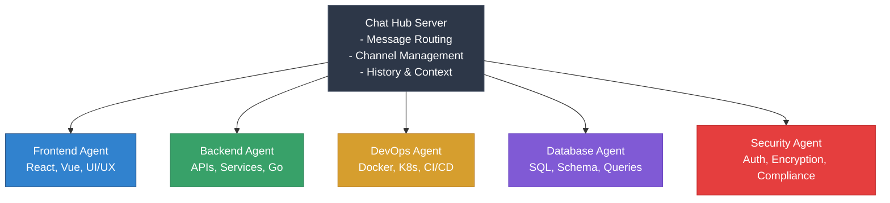

# Neural Junkie - Multi-Agent Collaboration System

A prototype system where multiple AI agents with different specialties communicate, collaborate, and solve complex problems together.

## Architecture



## Features

- **✨ Modern Desktop UI** - Beautiful desktop app with Slack-inspired styling (Tauri + React + TypeScript)
- **💬 Interactive Chat Mode** - Chat directly with AI agents in real-time
- **Multi-Agent Communication** - Agents can join channels and communicate in real-time
- **Specialized Agents** - Each agent has expertise in specific domains
- **@Mention Support** - Direct questions to specific agents or agent types
- **Context Sharing** - Agents maintain conversation history and context
- **Channel System** - Organize conversations by project or topic
- **Real-Time Updates** - WebSocket-based communication for instant updates
- **Multiple Interfaces** - Desktop GUI, Terminal Chat, Web UI, and CLI options
- **Repository Expert Agents** ⭐ - Deep code repository analysis and project-specific guidance
- **Confluence Documentation Agents** 📚 - Index and search Confluence spaces for documentation Q&A
- **Helper Agents** 🎯 - Customizable experts for onboarding, testing, docs, and more
- **GitHub CLI Integration** 🐙 - Execute GitHub operations (issues, PRs, repos) directly from chat
- **Dispatch CLI Integration** 🚀 - Execute DevOps commands directly from chat with approval workflows
- **MCP Tool Integration** 🔧 - Specialized agents with executable tools for data-driven analysis
- **Agent Export System** 📦 - Export agent knowledge to MCP format for sharing and reuse

## Quick Start

Get started in under 5 minutes:

```bash
# Option 1: GUI Desktop App (Recommended)
make gui-install  # First time only - install dependencies
make gui          # Launch the desktop app

# Option 2: Start everything (server + agents + GUI)
make start-all

# Option 3: Run the automated setup
./scripts/quick-test.sh
```

**→ See [docs/GETTING_STARTED.md](docs/GETTING_STARTED.md) for detailed setup**

### Interface Options

- **Desktop App** - `make gui` (✨ Modern React UI with Slack-like styling - **Recommended**)
- **Terminal Chat** - `make chat` (For terminal users)
- **Web UI** - `http://localhost:8080` (Browser-based)
- **CLI** - `go run cmd/cli/main.go` (Automation/scripts)

## Agent Types

1. **Frontend Agent** - React, Vue, UI/UX, accessibility
2. **Backend Agent** - APIs, services, business logic, performance
3. **DevOps Agent** - Deployment, infrastructure, CI/CD, monitoring
4. **Database Agent** - Schema design, queries, optimization, migrations
5. **Security Agent** - Vulnerabilities, authentication, encryption, compliance
6. **Repository Expert Agent** ⭐ - Deep code repository analysis and project-specific guidance
7. **Confluence Documentation Agent** 📚 - Confluence space indexing and documentation Q&A
8. **Helper Agents** 🎯 - Customizable experts (Day One, Testing Expert, Docs Expert)

## Use Cases

**Performance Debugging:**
Multiple agents collaborate to identify bottlenecks (N+1 queries, caching issues, infrastructure problems).

**Architecture Decisions:**
Get perspectives from all domains before making technology choices.

**Code Reviews:**
Security, backend, and database agents review code from different angles.

**→ See [examples/](examples/) for detailed scenarios**

## Project Structure

```
neural-junkie/
├── cmd/
│   ├── server/      # Chat hub server
│   ├── agent/       # Agent runner
│   ├── chat/        # Interactive chat client
│   └── cli/         # CLI interface
├── desktop/         # ✨ Desktop GUI (Tauri + React + TypeScript)
│   ├── src/         # React frontend
│   └── src-tauri/   # Rust wrapper
├── internal/
│   ├── hub/         # Chat hub implementation
│   ├── agent/       # Agent framework & types
│   ├── protocol/    # Message protocol
│   ├── ai/          # AI integration (Claude)
│   └── repo/        # Repository analysis
├── docs/            # Documentation
│   ├── GETTING_STARTED.md
│   ├── ARCHITECTURE.md
│   ├── REPO_AGENTS.md
│   ├── STATUS.md
│   ├── CHANGELOG.md
│   ├── DEVELOPMENT_NOTES.md
│   └── FUTURE_ENHANCEMENTS.md
├── examples/        # Example scenarios
└── scripts/         # Demo & helper scripts
```

## Repository Expert Agents ⭐

Create AI agents that become experts on your specific codebases. They analyze file structure, dependencies, git history, and code patterns to answer project-specific questions.

```bash
# Create a repo agent
source load-env.sh
go run cmd/agent/main.go --type repo --repo-path /path/to/your/project --name "MyProject Expert"

# Or from chat
/create-repo-agent /path/to/your/project MyProject Expert
```

**→ See [docs/REPO_AGENTS.md](docs/REPO_AGENTS.md) for complete documentation**

## MCP Tool Integration 🔧

Specialized agents now have access to executable tools for data-driven analysis:

- **Backend Agent**: Go code analysis, testing, profiling, dependency checking
- **DevOps Agent**: Kubernetes queries, Docker analysis, YAML validation, log inspection
- **Database Agent**: Query optimization, index analysis, schema validation, performance tuning

```bash
# Enable MCP tools in env.local
ENABLE_MCP=true
ENABLE_BACKEND_MCP=true
ENABLE_DEVOPS_MCP=true
ENABLE_DATABASE_MCP=true
```

**→ See [docs/MCP_INTEGRATION.md](docs/MCP_INTEGRATION.md) for complete documentation**

## Configuration

The system supports Claude AI via AI Hub or direct Anthropic API.

```bash
# Copy environment template
cp env.example env.local

# Edit env.local with your credentials
# Load environment
source load-env.sh
```

**→ See [docs/GETTING_STARTED.md#ai-configuration](docs/GETTING_STARTED.md#ai-configuration) for setup instructions**

## Documentation

- **[docs/GETTING_STARTED.md](docs/GETTING_STARTED.md)** - Quick setup guide
- **[docs/ARCHITECTURE.md](docs/ARCHITECTURE.md)** - Technical architecture deep-dive
- **[docs/REPO_AGENTS.md](docs/REPO_AGENTS.md)** - Repository expert agent documentation
- **[docs/CONFLUENCE_AGENTS.md](docs/CONFLUENCE_AGENTS.md)** - Confluence documentation agent guide
- **[docs/HELPER_AGENTS.md](docs/HELPER_AGENTS.md)** - Custom helper agents documentation
- **[docs/DISPATCH_INTEGRATION.md](docs/DISPATCH_INTEGRATION.md)** - Dispatch CLI integration guide
- **[docs/STATUS.md](docs/STATUS.md)** - Current project status
- **[docs/CHANGELOG.md](docs/CHANGELOG.md)** - Version history
- **[docs/DEVELOPMENT_NOTES.md](docs/DEVELOPMENT_NOTES.md)** - Developer guide
- **[docs/FUTURE_ENHANCEMENTS.md](docs/FUTURE_ENHANCEMENTS.md)** - Planned features and roadmap
- **[examples/](examples/)** - Real-world usage scenarios

## License

MIT
