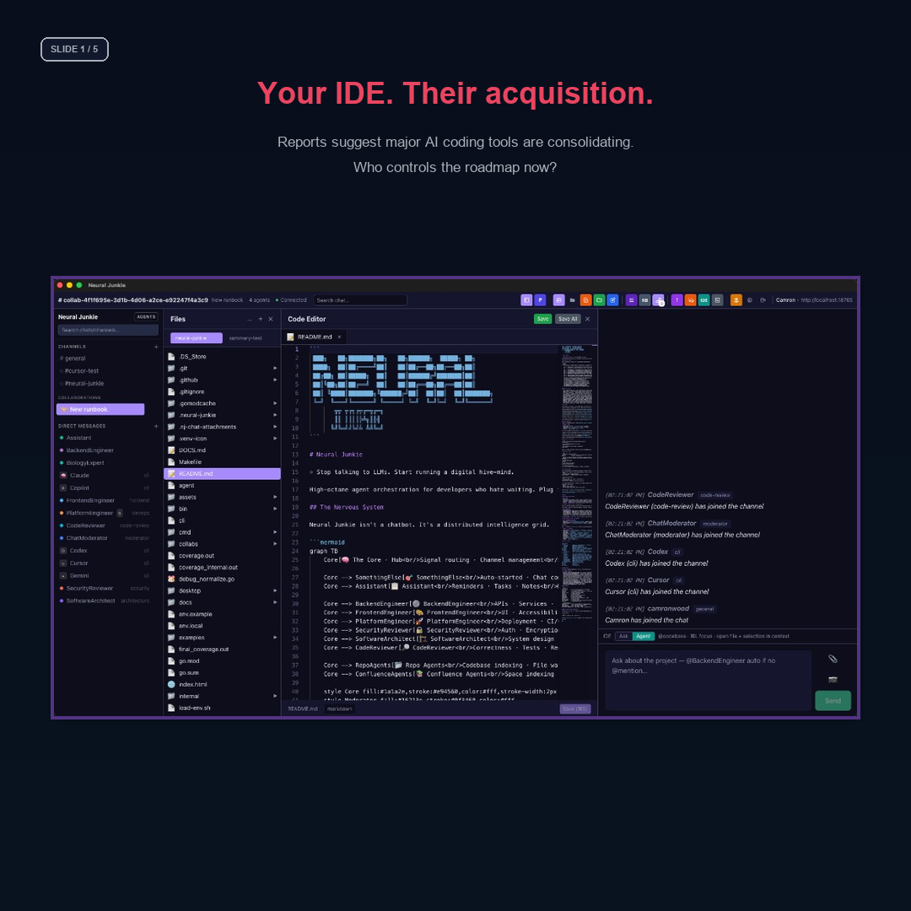
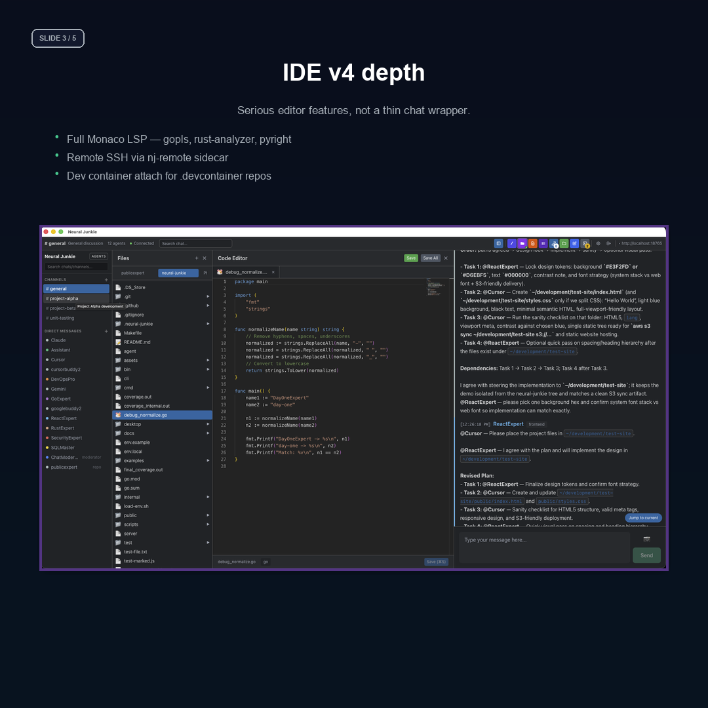
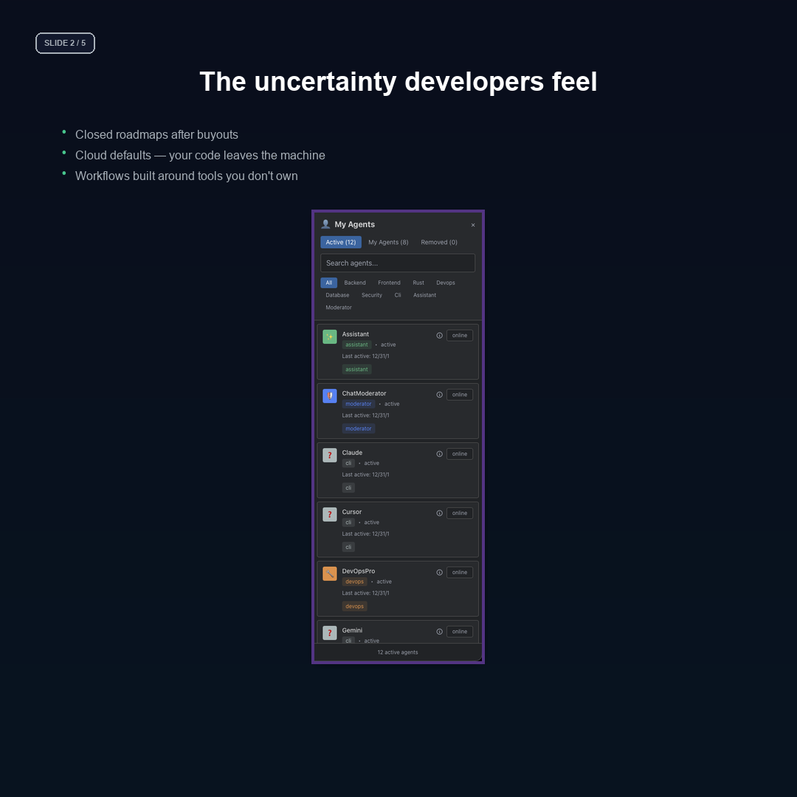

```
 ███╗   ██╗███████╗██╗   ██╗██████╗  █████╗ ██╗
 ████╗  ██║██╔════╝██║   ██║██╔══██╗██╔══██╗██║
 ██╔██╗ ██║█████╗  ██║   ██║██████╔╝███████║██║
 ██║╚██╗██║██╔══╝  ██║   ██║██╔══██╗██╔══██║██║
 ██║ ╚████║███████╗╚██████╔╝██║  ██║██║  ██║███████╗
 ╚═╝  ╚═══╝╚══════╝ ╚═════╝ ╚═╝  ╚═╝╚═╝  ╚═╝╚══════╝
       ╦╦ ╦╔╗╔╦╔═╦╔═╗
       ║║ ║║║║╠╩╗║║╣
      ╚╝╚═╝╝╚╝╩ ╩╩╚═╝
```

# Neural Junkie

> Stop talking to LLMs. Start running a digital hive-mind.

Multi-agent orchestration for teams and individuals — local-first AI, custom experts, Slack integration, and collaboration with human approval.

## The Nervous System

Neural Junkie isn't a chatbot. It's a distributed intelligence grid.


```mermaid
graph TB
    Core[🧠 The Core · Hub<br/>Signal routing · Channel management<br/>Command handling · Session persistence]

    Core --> Assistant[📋 Assistant<br/>Reminders · Tasks · Notes<br/>Chat guidance · Safety net]

    Core --> BackendEngineer[⚙️ BackendEngineer<br/>APIs · Services · Integrations]
    Core --> FrontendEngineer[🎨 FrontendEngineer<br/>UI · Accessibility · Design systems]
    Core --> PlatformEngineer[🚀 PlatformEngineer<br/>Deployment · CI/CD · Infrastructure]
    Core --> SecurityReviewer[🔒 SecurityReviewer<br/>Auth · Encryption · Threat modeling]
    Core --> SoftwareArchitect[🏗️ SoftwareArchitect<br/>System design · Tradeoffs · Migrations]
    Core --> CodeReviewer[🔎 CodeReviewer<br/>Correctness · Tests · Regressions]

    Core --> RepoAgents[📂 Repo Agents<br/>Codebase indexing · File watch<br/>Project-specific expertise]
    Core --> ConfluenceAgents[📚 Confluence Agents<br/>Space indexing · Doc search<br/>Knowledge Q&A]

    style Core fill:#1a1a2e,stroke:#e94560,color:#fff,stroke-width:2px
    style Assistant fill:#16213e,stroke:#0f3460,color:#fff
    style BackendEngineer fill:#0f3460,stroke:#533483,color:#fff
    style FrontendEngineer fill:#0f3460,stroke:#533483,color:#fff
    style PlatformEngineer fill:#0f3460,stroke:#533483,color:#fff
    style SecurityReviewer fill:#0f3460,stroke:#533483,color:#fff
    style SoftwareArchitect fill:#0f3460,stroke:#533483,color:#fff
    style CodeReviewer fill:#0f3460,stroke:#533483,color:#fff
    style RepoAgents fill:#533483,stroke:#e94560,color:#fff
    style ConfluenceAgents fill:#533483,stroke:#e94560,color:#fff
```

## What's In the Box

- **Multi-agent workspace** — Specialist agents, bounded `/collaborate` sessions, threads, file-change approval, and Slack Connect
- **IDE v4 + implementation sessions** — Full Monaco LSP, remote SSH via `nj-remote`, Ask/Agent composer, and the NJ Fix Loop for boot/build repair ([guide](docs/features/fix-loop.html))
- **Seven domain packs** — Software development, life sciences, CAD, specialist tuning, AWS, incident management, and web browser — plus Pack Dev Studio for custom packs ([PACKS.md](docs/PACKS.md))
- **Local-first AI** — Bundled Ollama, Agent Runtime v2, model library, and optional cloud providers (Claude, OpenAI-compatible APIs, LM Studio)
- **Repo + Confluence experts** — Index codebases and documentation spaces; MCP export/import for sharing agent knowledge
- **CLI agents + remote workspaces** — Auto-detected Cursor, Gemini, and other CLI tools; SSH workspaces with remote terminal and file apply

Full capability guides: [docs/features/](docs/features/) on the marketing site. Five-minute path: [start-here.html](docs/start-here.html).

## Screenshots

Desktop workspace and IDE (gallery art — see [Gallery](https://camronwood.github.io/neural-junkie/gallery/) for more).



IDE Agent mode with editor, terminal, and chat ([IDE v4 guide](docs/features/ide-v4.html)).



Multi-agent collaboration and specialist routing ([collaboration guide](docs/features/multi-agent-collaboration.html)).



**Web hub:** the browser UI at `http://localhost:18765` is a lightweight chat client. Use the **Tauri desktop app** for the full workspace.

## Install (download)

**Beta:** [GitHub Releases — v1.2.0-beta.3](https://github.com/camronwood/neural-junkie/releases/tag/v1.2.0-beta.3) or the [downloads page](https://camronwood.github.io/neural-junkie/download.html) — pick the installer for your platform:

| Platform | File |
|----------|------|
| **macOS (Apple Silicon)** | `.dmg` with `aarch64` in the name |
| **macOS (Intel)** | `.dmg` with `x64` or `x86_64` in the name |
| **Windows** | `.msi` installer (or `.exe` setup) |
| **Linux** | `.AppImage` and/or `.deb` |

The Go hub is bundled as a Tauri sidecar — you do **not** need Go installed to run the desktop app.

**macOS:** GitHub Release builds are Developer ID signed and notarized when CI secrets are configured. Source/local builds may require **Right-click → Open** the first time if Gatekeeper warns.

**Ollama:** Installers bundle the Ollama runtime on macOS, Windows, and Linux. First run pulls a default model once (internet required that one time). Cloud APIs remain optional in the wizard.

**Auto-update (beta.27+):** In-app updates on beta and stable channels — Settings → About → **Check for updates**. Installers from before beta.27 need one manual upgrade first; see [docs/RELEASE_UPDATES.md](docs/RELEASE_UPDATES.md).

**Quick start after install:** [docs/DOWNLOAD.md](docs/DOWNLOAD.md) · [5-minute start guide](https://camronwood.github.io/neural-junkie/start-here.html)

**Site:** [camronwood.github.io/neural-junkie](https://camronwood.github.io/neural-junkie/)

## Quick Start (from source)

```bash
git clone https://github.com/camronwood/neural-junkie.git
cd neural-junkie

# Install desktop dependencies (first time)
make gui-install

# Start everything: server + agents + desktop app
make start-all
```

That's it. **`make start-all`** starts the **hub** (with **Assistant** and enabled **domain-pack specialists** running **in-process** per `~/.neural-junkie/config.json`) and opens the **desktop app**. It does **not** spawn separate `cmd/agent` processes; those are optional (see below).

### Other Ways to Run

```bash
# Manual setup (separate terminals)
make server          # Terminal 1: Hub server (specialists in-process unless disabled in config)
make gui             # Terminal 2: Desktop app

# Optional: run the six specialists as separate OS processes instead of (or in
# addition to) in-process agents — avoid duplicate names with hub config.
make agents

# Terminal chat (no GUI)
make chat

# Web UI (browser chat client)
open http://localhost:18765

# CLI (scripting/automation)
go run cmd/cli/main.go --channel general --message "Your question"
```

### AI Provider Setup

Neural Junkie supports local and cloud AI providers. You need at least one. The **Setup Wizard** walks you through this on first launch, or configure later in **Settings > AI Providers**.

**Ollama (Local, Free)** -- Installers bundle the Ollama runtime (beta.22+). The app auto-starts `ollama serve` and walks you through a one-time model pull. For source builds:
```bash
# Or install manually: https://ollama.ai
make pull-models     # Downloads qwen3.5:27b + qwen3.5:9b
```

**Claude (Anthropic API)**
```bash
# Add via Settings > AI Providers > Add Provider, or:
cp env.example env.local
# Edit env.local: ANTHROPIC_API_KEY=sk-your-key-here
```

**Any OpenAI-Compatible API** -- Amazon Q, Azure OpenAI, Together AI, Groq, and more. Add via **Settings > AI Providers > Add Provider** with your endpoint, API key, and model.

**LM Studio (Local, Free)**
```bash
# Install: https://lmstudio.ai
# Start LM Studio, load a model, start the local server
```

Switch providers at runtime from the desktop Settings > AI Providers tab, or via slash commands:
```
/switch-provider BackendEngineer ollama qwen2.5-coder:14b
/switch-all-providers lmstudio
```

## Agents

### Auto-Started (with server)

| Agent | Role |
|-------|------|
| **Assistant** | Reminders, tasks, notes, meetings, scheduling, chat guidance, and safety-net for unanswered questions |
| **Cursor** | Codebase analysis, code generation, refactoring, shell commands (requires [Cursor CLI](docs/CLI_AGENTS.md)) |
| **Gemini** | Code generation, code review, multimodal analysis, architecture (requires [Gemini CLI](docs/CLI_AGENTS.md)) |

### Specialist Agents (Software development pack)

When the **Software development** domain pack is enabled (Settings → Domain packs, or the developer setup wizard track), the hub starts **six** broad in-process specialists: **BackendEngineer**, **FrontendEngineer**, **PlatformEngineer**, **SecurityReviewer**, **SoftwareArchitect**, and **CodeReviewer**. See [docs/SOFTWARE_DEVELOPMENT_PACK.md](docs/SOFTWARE_DEVELOPMENT_PACK.md).

Fresh installs default to **pack off** (Assistant and auto-detected CLI agents only). Enable the pack when you want hub-hosted coding specialists.

| Agent | Expertise |
|-------|-----------|
| **BackendEngineer** | APIs, services, integrations, business logic, performance |
| **FrontendEngineer** | Web/desktop UI, accessibility, design systems, visual QA |
| **PlatformEngineer** | Deployment, CI/CD, cloud infrastructure, observability |
| **SecurityReviewer** | Auth, encryption, threat modeling, OWASP, compliance |
| **SoftwareArchitect** | System design, service boundaries, tradeoffs, migrations |
| **CodeReviewer** | Correctness, tests, maintainability, regressions |

**Alternate layout:** `make agents` starts the same six roles as **standalone** `cmd/agent` processes (see Makefile). Only use that when you want external processes; if their names match in-process agents, you can get duplicate registrations—disable the in-process copies in config first if you need this split.

### Dynamic Agents (created via commands)

| Agent | Created With | Purpose |
|-------|-------------|---------|
| **Repo Agent** | `/create-repo-agent /path provider` | Indexes a codebase, watches for changes, answers project questions |
| **Confluence Agent** | `/create-confluence-agent space-key` | Indexes a Confluence space for documentation Q&A |
| **Expert Agent** | `/create-expert type [name]` | Spin up any specialist on the fly (backend, frontend, devops, security, architecture, code-review, or a custom slug) |

## Commands

Type `/` in the chat or click the **`/`** button to open the command palette. Commands are organized by category:

| Category | Key Commands |
|----------|-------------|
| **Repo Agents** | `/create-repo-agent`, `/reindex-agent`, `/enable-watch`, `/disable-watch` |
| **Confluence** | `/create-confluence-agent`, `/reindex-confluence-agent`, `/list-confluence-agents` |
| **Experts** | `/create-expert` |
| **Agent Mgmt** | `/list-agents`, `/delete-agent`, `/pause-agent`, `/unpause-agent`, `/remove-agent`, `/recall-agent` |
| **Providers** | `/switch-provider`, `/switch-all-providers` |
| **Files** | `/open-file`, `/list-file-changes`, `/approve-file`, `/reject-file` |
| **MCP Export** | `/export-agent-mcp`, `/import-agent-mcp`, `/list-exports`, `/export-all-agents` |
| **Meetings** | `/ingest-meetings`, `/search-meetings`, `/meeting-summary`, `/action-items` |
| **Assistant** | `/remind`, `/task-add`, `/task-list`, `/task-done`, `/note-save`, `/note-search` |
| **Connections** | `/test-anthropic-connection`, `/test-github-connection`, `/test-confluence-connection` |
| **Design** | `/analyze-design` |
| **Help** | `/help`, `/help-assistant` |

## Project Structure

```
neural-junkie/
├── cmd/
│   ├── server/          # Hub server (HTTP + WebSocket + config API)
│   ├── agent/           # Standalone agent runner
│   ├── chat/            # Interactive terminal chat
│   └── cli/             # CLI tool (automation, MCP server)
├── assets/              # Marketing images, icons, desktop screenshots (README)
├── public/              # Optional static HTML preview (screenshots; serve from repo root)
├── desktop/             # Tauri + React desktop app
│   ├── src/             # React frontend (components, stores, hooks)
│   └── src-tauri/       # Rust backend (sidecar management, auto-update)
├── internal/
│   ├── hub/             # Core hub, commands, workspaces
│   ├── agent/           # All agent implementations + CLI registry
│   ├── protocol/        # Message types, mentions, command detection
│   ├── ai/              # Providers: Ollama, Claude, LM Studio, OpenAI-compat, CLI
│   ├── config/          # App configuration (providers, agents, settings)
│   ├── ollama/          # Ollama lifecycle management (detect, install, start, pull)
│   ├── repo/            # Repository indexing, search, file watching
│   ├── confluence/      # Confluence client, indexing, search
│   ├── filechange/      # File change proposals, approval, execution
│   └── mcp_export/      # MCP format export/import
├── .github/workflows/   # CI/CD release pipeline
├── scripts/             # Build and release scripts
├── test/                # Go tests
├── docs/                # Documentation
└── examples/            # Usage scenarios
```

## Documentation

Full index: **[DOCS.md](DOCS.md)** (`make docs` prints the same file).

| Doc | What It Covers |
|-----|----------------|
| **[Getting Started](docs/GETTING_STARTED.md)** | Source setup, configuration, make targets |
| **[Domain packs](docs/PACKS.md)** | Seven official packs and install flow |
| **[Implementation sessions](docs/IMPLEMENTATION_SESSION.md)** | IDE Agent mode, verify/repair, NJ Fix Loop |
| **[IDE v4](docs/IDE_V4.md)** | Full LSP, remote SSH, dev containers |
| **[Cursor parity](docs/CURSOR_PARITY.md)** | Native agent workspace contract |
| **[Collaboration](docs/COLLABORATION.md)** | Multi-agent planning, delegation, execution |
| **[Architecture](docs/ARCHITECTURE.md)** | System design, data flow, patterns |
| **[Repo Agents](docs/REPO_AGENTS.md)** | Repository indexing and analysis |
| **[CLI Agents](docs/CLI_AGENTS.md)** | Cursor CLI and custom CLI integrations |
| **[Testing](docs/TESTING.md)** | Scenario gates and parity contract |
| **[Contributing](CONTRIBUTING.md)** | How to contribute and run test gates |
| **[Changelog](docs/CHANGELOG.md)** | Version history |
| **[Known issues](docs/KNOWN_ISSUES.md)** | Beta limitations and workarounds |

## Make Targets

```bash
# Development
make start-all        # Hub (in-process specialists) + desktop app
make server           # Hub server only (with env)
make agents           # Six specialist agents as separate processes (optional)
make gui              # Desktop app (Tauri + React)
make gui-install      # Install desktop dependencies
make chat             # Terminal chat client
make stop             # Kill all processes
make refresh          # Stop, clear logs, restart fresh
make build            # Build all Go binaries
make test-go          # Go tests only (-count=1)
make test-all         # go vet + Go tests + desktop tsc + Vitest
make test             # Alias for test-go
make pull-models      # Pull Ollama models
make repo-agent       # Create repo agent: make repo-agent PATH=/path NAME="Name"
make clean            # Remove build artifacts

# Packaging & Release
make build-sidecar    # Build Go server sidecar for current platform
make bundle           # Build distributable .dmg / .AppImage for current platform
make bundle-mac       # Build macOS bundle (Apple Silicon)
make bundle-linux     # Build Linux bundle (x86_64)
make release VERSION=0.1.0  # Bump versions, commit, tag (then push to trigger CI)
```

## Minimal static splash (`index.html`)

The repo root `index.html` is a zero-build splash (black background, centered title) suitable for GitHub Pages, Cloudflare Pages, Netlify, or Vercel when the publish/root directory is this repository root.

Preview locally:

```bash
python3 -m http.server 8765 --bind 127.0.0.1
```

Then open `http://127.0.0.1:8765/` in a browser. Do not commit API keys or other secrets into this repo; keep hosting tokens in CI or provider dashboards only.

## License

MIT

## Contributing · Security · Issues

- [Contributing](CONTRIBUTING.md)
- [Security policy](SECURITY.md)
- [Known issues](docs/KNOWN_ISSUES.md)
- [Report a bug](https://github.com/camronwood/neural-junkie/issues/new?template=bug_report.yml)
