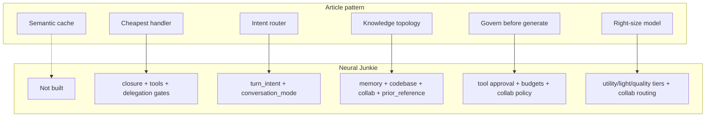
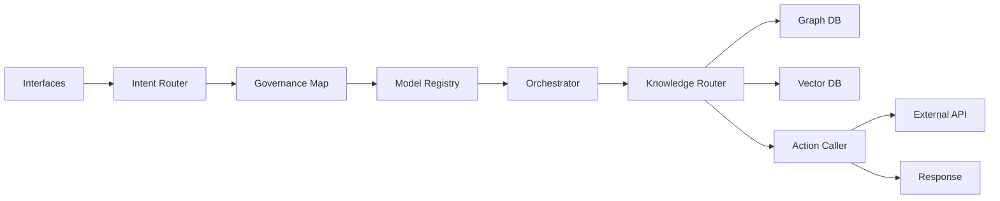

# Adaptive orchestration — external reference notes

**Captured:** June 2026  
**Source:** Sudarshan Mahabal, *Adaptive Intelligence: The Orchestration Layer That Turns AI Pilots Into Production* (LinkedIn, June 4 2026) — plus companion demo dashboard (banking root-cause scenario).

These notes map enterprise “adaptive intelligence” framing to Neural Junkie’s existing architecture, gaps, and possible future work. Not a roadmap commitment — reference for positioning, design, and prioritization.

## Core thesis (article)

The fix for stalled enterprise AI pilots is **not** a better frontier model. It is a **per-request orchestration layer** that decides:

1. How much intelligence to spend
2. Where to look for knowledge
3. What policy to enforce **before** generation

**Economic framing:** In a well-designed system, fewer than ~15% of queries reach a frontier model. Savings on the cheap paths fund the expensive ones (deep reasoning, graph traversal, human-in-the-loop).

Same bet as Neural Junkie’s [Conversation Context Stack](CONTEXT_MODEL.md) — described for CIOs instead of developers.

## Article patterns → Neural Junkie mapping

| Pattern | Article claim | Neural Junkie today | Status |
|---------|---------------|---------------------|--------|
| **Cache before compute** | Semantic cache deflects 30–50% traffic | No answer-level semantic cache | **Gap** (low priority for local desktop) |
| **Cheapest capable handler** | Rules / ML / agentic escalation | `IntentClosure` → canned reply (no LLM); slash commands; MCP tool loops vs pure chat; delegation skipped for closure/casual | **Built** |
| **Classify intent first** | Lightweight router: task type, complexity, sensitivity | `turn_intent.go` + `conversation_mode` (chat / code / collab) | **Built** — primary differentiator |
| **Match knowledge to topology** | Vector vs hybrid vs graph per question shape | Split across: conversation memory, `@codebase` hybrid search, workspace scan (task only), `prior_reference.go`, collab artifacts | **Partial** — topology-aware, not unified |
| **Govern before generate** | Policy bound to request through pipeline | Tool approval hook; `context_budget.go` byte caps; collab blocked-upstream policies; memory channel/collab scoping | **Partial** — strong on tools/actions, light on model/data policy |
| **Right-size every call** | Tiered model registry per agent role | Utility tier (`qwen2.5:7b` summaries); light Ollama collab routing; wizard RAM tiers; two-tier inference vs LoRA; per-specialist provider tags; delegation model split (chat vs tools) | **Built** |

## Demo dashboard (banking root-cause scenario)

The article’s animation companion shows the **expensive seventh path** — the one the other six subsidize.

### Selected scenario

> Explain the root-cause chain for SIP-7754 failures and design an escalation workflow.

| Field | Value |
|-------|-------|
| Complexity | Complex |
| Handler | Agentic + human-in-the-loop |
| Intelligence tier | Frontier |
| Retrieval | Graph-anchored Agentic RAG |
| Governance | PII, Compliance, Traceability, HITL |
| Hops | ~11 |
| Cost (demo) | $0.18 / 14K tokens / 11.5s |

### Active path (green trace)

**Routing rationale (caption):** A recurring mandate failure is **relational** (issuer, rail, account state, prior reversals). Vector-only RAG would be fluently wrong. Graph traversal (Neo4j) + vector evidence + action caller + HITL gate is the correct topology.

### Dashboard node → Neural Junkie equivalent

| Demo node | NJ implementation |
|-----------|-------------------|
| Intent Router | `internal/agent/turn_intent.go` |
| Governance Map | Tool approval (`cmd/tool-approval-hook`), file-change gates, collab `BlockedUpstreamPolicy` |
| Model Registry | Per-agent provider/model tags; `UtilityOllamaModel`; collab `SelectLightOllamaTag`; LoRA-composed specialists |
| Orchestrator | Hub collab phases, task graph, delegation consult loop |
| Knowledge Router | **Split today** — no single router (see gaps) |
| Graph DB | Collab **task graph** + dependency edges (structural, not Neo4j) |
| Vector DB | `memory.db` (conversation memory); repo semantic index (`POST /api/repo/search/semantic`) |
| Action Caller | MCP tools, implementation sessions, runbook actions |
| HITL | Pending tool approvals bar; file-change approval |

### Local analog query

> Why did collab task 4 fail after task 2 completed, and what should we escalate to SecurityReviewer?

Expected NJ path: `IntentTask` → collab task graph (deps) → conversation memory / `findings.md` → delegate to SecurityReviewer → tool approval before `grep`/`read_file` → frontier model on synthesis turn only.

Collab tasks already carry `routing_reason` (e.g. `light_local_model`) via `internal/hub/collab_task_routing.go` and `internal/collaboration/routing/`.

## Knowledge retrieval — four routers today

The article’s “knowledge topology” insight is the most actionable gap. Retrieval mode is chosen **implicitly** per subsystem:

| Question shape | NJ path | Mechanism |
|----------------|---------|-----------|
| “What did we decide about auth?” | Conversation memory | Vector + keyword prefilter in `memory.db` |
| “Where is this function defined?” | Codebase | `@codebase` / `semantic_search` / grep tools |
| “What depends on task 3?” | Collab structure | Task graph edges (not retrieved) |
| “Use that article you wrote” | Prior reference | Deterministic history scan — `prior_reference.go` |

**Future direction (not scheduled):** A lightweight classifier that picks retrieval strategy explicitly — not a graph DB, but unified routing between modes we already have.

## What validates existing NJ bets

1. **Orchestration layer, not chat wrapper** — Context Stack (mode → intent → memory → grounding → persona → budget) is the same architecture enterprises are selling.
2. **When not to use the model** — Closure path never loads LLM; casual gets minimal prompt + 2 history rows; delegation skipped for closure/casual.
3. **Multi-agent collab = expensive path** — Task graphs, runbooks, specialist routing, HITL tool/file gates are the “graph + agentic + HITL” path.
4. **Two-tier LoRA** — Inference tier (Qwen) vs LoRA tier (Llama/Mistral) is “right-size every call” for local stacks. See [TWO-TIER-LORA-LINKEDIN.md](marketing/TWO-TIER-LORA-LINKEDIN.md).

## Enterprise noise (low relevance for NJ today)

- Customer tier routing (Retail cost-optimized vs Premium frontier)
- FinOps dashboards (% traffic to frontier, $/query)
- Domain-specific knowledge graphs (banking supplier chains)
- “Agentic mesh” as product category

## Useful signals for later

### Marketing / positioning

Sell **orchestration**, not models:

> The edge isn’t the biggest model on your machine. It’s the layer that knows when **not** to load it.

Conversation memory, collab graphs, delegation, and two-tier LoRA are **patterns inside that layer**, not standalone features.

**Scenario sidebar idea** (article’s left panel, adapted for NJ):

| Archetype | Example | Hops | Tier | Retrieval |
|-----------|---------|------|------|-----------|
| Closure | “thanks” | 0 | None | — |
| Casual | “hey” | 1 | Minimal prompt | Session summary |
| Memory lookup | “what did we decide on auth?” | 2–3 | Standard | Conversation memory |
| Code task | “review turn_intent.go” | 4–6 | Code specialist | Workspace scan + tools |
| Delegation | “is this sequence safe?” | 5–8 | Specialist consult | Domain router + MCP |
| Collab light | “list files matching X” | 3–5 | Light local | Grep/glob |
| Collab deep | “synthesize findings + escalate” | 10+ | Frontier + multi-agent | Task graph + memory + HITL |

### Observability (debug today)

With `NEURAL_JUNKIE_DEBUG=1`:

- `GET /api/debug/channel-context?channel=...` — session summary + recent messages
- `GET /api/debug/delegation-resolve?from=...&q=...` — consultant resolution
- `GET /api/memory/stats` — conversation memory index stats
- `GET /api/memory/query` — scoped retrieval probe

Collab routing logs: `[collab-routing]` with `provider_id` and `reason`.

**Future direction (not scheduled):** Per-turn routing trace UI — intent, memory source, model tier, retrieval mode, governance gates — packaging existing metadata like the article demo.

## Possible future work (backlog ideas)

| Item | Effort | Value |
|------|--------|-------|
| Unified knowledge router (classify → memory / codebase / collab graph / prior-ref) | Medium | Accuracy on mixed questions |
| Per-turn routing trace (debug panel or dev overlay) | Medium | Trust, debugging, marketing demos |
| Semantic answer cache | Medium | Cloud/cost scenarios; less critical locally |
| Scenario archetype docs / demo script | Low | LinkedIn and onboarding narrative |

## Related docs

- [CONTEXT_MODEL.md](CONTEXT_MODEL.md) — Conversation Context Stack (implementation)
- [DELEGATION.md](DELEGATION.md) — cross-specialist consult after intent
- [COLLABORATION.md](COLLABORATION.md) — task graphs, phases, runbooks
- [marketing/CONVERSATION-MEMORY-LINKEDIN.md](marketing/CONVERSATION-MEMORY-LINKEDIN.md) — memory as topology-aware retrieval
- [marketing/TWO-TIER-LORA-LINKEDIN.md](marketing/TWO-TIER-LORA-LINKEDIN.md) — model tiering
- [marketing/CONVERSATIONAL-TEST-HARNESS.md](marketing/CONVERSATIONAL-TEST-HARNESS.md) — test orchestrator vs conversation separately

## External reference

- Sudarshan Mahabal — *Adaptive Intelligence: The Orchestration Layer That Turns AI Pilots Into Production* (LinkedIn, June 4 2026)
- Hashtags in source post: `#AdaptiveIntelligence #AgenticAI #EnterpriseAI #AIArchitecture #LLMOps #RAG #KnowledgeGraphs #AIGovernance #FinOps #GenAI`
- Companion reference mentioned: “Agentic Mesh Article — When Everyone is Super, No one is Super!”
