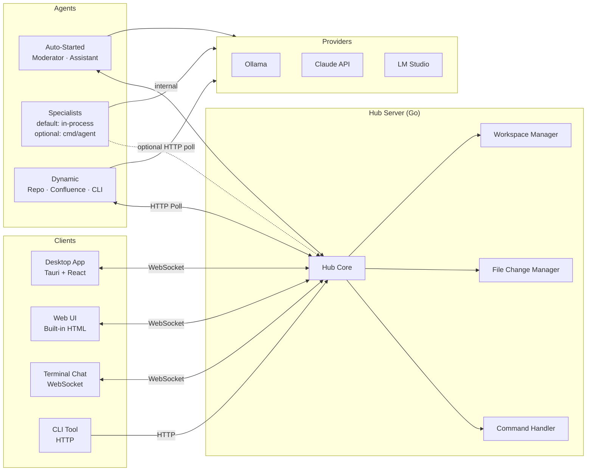

# Architecture

## System Overview

Neural Junkie is a multi-agent collaboration system where specialized AI agents communicate over a central hub, share context, and collaborate to solve complex problems. The system consists of a Go backend (hub server + optional standalone `cmd/agent` processes), a Tauri + React desktop frontend, and multiple interface options (web chat, screenshot gallery, terminal, CLI).

> **Default runtime:** Moderator, Assistant, and **auto-detected CLI agents** always start with the hub. In-process engineering specialists run when the **Software development** domain pack is enabled (`initializeConfiguredAgents`). **`make agents`** is optional for separate specialist processes over HTTP (see README).



## Core Components

### Hub (`internal/hub/`)

The central message broker and state manager.

- **Channels** -- Create, join, leave; per-channel message history and subscriber broadcast
- **Agent Registry** -- Register, unregister, list; duplicate cleanup on register; removed-agent tracking
- **Message Routing** -- Send with @mention parsing, keyword detection, path auto-detection; broadcast to subscribers
- **Thread Support** -- Thread storage, metadata, subscribe/unsubscribe; thread replies broadcast to both thread and channel
- **Command Handling** -- Slash command parsing and routing via `CommandHandler`
- **Collaboration Orchestration** -- Multi-agent planning/review/execution lifecycle via `CollaborationManager`
- **File Changes** -- Register proposals from agents, manage approval/rejection workflow
- **Workspace Management** -- Add/list/remove workspaces, persisted to disk
- **Session Persistence** -- Periodic save to `~/.neural-junkie/last-session.json`

```go
type Hub struct {
    channels        map[string]*protocol.Channel
    agents          map[string]*protocol.AgentInfo
    messages        map[string][]*protocol.Message
    subscribers     map[string][]chan *protocol.Message
    threads         map[string][]*protocol.Message
    commandHandler  *CommandHandler
    collabManager   *collaboration.CollaborationManager
    fileChangeManager *filechange.FileChangeManager
    workspaceManager  *WorkspaceManager
}
```

### Command Handler (`internal/hub/commands.go`)

Processes 50+ slash commands organized by category. Each command is defined with metadata (name, description, category, arguments with types) exposed via `GET /api/commands` for the command palette.

Categories: Repository Agents, Confluence, Agent Management, MCP Export, Provider, Files & Workspace, Meetings, Assistant, Design, Collaboration, Connection Tests, Help.

### Collaboration Package (`internal/collaboration/`)

Implements structured multi-agent collaboration with hard bounds and user-controlled phase transitions.

- **DiscussionSession** -- Round-robin turn-taking, per-agent turn budgets, total message ceilings, timeout enforcement
- **CollaborationManager** -- Lifecycle management (`draft` runbook → `planning` → `reviewing` → `approved` → `executing` → `completed/cancelled`)
- **SharedArtifact** -- Versioned plan document with edit history
- **Task DAG** (`dag.go`) -- `ValidateDAG`, `ReadyTasks`, dependency normalization; hub dispatches waves on completion
- **Runbooks** (`runbook.go`) -- User-authored collaborations (`source: runbook`) via `POST /api/runbooks` and desktop Runbook builder
- **Assign heuristic** (`suggest_assign.go`) -- Skill-based auto-assign for runbook tasks
- **Consensus Detection** -- Signal + heuristic convergence detection with disagreement escalation path

### Protocol (`internal/protocol/`)

Defines message types, agent types, and @mention parsing.

**Message Types:** `chat`, `question`, `answer`, `system_info`, `agent_join`, `agent_leave`, `agent_status`, `context_share`, `request_help`, `file_change`, `command_output`, `command_suggestion`, `design_output`, `tool_approval`, `stream_delta`, `stream_end`, `collaboration_plan`, `collaboration_task`, `collaboration_status`, `collaboration_discussion`

**Agent Types:** `frontend`, `backend`, `devops`, `database`, `security`, `rust`, `general`, `repo`, `confluence`, `moderator`, `assistant`, `helper` (legacy payloads only), `cli`

**Mention System:** Parses `@AgentName` and `@agenttype` from message content. Normalizes names for fuzzy matching.

### Agent Framework (`internal/agent/`)

All agents share a common base with type-specific behavior:

**Agent Lifecycle:**
1. **Creation** -- Initialize with type, name, expertise, AI provider
2. **Registration** -- Register with hub via HTTP
3. **Channel Join** -- Enter a conversation channel
4. **Message Processing** -- Poll for messages, decide relevance, generate response
5. **Shutdown** -- Leave gracefully

**Response Decision Logic:**
- Always respond if directly @mentioned
- Respond if message matches domain expertise keywords
- Moderator responds after 20s timeout if no other agent answers
- Skip own messages and other agent messages (dedup)

**Implemented Agents:**

| Agent | File | Key Capabilities |
|-------|------|-----------------|
| Frontend | `specialized_agents.go` | React, Vue, Angular, CSS, UI/UX, vision-capable |
| Backend | `specialized_agents.go` | Go, Node, Python, REST/GraphQL/gRPC, caching |
| DevOps | `specialized_agents.go` | Docker, K8s, CI/CD, AWS/GCP/Azure, Terraform |
| Database | `specialized_agents.go` | PostgreSQL, MySQL, MongoDB, Redis, schema, migrations |
| Security | `specialized_agents.go` | Auth, OAuth/JWT, encryption, OWASP, compliance |
| Moderator | `moderator_agent.go` | Chat commands, features, user guidance, safety-net timer |
| Assistant | `assistant_agent.go` | Reminders, tasks, notes, meetings, scheduling; persistent storage |
| Repo | `repo_agent.go` | Codebase indexing, search, file watching, reindex |
| Confluence | `confluence_agent.go` | Confluence space indexing, doc search, knowledge Q&A |
| Cursor CLI | `cli_agent.go` | Cursor CLI subprocess for code analysis and generation |
| Gemini CLI | `cli_agent.go` | Gemini CLI subprocess for code generation, review, and multimodal analysis |

### AI Providers (`internal/ai/`)

All providers implement the `AIProvider` interface:

```go
type AIProvider interface {
    GenerateResponse(ctx context.Context, prompt string, history []protocol.Message) (string, error)
    GenerateVisionResponse(ctx context.Context, prompt string, imageData []byte, mimeType string) (string, error)
    GetModel() string
}
```

| Provider | File | Config | Notes |
|----------|------|--------|-------|
| **Ollama** | `ollama.go` | `OLLAMA_ENDPOINT`, `OLLAMA_MODEL` | Local inference, model listing, connection test |
| **Claude** | `claude.go` | `ANTHROPIC_API_KEY`, `USE_AI_HUB`, `AI_HUB_ENDPOINT` | Anthropic direct or AI Hub proxy |
| **LM Studio** | `lmstudio.go` | `LM_STUDIO_ENDPOINT`, `LM_STUDIO_MODEL` | OpenAI-compatible local server |
| **Mock** | `mock.go` | -- | Rule-based responses for testing |
| **Cursor CLI** | `cli_agent.go` | `CURSOR_API_KEY`, `CURSOR_WORK_DIR` | Subprocess-based, wraps Cursor CLI |
| **Gemini CLI** | `cli_agent.go` | `GEMINI_WORK_DIR` | Subprocess-based, wraps Gemini CLI |

### Server (`cmd/server/main.go`)

HTTP + WebSocket server. Key endpoints:

**Core:**
- `GET /ws` -- WebSocket connection (query: `channel`, `thread`)
- `GET /` -- Built-in web chat UI
- `GET /api/commands` -- Command palette metadata

**Channels & Messages:**
- `GET /api/channels`, `POST /api/channels/create`, `POST /api/channels/join`
- `GET /api/messages`, `POST /api/send`

**Agents:**
- `GET /api/agents`, `POST /api/agents`
- `GET /api/my-agents`, `GET /api/cached-agents`, `GET /api/removed-agents`
- `POST /api/agents/{id}/provider`, `POST /api/agents/switch-all-providers`

**Threads:**
- `GET /api/threads/{id}/messages`, `POST /api/threads/{id}/reply`
- `GET /api/threads/{id}/metadata`, `GET /api/threads/{id}/parent-author`

**Files & Workspaces:**
- `GET /api/files`, `GET/POST /api/file-content`, `POST /api/file-create`, `POST /api/file-rename`, `DELETE /api/file-delete`
- `GET/POST/DELETE /api/workspaces`

**File Changes:**
- `GET /api/file-changes`, `GET /api/file-changes/{id}`
- `POST /api/file-changes/approve/{id}`, `POST /api/file-changes/reject/{id}`

**Provider Health:**
- `GET /api/ollama/status`, `GET /api/ollama/models`, `POST /api/test-ollama-connection`
- `GET /api/lmstudio/status`, `GET /api/lmstudio/models`, `POST /api/test-lmstudio-connection`

**Auto-started agents:** The server creates the Moderator and Assistant agents on startup, then starts **enabled specialist agents from config** in-process (`initializeConfiguredAgents`). If the Cursor CLI or Gemini CLI binaries are detected on PATH, it also starts the respective CLI agents.

### Desktop App (`desktop/`)

Tauri (Rust) + React (TypeScript) + Tailwind CSS.

**Key Components:**
- `ChatWindow` -- Main chat interface with message list, rich text input, toolbar
- `CommandPalette` -- Searchable slash-command UI with argument forms
- `SettingsModal` -- Appearance, Layout, Integrations, AI Providers, Developer, About
- `AgentList` -- Active agents with status indicators
- `FileExplorerPanel` -- Workspace file browser
- `CodeEditorPanel` -- Code viewing/editing
- `TerminalPanel` -- Embedded terminal output
- `ThreadPanel` -- Threaded conversation view
- `PendingChangesPanel` -- File change proposals with diff preview
- `MentionAutocomplete` -- @mention agent picker
- `MessageContent` -- Markdown rendering with Mermaid diagram support

**State Management:** Zustand stores (`chatStore`, `settingsStore`, `editorStore`, `fileExplorerStore`, `terminalStore`, `fileChangeStore`)

**Persistent Settings:** Tauri Store plugin saves settings, integrations, and layout preferences to `~/.neural-junkie-*.dat` files.

## Data Flow

### Message Flow

```
User sends message
    │
    ▼
Hub receives via WebSocket/HTTP
    │
    ├── Parse @mentions
    ├── Detect slash commands → CommandHandler
    ├── Detect file paths → auto-create repo agent (if enabled)
    │
    ▼
Broadcast to channel subscribers
    │
    ▼
Each Agent receives message
    │
    ├── Already processed? (dedup) → skip
    ├── Own message? → skip
    ├── @mentioned? → respond
    ├── Matches expertise? → respond
    │
    ▼
Build prompt (role + context + history + message)
    │
    ▼
AI Provider generates response
    │
    ▼
Agent sends response → Hub → Broadcast
```

### File Change Flow

```
Agent proposes file change (via message metadata)
    │
    ▼
Hub registers proposal with FileChangeManager
    │
    ▼
Desktop shows in Pending Changes panel (with diff)
    │
    ├── User approves → Executor applies change to workspace
    └── User rejects → Change discarded
```

## Design Patterns

- **Pub/Sub** -- Hub broadcasts messages to subscriber channels
- **Factory** -- `AgentFactory` creates typed agents from config
- **Strategy** -- Pluggable AI providers behind `AIProvider` interface
- **Observer** -- Agents observe message streams, react based on expertise
- **Command** -- Slash commands parsed and routed to handlers

## Concurrency

- **Hub** -- Protected by `sync.RWMutex`; safe for concurrent reads
- **Standalone `cmd/agent` processes** -- Each polls the hub over HTTP in its own goroutine
- **In-process runtime agents** -- Run in goroutines started by the hub; message delivery is push-based from the hub (no HTTP polling loop to self)
- **Message Channels** -- Buffered Go channels (size 100) for real-time broadcast
- **Deduplication** -- Three-layer: polling dedup (standalone agents), handler-level tracking, agent-type filtering

## Data Storage

All persistent data under `~/.neural-junkie/`:

| Path | Purpose |
|------|---------|
| `repos/` | Cached repository indexes |
| `confluence/` | Cached Confluence space indexes |
| `assistant/` | Reminders, tasks, notes, meeting data |
| `exports/` | MCP-format agent exports |
| `backups/` | File change backups before edits |
| `workspaces.json` | Registered workspace list |
| `last-session.json` | Session state for recovery |

## Extension Points

### Adding a New Agent Type

1. Define the agent type in `internal/protocol/types.go`
2. Create a constructor in `internal/agent/specialized_agents.go`
3. Register in the `AgentFactory` function
4. Add to `cmd/agent/main.go` CLI flags

### Adding a New AI Provider

Implement the `AIProvider` interface in `internal/ai/`:
```go
type MyProvider struct { /* config */ }

func (p *MyProvider) GenerateResponse(ctx context.Context, prompt string, history []protocol.Message) (string, error) {
    // Your implementation
}

func (p *MyProvider) GenerateVisionResponse(ctx context.Context, prompt string, imageData []byte, mimeType string) (string, error) {
    return "", fmt.Errorf("vision not supported")
}

func (p *MyProvider) GetModel() string { return "my-model" }
```

### Adding a New Slash Command

1. Add the handler case in `CommandHandler.ProcessCommand()` in `internal/hub/commands.go`
2. Add metadata to `GetCommandDefinitions()` for command palette support
3. Define arguments with types (`string`, `path`, `provider`, `model`, `agent-name`)

## Security Considerations

**Current state (prototype):**
- No authentication or authorization
- CORS allows all origins
- No rate limiting
- API keys stored in env files (not committed)

**For production, add:**
- JWT/API key auth for all endpoints
- Channel-level access control
- Rate limiting per agent and per endpoint
- Input validation and sanitization
- Encrypted secret storage
