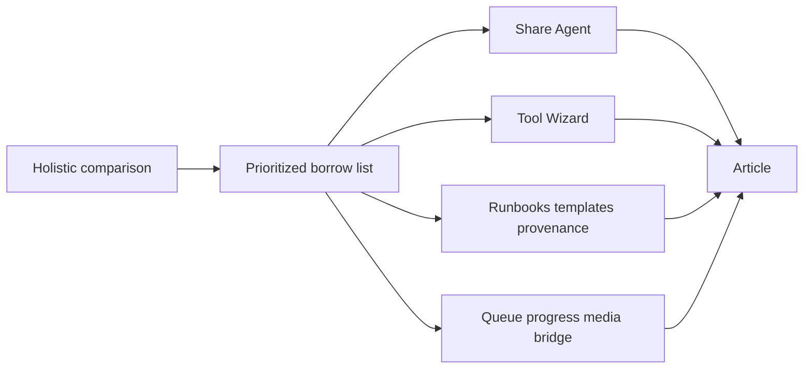

# Neural Junkie vs ComfyUI — holistic comparison

**Captured:** July 2026  
**Status:** Design note (learnings + prioritized borrows). Not a port plan.

ComfyUI is a useful reference for **extension friction, shareable reproducibility, templates, and queue clarity**. Neural Junkie is a different product: multi-agent hub, chat, IDE, collaboration, and Context Stack. This note maps dimensions, gaps, NJ wins, and a borrow list expressed in **NJ vocabulary**.

**ComfyUI is not part of Neural Junkie.** No Comfy source, binary, models, or pack ships in this repo. Optional HTTP bridges may point at a user-run external service; the hub works with those settings empty.

Related: [COMPOSITION_MODEL.md](COMPOSITION_MODEL.md) (composition subset of borrows), [FUTURE_ENHANCEMENTS.md](FUTURE_ENHANCEMENTS.md), [MCP_EXPORTS.md](MCP_EXPORTS.md), [RUNBOOKS_V2.md](RUNBOOKS_V2.md).

## Non-goals

- Embed, vendor, or ship ComfyUI
- Make a diffusion node canvas NJ’s primary UX
- Replace Context Stack / multi-agent chat with “everything is a graph”
- Copy community-node chaos without schema, grants, and security

## Gap matrix

| Dimension | Comfy tendency | NJ today | Gap / opportunity | NJ pointers |
|-----------|----------------|----------|-------------------|-------------|
| **Product shape** | Visual workflow for generative pipelines | Multi-agent hub + chat + IDE + collab | Different products; borrow *patterns*, not UI | [ARCHITECTURE.md](ARCHITECTURE.md), [COLLABORATION.md](COLLABORATION.md) |
| **Extension barrier** | Drop-in custom node (schema + execute) | Packs / core MCP; user tool wizard shipping | **High** — MCP Tool Wizard | [MCP_INTEGRATION.md](MCP_INTEGRATION.md), `cmd/server/user_tools_handlers.go` |
| **Share / reproduce** | Workflow JSON; often embedded in outputs | MCP export; hydrate-from-resources; learnings in Share Agent | **High** — Share Agent (portable packages) | [MCP_EXPORTS.md](MCP_EXPORTS.md), `HydrateFromExport`, `/import-agent-mcp --hydrate` |
| **Templates / discovery** | Workflow template gallery | Pack runbooks; library UX improving | **Medium** — template gallery | [RUNBOOKS_V2.md](RUNBOOKS_V2.md), `internal/runbooklibrary/` |
| **Execution model** | Queue, batch, progress, cancel | Collab DAG waves, turn pipeline | **Medium** — queue/progress polish | [COLLABORATION.md](COLLABORATION.md), turn pipeline |
| **Caching / lazy eval** | Dirty nodes / skip unused inputs | Intent skip, CCR, ReadyTasks | **Low–medium** — document + tighten | [CONTEXT_MODEL.md](CONTEXT_MODEL.md), collab ReadyTasks |
| **Model / asset library** | Checkpoints, LoRAs, browsable assets | Model library + Ollama/HF/LoRA (partial) | **Medium** — UX parity ideas | [LORA_ADAPTERS.md](LORA_ADAPTERS.md) |
| **Provenance** | Graph in image metadata | Turn traces, workflow-events, run metadata (fragmented) | **Medium** — unify run → definition → events → traces | Runbook provenance APIs |
| **API-first** | Engine + GUI clients | Hub API + desktop (strong) | **Low** — already aligned | Hub HTTP + desktop |
| **Community registry** | Custom-node ecosystem / registry | Packs + GitHub; no tool/agent marketplace | **Later** — after wizard | [PACKS.md](PACKS.md) |
| **Multi-agent / gates** | Weak / not core | Collab, approvals, Context Stack | **NJ wins** — keep | [COLLABORATION.md](COLLABORATION.md), approvals |
| **Repo / IDE grounding** | Weak | Workspace scope, IDE pack | **NJ wins** — keep | [IDE_V4.md](IDE_V4.md), [REPO_AGENTS.md](REPO_AGENTS.md) |
| **Security / consent** | Variable (community nodes) | Approvals, SSRF gates, ACL | **NJ wins** — apply to all borrows | [SECURITY.md](SECURITY.md) |

Also map briefly:

- Subgraphs / blueprints ↔ runbook reuse and pack runbooks
- Headless CI ↔ NJ scenarios / runbooks (`docs/USER_FLOW_SCENARIOS.md`)
- Intermediate inspect ↔ debug channel-context / turn traces

## Comfy strengths (worth learning from)

1. **Cheap extension** — a new capability is mostly schema + execute, not a full product rewrite.
2. **Shareable reproducibility** — a workflow (or artifact metadata) can recreate a run elsewhere.
3. **Template discovery** — users browse known-good graphs instead of starting blank.
4. **Queue clarity** — long work shows progress, cancel, and batching without guessing.
5. **Lazy / dirty evaluation** — skip work that cannot affect outputs.

## NJ wins (protect in messaging)

- Multi-agent collaboration with gates and approvals
- Context Stack / turn intent (not “everything is a graph”)
- Repo and IDE grounding (workspace scope, code agents)
- Local-first security: SSRF gates, consent, ACL — apply the same bar to Tool Wizard and external media bridges
- Hub-owned execution with desktop as client (API-first already)

Do not dilute chat/collab/security when borrowing patterns.

## Prioritized borrow list

### Must

| Borrow | NJ feature name | Intent |
|--------|-----------------|--------|
| Portable packages | **Share Agent** | Hydrate knowledge from bundle; path remap; learnings/rules/LoRA in export; desktop Share/Import |
| Cheap extensions | **MCP Tool Wizard** | User-defined HTTP/remote MCP tools; grants on custom experts; SSRF/consent preserved |
| Shareable process | **Runbook packages + templates + provenance** | Definition export/import; library browse; run → definition → events → traces |
| Execution polish | **Queue / progress / cancel** + optional **external media HTTP MCP** | Hub-owned visibility for long work; media tools inert when URL unset; **no Comfy in repo** (`internal/mcp/externalmedia/`) |

### Should

- Stronger model/asset library browse UX (parity ideas, not checkpoint bazaar)
- Tighter documentation of intent-skip / ReadyTasks / CCR as the lazy-eval story

### Later

- Community registry / marketplace (after Tool Wizard is solid)
- First-class subgraph blueprints beyond runbook reuse
- Deep intermediate-node caching UX

### Ignore

- Pixel node editor as primary product surface
- Shipping or depending on ComfyUI
- Unscoped community-node install without grants

## Implementation arc (from Must-list)

Composition (nodes / graphs / packages) is one pillar among these borrows — see [COMPOSITION_MODEL.md](COMPOSITION_MODEL.md).

## Naming

- This doc: **Comfy comparison** / learnings (honest about inspiration).
- Product features: **Composition Model**, Share Agent, Tool Wizard, runbook packages — NJ vocabulary.
- Never imply Comfy is a dependency or submodule. Avoid “Comfy for agents” / “we added Comfy.”
