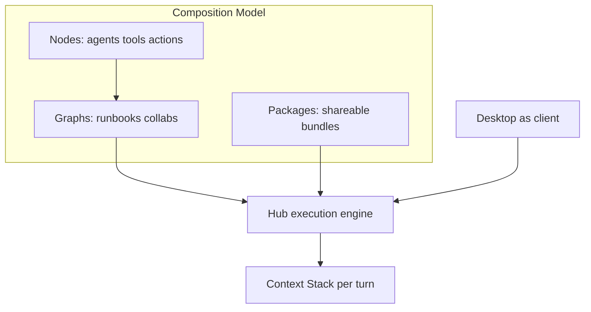

# Composition Model

**Captured:** July 2026  
**Status:** Design note — NJ-owned vocabulary for composable agents, tools, and runbooks.

The **Composition Model** is Neural Junkie’s product framing for portable, grant-scoped, provenance-friendly units of work. It is the *composition subset* of learnings from the holistic Comfy comparison ([COMFY_COMPARISON.md](COMFY_COMPARISON.md)) — not a Comfy port and not a replacement for the Context Stack.

Parallel concepts: Context Stack / turn pipeline own **per-turn context**; Composition Model owns **how units are packaged, granted, shared, and traced**.

## Vocabulary

| Idea (external) | NJ primitive |
|-----------------|--------------|
| Node | Agent, MCP tool, runbook action, connector |
| Workflow JSON | RunbookDefinition + Share Agent / tool-grant packages |
| Custom nodes | Packs + **MCP Tool Wizard** |
| Graph editor as client | Desktop runbook graph; **hub owns DAG dispatch** |
| Lazy / dirty eval | Intent skip, `ReadyTasks` waves, CCR / context budget |
| Provenance in artifact | Turn traces, run metadata, workflow-events, stamped responses |
| Optional external engine | HTTP MCP media bridge (`internal/mcp/externalmedia/`) — URL empty by default; **never a core dependency** |

## Today vs gaps

| Area | Shipped / in progress | Gap |
|------|----------------------|-----|
| Graphs | Collab DAG, runbook graph layout | Template gallery polish; richer browse UX |
| Packages | Share Agent hydrate (`HydrateFromExport`), `/import-agent-mcp --hydrate`, learnings merge (`ImportShareLearnings`) | Broader agent types; LoRA pull-on-import polish |
| Cheap nodes | User tools + **pack tool grants** (`/api/mcp/pack-tools`) on custom experts; ability packs attach to Assistant | Full Settings wizard UX; remote MCP registry completeness |
| Provenance | Traces + workflow-events | Unified run → definition version → events → traces navigation |
| Media | Optional external media MCP | Inert when unset; mock HTTP in tests — keep Comfy out of repo |

## Security / local-first

- Tool grants are scoped (agent name / channel), not global silent install
- Same private-IP / consent gates as `fetch_url` for HTTP tools and media bridges
- Approvals and ACL apply to composed runs the same as chat tool loops
- Share Agent is file handoff (git, AirDrop, Slack) — not multi-hub live sync

## Pillars

1. **Share Agent** — portable knowledge packages; hydrate from embedded resources; optional path remap; learnings / rules / LoRA metadata in the bundle. See [MCP_EXPORTS.md](MCP_EXPORTS.md) and [FUTURE_ENHANCEMENTS.md](FUTURE_ENHANCEMENTS.md#share-agent-gift-bundle-for-friends--coworkers).
2. **MCP Tool Wizard** — cheap extensions: HTTP-fetch template, remote MCP connect, grants on custom experts, and **pack ability grants** (`maps-tools`, `maps-location`, `web-browser`, `music-generation` via `POST /api/mcp/pack-tools/{id}/grant`). See [FUTURE_ENHANCEMENTS.md](FUTURE_ENHANCEMENTS.md#mcp-tool-wizard-user-defined-tools--agents).
3. **Runbook packages** — definition export/import, template discovery, provenance links. See [RUNBOOKS_V2.md](RUNBOOKS_V2.md).
4. **Execution polish** — queue / progress / cancel for long runbooks and multi-tool turns; optional external media HTTP MCP.

## Phased arc

| Phase | Outcome |
|-------|---------|
| **P0** | This doc + [COMFY_COMPARISON.md](COMFY_COMPARISON.md) + backlog wiring |
| **P1** | Share Agent hydrate-from-resources + path remap + learnings/rules/LoRA |
| **P2** | MCP Tool Wizard + grants on custom experts |
| **P3** | Runbook export/import + template gallery + provenance links |
| **P4** | Queue/progress polish + optional external media bridge |

## Naming

Use **Composition Model** / **composition package** in product docs. Credit node-graph composition briefly as inspiration; speak in NJ primitives thereafter. Desktop already has a runbook graph view — extend that metaphor for workflows, wizard for tools, Share for agents.
