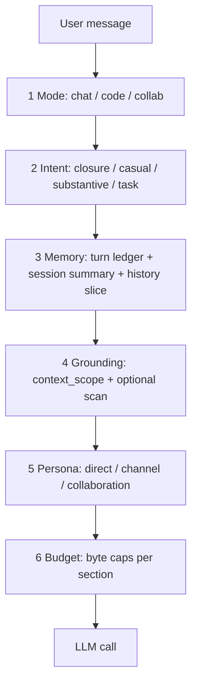

# Context model v2

Neural Junkie assembles agent context through a **Conversation Context Stack** — a single pipeline with explicit stages, budgets, and metadata contracts. v2 replaces the earlier two-layer doc (intent router + DM session summary only).

## Goals and non-goals

**Goals**

- Pleasant 1:1 chat (natural tone, no tool dumps on greetings)
- Coherent memory across longer conversations
- Code/repo grounding only when the user is actually coding
- Predictable agent persona (DM vs channel vs collaboration)

**Non-goals**

- Full RAG or vector retrieval rewrite (chat/casual stay on small budgets)
- Cross-session long-term memory for casual chat (see [FUTURE_ENHANCEMENTS.md](FUTURE_ENHANCEMENTS.md); **agent-runtime v2** uses full Context Stack + CCR + workspace learnings)
- CLI agent context unification (see [CLI_AGENTS.md](CLI_AGENTS.md) follow-up)

## Agent-runtime v2 exception

When `features.agent_runtime_v2` is enabled (default) and the user is in **Agent** / implementation mode:

- Prompt budget derives from `ollama.num_ctx` ([HARDWARE.md](HARDWARE.md) tiers)
- CCR tool compression uses elevated `agent_runtime_max_tool_bytes` and `nj_retrieve_context` per-turn budget
- Per-file read caps use chunked `read_file` (512 KB agent reads) instead of silent 50 KB truncation
- See [CURSOR_PARITY.md](CURSOR_PARITY.md)

## Baseline fixes (v2 foundation)

These ship as part of the v2 rollout:

- **@mention overrides IDE route** — explicit `@Assistant` no longer loses to `ide_route_agent_type: backend` (`internal/agent/agent.go`, `desktop/src/utils/ideComposer.ts`)
- **Session persist slimming** — `workspace_context` bodies are outline-only on disk; runtime prompts stay rich (`internal/hub/session_persist.go`)

## Conversation Context Stack

Every user turn flows through six stages before the LLM call:



| Stage | Input | Metadata / state | Owner |
|-------|-------|------------------|-------|
| **Mode** | Composer UI + heuristics | `conversation_mode`: `chat` \| `code` \| `collab` | Desktop |
| **Intent** | Message text + channel type | Internal: `closure` / `casual` / `substantive` / `task` / `meta` | Server `turn_intent.go` |
| **Memory** | Channel transcript | turn ledger + `session_summary` (hub) + history slice | Hub + agent |
| **Grounding** | Mode + intent + scope | `context_scope` + optional file scan | Desktop + agent |
| **Persona** | Channel type | Prompt framing tier | Agent `buildPrompt` |
| **Budget** | Assembled prompt | Truncation order before LLM | Agent `context_budget.go` |

Implementation entry points: `generateResponse` / `generateResponseStreaming` in `internal/agent/agent.go`.

## Conversation modes

Three modes control how much context is attached:

| Mode | Default `context_scope` | Workspace scan | MCP / FILE_CHANGE in prompt | History cap |
|------|---------------------------|----------------|-----------------------------|-------------|
| **chat** | `none` | off | off | summary + ~6 exchanges (12 msgs) |
| **code** | auto (`inferContextScope`) | on when paths/verbs | on for specialists | summary + ~8 exchanges (16 msgs) |
| **collab** | collab rules | per collab phase | per phase | collab transcript rules |

**Dialogue window (always):** Recent complete user↔assistant exchanges are the protected ConversationWindow. Session summary, durable goals/actions, and vector memory are **overlays** — they must not shrink or replace the window, and chat mode must not inject stale implement goals.

**Desktop UX:** Composer mode chip (Auto / Chat / Code) alongside the workspace context cycle. Persisted in `localStorage`. Outbound metadata key: `conversation_mode`.

**Auto (default):** Infer `chat` vs `code` from message signals in `desktop/src/utils/conversationMode.ts` (code verbs, file paths, `@codebase`, IDE layout with open tab). Server re-infers when metadata is missing.

## Turn intent router

Each message is classified before building the prompt:

| Intent | Behavior | History rows | Session summary |
|--------|----------|--------------|-----------------|
| `closure` | Canned reply (thanks, brief ack); no LLM | 0 | n/a |
| `casual` | Minimal prompt (was `low_signal`) | ~4 msgs / 2 exchanges | yes if present |
| `meta` | Minimal prompt when user asks about prompt/context | ~4 msgs / 2 exchanges | yes if present |
| `substantive` | Full / dialogue prompt | ~12 msgs / 6 exchanges | yes if present (overlay only) |
| `task` | Full prompt + workspace scan when paths/verbs | ~16 msgs / 8 exchanges | yes if present |

**Mode interaction:** `conversation_mode=chat` biases toward `casual` for cold greetings, but **open-thread follow-ups** (capability notices, pronouns, “why?”, “go on”) stay `substantive` so the ConversationWindow is used.

Collaboration channels use closure for acks; they always keep the full collab prompt for substantive collab turns.

Implementation: `internal/agent/turn_intent.go`.

## Agent delegation

When [delegation](DELEGATION.md) is enabled, after intent classification the hub may consult other specialists and inject `=== DELEGATE_RESULTS ===` before the main LLM call. **Skipped for `closure` and `casual` intents.**

## Session summary (memory)

The hub maintains a rolling **session summary** per eligible channel:

- Updated asynchronously with `qwen2.5:3b` (`config.SessionSummaryOllamaModel`) after every 3 user turns (or sooner when empty and enough transcript exists)
- **90s** LLM timeout (`NJ_SESSION_SUMMARY_TIMEOUT`); override model via `NJ_SESSION_SUMMARY_MODEL`
- **Eligible channels:** DM, custom, public (`#general`, etc.), collaboration rooms, and `dm-*` specialist slugs — **not** regression harness channels (`implement-scenarios`, `chat-scenarios`, etc.)
- Digests are **speaker-attributed** (who committed to what, open questions, named entities to retain)
- Persisted in `last-session.json` as `session_summary` / `session_summary_at`
- Cleared with **Clear message history** (also clears durable conversation state for that channel)
- Injected into agent prompts as `=== SESSION SUMMARY ===` with continue-thread guidance (summary is overlay; recent exchanges remain ground truth)

Implementation: `internal/hub/channel_summary.go`, `internal/chatcontext` for transcript filtering.

### Turn ledger (long-conversation tracking)

Alongside the prose summary, the hub appends a durable **turn ledger** for eligible channels:

- Path: `~/.neural-junkie/turn-ledgers/{safe_channel}.jsonl`
- Each chat/question/answer turn records speaker, type, bounded excerpt, lightweight entities (backticks / CamelCase), and optional goal/collab/trace links
- Injected as `=== TURN LEDGER (recent) ===` (last ~12 rows) before the session summary in the Memory stage — still an overlay; the ConversationWindow remains ground truth
- API: `GET /api/channels/turn-ledger?channel=…&limit=50`
- Debug: `GET /api/debug/channel-context?channel=…` includes `turn_ledger` when `NEURAL_JUNKIE_DEBUG=1`

Implementation: `internal/turnledger`, `internal/hub/turn_ledger.go`.

### Thread-scoped history

When `msg.IsInThread()`, history for the LLM is **thread messages + parent** only — not the full channel transcript. Implementation: `historyForGeneration` in `internal/agent/history_llm.go`.

## Persona tiers

Prompt framing in `buildPrompt` uses three tiers:

| Tier | When | System prompt shape |
|------|------|---------------------|
| **direct** | DM / single-agent channel | 1:1 with the user; no peer agent list |
| **channel** | `#general`, multi-agent | Multi-agent chat room framing |
| **collaboration** | Collab channels | Existing collab blocks (unchanged) |

MCP tools and `[FILE_CHANGE]` docs are **off** for `direct` + `casual`; **on** for `code`/`task` + specialists.

Implementation: `promptPersonaTier()` in `internal/agent/prompt_persona.go`.

## Context budget

Before the LLM call, `applyContextBudget()` enforces a ~32KB prompt target (tunable):

1. User message + attachments (required, never truncated)
2. Turn ledger overlay (cap ~1.5KB)
3. Session summary (cap 2KB)
4. Recent turns in prompt body (cap 12KB)
5. Workspace outline (cap 4KB)
6. Open file bodies / scan (remainder, cap 12KB)

Truncate tail sections first. When context compression is enabled, oversized sections are stored in the hub cache with a ref marker instead of silent truncation — see [CONTEXT_COMPRESSION.md](CONTEXT_COMPRESSION.md).

Implementation: `internal/agent/context_budget.go`.

## Desktop ↔ server metadata contract

| Key | Set by | Read by |
|-----|--------|---------|
| `conversation_mode` | Desktop | Agent intent + grounding |
| `context_scope` | Desktop (`inferContextScope`) | Agent workspace append |
| `context_scope_reason` | Desktop | Debug UI / composer chip |
| `linked_workspaces` | Desktop | Agent multi-repo scope (outline + open tabs per linked repo) |
| `ide_route_agent_type` | Desktop IDE | Agent routing (skipped when `@mentions` present) |
| `session_summary` | Hub (persisted) | Agent prompt injection |

Keys must stay in sync between `desktop/src/constants/promptMetadata.ts` and `internal/agent/prompt_context.go`.

## Persistence rules

Runtime prompts may include full `workspace_context` (open files, selections). **Disk persistence** stores outline-only metadata:

- `open_files[].content` stripped
- `file_tree` capped at 12KB
- `prompt_attachments`, `user_images`, `granted_hub_data_access` bodies stripped

See `cloneMessageForSessionPersist` in `internal/hub/session_persist.go`.

## Migration and compatibility

- New metadata keys are optional; missing `conversation_mode` → server-side Auto inference
- No breaking changes to `last-session.json` schema
- During development: `NEURAL_JUNKIE_CONTEXT_V2=1` enables v2 intent/persona paths (default on in v2 release)

## Debug

When `NEURAL_JUNKIE_DEBUG=1`:

```bash
curl 'http://localhost:18765/api/debug/channel-context?channel=dm-camron-assistant'
```

Response includes: `session_summary`, `conversation_mode`, resolved intent (when message query param provided), persona tier, budget stats.

## Test plan

| Area | Test file |
|------|-----------|
| **Semantic corpus (CI policy)** | `internal/intent/corpus_policy_test.go` + `scenarios/routing/semantic-intents.json` |
| **Semantic live classify+policy** | `make semantic-eval` / `make semantic-eval-compare` (`NJ_RUN_LOCAL_SEMANTIC_EVAL=1`) |
| **Chat quality router (CI catalog)** | `internal/agent/chat_quality_router_test.go` |
| Intent + mode interaction | `internal/agent/turn_intent_test.go` |
| Mention overrides IDE route | `internal/agent/should_respond_test.go` |
| Session summary on public channels | `internal/hub/channel_summary_test.go` |
| Thread history | `internal/agent/history_llm_test.go` |
| Context budget truncation | `internal/agent/context_budget_test.go` |
| Composer mode metadata | `desktop/src/utils/conversationMode.test.ts` |
| DM persona (no MCP block) | `internal/agent/prompt_persona_test.go` |
| **Live multi-turn chat (local)** | `scenarios/chat/*.json` — `make chat-scenario` — see [CHAT_SCENARIOS.md](CHAT_SCENARIOS.md) |

### Semantic stamp graduation

The binding constraint is **untrusted stamps patched by `LooksLike*` policy**. Workflow:

1. Expand `scenarios/routing/semantic-intents.json` (policy classes: workspace_fix, project_overview, canvas_*, open_canvas_*, …)
2. CI: `go test ./internal/intent/ -run TestResolvePolicyAgainstCorpus` (gold stamps + structural features)
3. Live: `make semantic-eval` (classify+policy; default `action_accuracy ≥ 0.90` and `misstamp_rate ≤ 0.05`)
4. Prefer **reason_codes** (+ gold `stamp_*`) as the primary policy signal; keep `LooksLike*` as live fallback until a class holds ≥0.90 **without** text gates
5. Delete `LooksLike*` branches only when that live-without-text gate holds; open-canvas revise/fill already graduated to `open_artifact_*`
6. Bump `SemanticClassifierOllamaModel` only after `make semantic-eval-compare` shows a candidate that passes the dual gate and beats the current default (done 2026-07-29: → `qwen3.5:9b`)

**2026-07-30 graduation progress**

| Class | Status |
|-------|--------|
| open-canvas revise/fill | Graduated to `open_artifact_*` (unchanged) |
| workspace_fix / project_overview / git_inspect / open_canvas_meta | Reason codes + gold stamps in corpus; `LooksLike*` retained as fallback |
| canvas create | Gold `stamp_action=artifact` + deliverable reason codes; text corroboration still used for spray demote |
| spurious canvas demote | Kept text negative gates (spray safety) |
| dialogue soft-followup / closure ask_user spray | Policy demotes `continue` without pending → answer; empty-ambiguity `ask_user` → answer (incl. correction) |
| repo_fact | Reason code + narrow text fallback promotes answer → inspect |
| plan→edit implementation | Direct “add/create/implement …” asks mis-stamped as plan promote to edit |

New reason codes taught to the classifier: `canvas_meta_question`, `canvas_title_question`, `project_overview`, `git_inspect`, `repo_fact`.

Pack domain/recipient vocabulary is now an **OntologyRegistry** rebuilt from enabled pack agents in `SyncAgentsFromPacks` (typed routing authority — not Auto model routing).

### Live scoreboard

| Model | action_accuracy | full_accuracy | abstention_rate | misstamp_rate | n | Artifact |
|-------|-----------------|---------------|-----------------|---------------|---|----------|
| `qwen2.5:3b` (prior default) | 0.797 | 0.797 | — | — | 59 | `docs/testing/semantic-eval-2026-07-29-1732.json` |
| `qwen3.5:9b` (promoted default) | 0.915 | 0.915 | — | — | 59 | `docs/testing/semantic-eval-2026-07-29-1735.json` |
| `qwen3.5:9b` (post-gap metrics) | 0.903 | 0.903 | 0.016 | 0.081 | 62 | `docs/testing/semantic-eval-2026-07-30-1850.json` |
| `qwen3.5:9b` (low misstamp / timeout-heavy) | 0.887 | 0.887 | 0.113 | 0.000 | 62 | `docs/testing/semantic-eval-2026-07-30-1900.json` |
| `qwen3.5:9b` (dialogue + repo_fact harden) | 0.984 | 0.984 | 0.000 | 0.016 | 62 | `docs/testing/semantic-eval-2026-07-30-2328.json` |
| `qwen3.5:9b` (dual-gate pass / load abstentions) | 0.903 | 0.903 | 0.097 | 0.000 | 62 | `docs/testing/semantic-eval-2026-07-30-2337.json` |

**Metric split:** `misstamp` = confident wrong `local_model` end decision (dangerous). `abstention` = `safe_fallback` (often classifier timeout). Promote when `action_accuracy ≥ 0.90` **and** `misstamp_rate ≤ 0.05`. Per-case misses are logged as diagnostics; the dual gate is the hard ship bar. Under Ollama load, abstentions can dominate `action_accuracy` even when `committed_action_accuracy` is near 1.0 — use both rates when comparing.

**Promotion decision (2026-07-29):** default bumped to `qwen3.5:9b` — candidate ≥0.90 and beats prior 3b baseline on the same corpus.

### Conversation memory retrieval graduation

Stamp graduation hardened *when* to retrieve; this loop hardens *what* comes back in `=== RELEVANT PAST CONTEXT ===` on the existing SQLite + Ollama stack (**no new vector DB**).

1. Expand `scenarios/memory/retrieval-corpus.json` (must_include / must_exclude by chunk id)
2. CI: `go test ./internal/memory/ -run TestRetrievalAgainstCorpus` / `make memory-retrieval-corpus` (deterministic; no Ollama)
3. Fix ranking/indexing until corpus is green; keep smoke via `scripts/test-conversation-memory.sh`
4. Live embeds: `make memory-eval` (`hit_rate ≥ 0.90`, `forbidden_hit_rate ≤ 0.05`; needs `nomic-embed-text`)

**2026-07-30 retrieval progress**

| Change | Status |
|--------|--------|
| Retrieval gold corpus + CI gate | Shipped (`scenarios/memory/retrieval-corpus.json`, 10 cases) |
| Multi-chunk per source | Up to `MaxChunksPerSource` (3) fragments per message/artifact |
| Collab artifact ranking | Boost `findings.md` / `plan.md` / summary paths |
| Findings / collab backfill | Workspace `collabs/<id>/*.md` + assets `reviews/`/`collabs/`; `IndexReviewAssetPaths` picks up sibling `*.md` |
| Chunk / inject polish | Sentence/paragraph soft boundaries; inject full scored chunk (budget truncates) |
| Live embed eval | `make memory-eval` — `hit_rate ≥ 0.90`, `forbidden_hit_rate ≤ 0.05` |

**Live scoreboard (memory retrieval)**

| Model | hit_rate | forbidden_hit_rate | n | Artifact |
|-------|----------|--------------------|---|----------|
| `nomic-embed-text` | 1.000 | 0.000 | 10 | `docs/testing/memory-eval-2026-07-31-0009.json` |

## Preconditions

- Ollama running with `qwen3.5:9b` for semantic classify (`ollama pull qwen3.5:9b`) and `qwen2.5:3b` for session summaries
- Rebuild hub: `make stop && make start-all`

## Related

- [ARCHITECTURE.md](ARCHITECTURE.md) — system overview and context stack pointer
- [ADAPTIVE-ORCHESTRATION-NOTES.md](ADAPTIVE-ORCHESTRATION-NOTES.md) — external “adaptive intelligence” framing mapped to this stack
- [DELEGATION.md](DELEGATION.md) — cross-specialist consult after intent
- [CLI_AGENTS.md](CLI_AGENTS.md) — CLI subprocess context (separate stack today)
