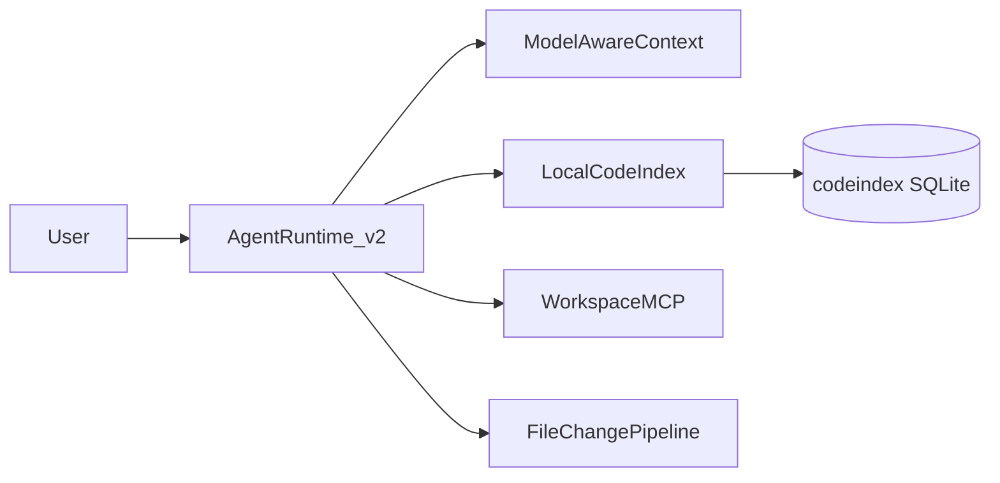

# Native Cursor parity (local-first)

**Last updated:** June 2026

Neural Junkie native agents target **Cursor-equivalent workspace access** without `@Cursor` CLI or cloud indexing defaults. Inference and embeddings stay on-device (Ollama) unless the user explicitly selects a cloud provider.

## Parity dimensions

| Dimension | Cursor | NJ acceptance |
|-----------|--------|---------------|
| Edit primitive | `search_replace`, `apply_patch`, full write | `search_replace`, `apply_patch`, `propose_file_edit` (full file) via FileChange pipeline |
| File reach | Read/write/delete within workspace | `WorkspaceBackend` (local + `nj-remote`) |
| Discovery | Semantic + grep + glob at scale | `semantic_search` in 10k+ file repos |
| Agent loop | Open-ended until done | Agent Runtime v2 until success, guardrail, or cancel |
| Multi-file | Coordinated edits | Batched apply + checkpoint (no 5-file cap) |
| Verify | Build/test loop | Node, Go, Rust, Python, Terraform |
| Failure-driven repair | Read → edit → re-run on errors | **NJ Fix Loop** — circuit breaker, boot-fix playbooks, grounding gates |
| Context | Large effective context | Model-aware budget + CCR + `nj_retrieve_context` |
| Apply UX | Edits in editor | Auto-apply default in Agent mode; Monaco buffer sync |
| Governance | Optional | `interactive` / `auto_apply_edits` / `yolo` |

## Explicit non-goals

- VS Code extension marketplace
- Cloud semantic index (Turbopuffer-class) as default
- Cursor-class tab completion (tracked separately)
- Background cloud agents

## Feature flag

`features.agent_runtime_v2` (default **on** in v1.3+) enables:

- Open-ended Agent Runtime loop (replaces bounded impl-session caps)
- Model-aware prompt budgets from `ollama.num_ctx`
- Raised tool-output and retrieve limits in agent mode
- Disk-backed codebase index at monorepo scale

## Scenarios

Parity contract scenarios live under `scenarios/parity/`:

| Scenario | Proves |
|----------|--------|
| `large-repo-semantic-find` | Semantic search finds distant symbol |
| `multi-file-refactor-10` | 10+ file coordinated edit |
| `long-agent-loop-repair` | Verify/repair without manual continuation |
| `remote-ssh-implement` | `nj-remote` file apply path |

Run:

```bash
make server-regression
make parity-scenarios          # all parity scenarios
make test-parity-full-restart  # implement + parity, 3× with hub restart
```

## Architecture



## Related

- [IMPLEMENTATION_SESSION.md](IMPLEMENTATION_SESSION.md) — legacy bounded session (v1)
- [CONTEXT_COMPRESSION.md](CONTEXT_COMPRESSION.md) — CCR + retrieve
- [TESTING.md](TESTING.md) — parity gates
- [HARDWARE.md](HARDWARE.md) — `num_ctx` tiers
