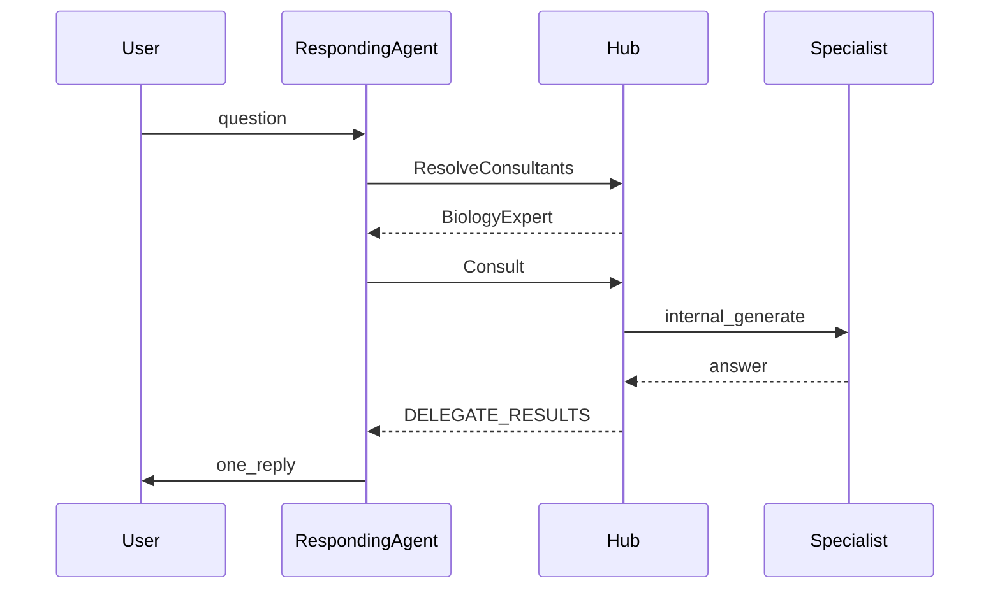

# Agent delegation (cross-specialist consult)

Neural Junkie can let **any in-process hub agent** consult **other registered specialists** when a user question fits another domain better. The agent the user talked to still posts **one synthesized reply**.

## How it works

1. User messages an agent (DM, custom channel, etc.).
2. Hub **registry** scores all other runtime specialists (`Expertise` + type keywords).
3. Consultants with score above threshold—and higher than the responding agent's self-score—are consulted (up to `max_consults_per_turn`, default 2).
4. Consult runs **in-process** (no public handoff message unless visibility is changed later).
5. Results appear in the prompt as `=== DELEGATE_RESULTS ===`; the responding agent's model merges them.

**Context v2:** Delegation runs after turn intent classification. It is **skipped** for `closure` and `casual` intents so greetings and small talk do not trigger cross-agent consults. See [CONTEXT_MODEL.md](CONTEXT_MODEL.md).



## Enable

**Settings → AI & providers → Agent delegation** — toggle **Enable cross-agent delegation**.

Or in `~/.neural-junkie/config.json`:

```json
"delegation": {
  "enabled": true,
  "max_consults_per_turn": 2,
  "max_depth": 1,
  "min_relevance_score": 2,
  "visibility": "silent",
  "biology_chat_model": "koesn/llama3-openbiollm-8b:latest",
  "biology_tool_model": "qwen2.5:7b"
}
```

Default is **`enabled: false`** (no behavior change until you turn it on).

## Biology pack integration

| Intent | Behavior |
|--------|----------|
| `domain_reasoning` | Specialist chat model (e.g. OpenBio for biology) via model consult |
| `domain_tools` | Specialist runtime agent + MCP tools (tool loop with qwen fallback when needed) |

Supported `domain_tools` targets when the consultee has MCP tools: **BackendEngineer**, **PlatformEngineer**, **DatabaseSpecialist**, **FrontendEngineer**, **SecurityReviewer**, **CodeReviewer**, **SoftwareArchitect**, **RustExpert**, and **BiologyExpert**. Classification uses keyword heuristics on the sub-question (see `internal/delegation/classify_tools.go`).

See [BIOLOGY_PACK.md](BIOLOGY_PACK.md) for model pulls and disclaimers.

## Limits

- **In-process hub agents only** (not standalone `cmd/agent` subprocesses).
- **No delegation** during collaboration task/recap messages (collab orchestration owns multi-agent flow).
- **Max depth** 1 — no consult chains (A→B→C).
- **Moderator** is not a consult target.

## Debug

When `NEURAL_JUNKIE_DEBUG=1`:

```bash
curl 'http://localhost:18765/api/debug/delegation-resolve?from=BackendEngineer&q=review+this+api+change'
```

## Related

- [CONTEXT_MODEL.md](CONTEXT_MODEL.md) — Conversation Context Stack v2; turn intent runs before delegation augments the prompt.
- [AGENT_REVIEW.md](AGENT_REVIEW.md) — user-driven second opinion (@mention), not automatic consult.
- [COLLABORATION.md](COLLABORATION.md) — structured multi-agent projects.
