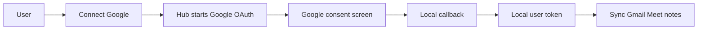

# Google Meet Notes

Google Meet notes lets Assistant sync Gemini meeting notes from Gmail into Neural Junkie.

## Public Path: Connect Google

Release builds can include the Neural Junkie Google OAuth app. In that path, users do not paste OAuth client credentials.



Use **Settings -> Integrations -> Google Meet notes -> Connect Google**. After consent, use **Sync now** or ask Assistant about synced meeting notes.

## Advanced: Custom OAuth Client

Self-hosted and dev builds can bring their own Google Cloud OAuth client:

1. Create a Google Cloud OAuth web client.
2. Add this redirect URI exactly:

```text
http://localhost:18765/api/assistant/google/callback
```

3. In Neural Junkie, open **Settings -> Integrations -> Google Meet notes -> Advanced (bring your own Google OAuth client)**.
4. Paste the Client ID, Client Secret, and Redirect URI, then save.
5. Click **Connect Google**.

Environment variables are also supported for local/dev runs:

```bash
NEURAL_JUNKIE_GOOGLE_OAUTH_CLIENT_ID=your-client-id.apps.googleusercontent.com
NEURAL_JUNKIE_GOOGLE_OAUTH_CLIENT_SECRET=your-client-secret
NEURAL_JUNKIE_GOOGLE_OAUTH_REDIRECT_URL=http://localhost:18765/api/assistant/google/callback
```

Credential resolution order is:

1. Environment variables.
2. Bundled release credentials (`-tags googlevendor`).
3. Saved Advanced custom client config.

## Release Builds

Release CI writes the gitignored vendor credential file from GitHub Actions secrets:

```bash
GOOGLE_VENDOR_CLIENT_ID=...
GOOGLE_VENDOR_CLIENT_SECRET=...
./scripts/ci-write-google-vendor-oauth.sh
go build -tags "slackvendor googlevendor" ./cmd/server
```

The generated file is `internal/google/meetnotes/vendor/oauth.json` and should not be committed.

## Scopes And Verification

The integration requests read-only Gmail and Drive scopes:

- `https://www.googleapis.com/auth/gmail.readonly`
- `https://www.googleapis.com/auth/drive.readonly`

These scopes are sensitive. A public Google OAuth app may require Google OAuth consent verification before broad external distribution. For early/internal use, configure the OAuth app as Internal if your Google Workspace allows it, or add test users while the app is in testing mode.

## Smoke Tests

- Release/dev build with env vars: **Connect Google** opens the Google consent URL.
- Advanced custom client: save credentials, connect, then sync notes.
- No credentials: **Connect Google** is disabled and Settings explains Advanced setup.
