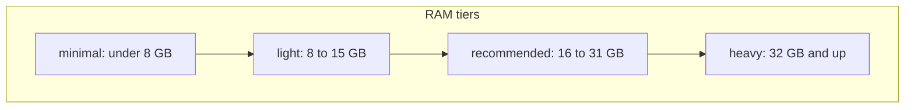

# Hardware requirements

**Last updated:** June 2026 · **Current beta:** [v1.2.0-beta.5](https://github.com/camronwood/neural-junkie/releases/tag/v1.2.0-beta.5)

Neural Junkie is lightweight as an **app**; the hardware story is about **models**, **concurrency**, and what you expect local agents to do. This doc is the authoritative reference for disk, RAM, and tiered model choices. The setup wizard and **Settings → AI Providers** use the same tiers via `GET /api/system/hardware`.

---

## App footprint (small)

| Component | Typical size |
|-----------|----------------|
| Desktop installer (Tauri + hub sidecar) | ~10–15 MB app bundle |
| Ollama **runtime** (bundled macOS; wizard on Linux/Windows) | ~1–2 GB per platform |
| Hub process | Modest CPU/RAM; listens on `http://localhost:18765` |
| Session / config under `~/.neural-junkie/` | Grows with history; bounded per channel |

macOS bundles the Ollama **runtime**; Linux and Windows install it via the setup wizard. Installers never bundle models — first model pull is a one-time download (often several GB). See [DOWNLOAD.md](DOWNLOAD.md).

**From source:** Go 1.23+, Node 18+, Rust (desktop only). Downloaded builds need none of these.

---

## Default model footprint (local Ollama)

From [GETTING_STARTED.md](GETTING_STARTED.md) — software development track:

| Role | Default tag | Disk (approx) |
|------|-------------|---------------|
| Coding specialists | `qwen2.5-coder:14b` | ~9 GB |
| Moderator + Assistant (utility) | `qwen3.5:9b` | ~6.6 GB |

**Typical first-run disk:** installer + runtime + both models ≈ **15–20 GB**.

Lighter alternatives in the Model library: `qwen3.5:9b` (~6.6 GB), `gemma3:12b` (~8.1 GB, optional Assistant upgrade — release benchmark co-winner), `llama3.2:3b` (~2 GB). Life sciences and CAD tracks use different defaults — see [BIOLOGY_PACK.md](BIOLOGY_PACK.md) and [CAD_PACK.md](CAD_PACK.md).

---

## RAM tiers and recommended models

The hub classifies installed RAM into four tiers (`GET /api/system/hardware`). Boundaries use whole GB (floor from total bytes).

**Live memory monitor:** `GET /api/system/memory` reports system RAM usage. On macOS it uses the same **App + Wired + Compressed** formula as Activity Monitor’s breakdown (via `vm_stat` + `vm.page_pageable_internal_count`). The headline “Memory Used” figure in Activity Monitor can read slightly higher than that sum because Apple also accounts for cached/file-backed pages separately.



| Tier | RAM | Developer / CAD primary | Utility | Good for |
|------|-----|-------------------------|---------|----------|
| **minimal** | &lt; 8 GB | `llama3.2:3b` or `qwen3.5:9b` | `qwen3.5:9b` | Light chat; collab/repo work may struggle — prefer cloud hybrid |
| **light** | 8–15 GB | `qwen3.5:9b` | `qwen3.5:9b` | Safe local dev; skip 27B default |
| **recommended** | 16–31 GB | `qwen2.5-coder:14b` | `qwen3.5:9b` | Full software pack, repo agents, collaboration |
| **heavy** | 32 GB+ | `qwen2.5-coder:14b` (+ optional `qwen3.5:27b`, LoRA bases, 70B experiments) | `qwen3.5:9b` | Multi-model library, LoRA training with CUDA |

**Life sciences:** `koesn/llama3-openbiollm-8b:latest` + `qwen3.5:9b` for tools on most tiers; under 8 GB, prefer cloud Hugging Face in the wizard.

**Team chat / productivity:** `qwen3.5:9b` only — lowest local footprint.

### Recommended stacks (inference + LoRA)

Neural Junkie uses a **two-tier model strategy**: Qwen for day-to-day inference and tool loops; Llama/Mistral bases for composed `nj-*` LoRA specialists. The hub exposes the same stacks via `GET /api/system/hardware` (`recommended_stacks`).

| Tier | Inference stack | LoRA stack (optional) | Disk (approx) |
|------|-----------------|----------------------|---------------|
| **minimal** | `qwen3.5:9b` + cloud hybrid | none | ~10 GB |
| **light** | `qwen3.5:9b` (chat + tools) | 1 base + 1 composed tag (e.g. `nj-security:14b`) | ~15 GB |
| **recommended** | `qwen2.5-coder:14b` + `qwen3.5:9b` (+ optional `qwen3.5:27b`, `gemma3:12b`) | 3 bases + 4 bootstrap tags | ~35 GB |
| **heavy** | above + OpenBio / optional CAD imports | full specialist-tuning bootstrap | ~50+ GB |

Collab smart routing may suggest composed tags you have not installed yet — the router falls back to your agent default model. See [LORA_ADAPTERS.md](LORA_ADAPTERS.md).

### Estimated RAM for a model tag

For catalog models, the app derives:

```
estimated_ram_gb = ceil(model_disk_gb × 1.25 + 4)
```

The **4 GB** headroom covers OS, hub, and Ollama runtime. Example: `qwen3.5:27b` (~17 GB disk) → **26 GB** suggested RAM. Lookup: `GET /api/ollama/library/lookup?name=qwen3.5:27b`.

---

## Multi-agent ≠ multi-model

Specialists **share one Ollama backend**. You are not loading six separate 14B weights for six agents. You **do** pay for:

- **Sequential inference** when several agents reply in a thread or collaboration
- **Hub memory** for message history, repo indexes, session state
- **Extra disk** if you add LoRA bases (`llama3.1:8b`, `mistral:7b`, …) on top of Qwen

LoRA adapters (~tens of MB each) reduce “five full 14B downloads” — see [LORA_ADAPTERS.md](LORA_ADAPTERS.md).

---

## Optional workloads

| Feature | Extra requirements |
|---------|-------------------|
| **LoRA training** | Specialist tuning pack; Python `.venv-lora` (`make deps-lora`); **CUDA strongly recommended** — see [LORA_TRAINING.md](LORA_TRAINING.md) |
| **Repo agents** | Index capped at **2000** source file bodies in memory; large monorepos are trimmed |
| **Personal learning** | Ollama embeddings; no CUDA required — [PERSONAL_LEARNING_V2.md](PERSONAL_LEARNING_V2.md) |
| **Collaboration** | Local 7B/14B variance in plan quality — [KNOWN_ISSUES.md](KNOWN_ISSUES.md) (`collab-model-variance`) |
| **Slack bridge** | Hub must stay running locally (Socket Mode) |

---

## Hybrid strategy

- **Local (Ollama, LM Studio):** broad iteration, repo Q&A, specialist chat — no per-token bill
- **Cloud (Claude, OpenAI-compatible APIs):** hard reviews, long-context passes, when local models are not enough
- **Smart routing (optional):** execution tasks only — Settings → AI Providers

See [USER_VALUE_GUIDE.md](USER_VALUE_GUIDE.md).

---

## Platform matrix

| Platform | Installer | Notes |
|----------|-----------|-------|
| macOS Apple Silicon | `.dmg` (`aarch64`) | Developer ID signed + notarized when CI secrets configured |
| macOS Intel | `.dmg` (`x64`) | Same as Apple Silicon |
| Windows | `.msi` / `.exe` | Slim build — wizard **Install Ollama** |
| Linux | `.deb` | Slim build — wizard **Install Ollama**; AppImage not on stable download page |

Full install table: [DOWNLOAD.md](DOWNLOAD.md).

---

## Honest limits

Public tracker: [KNOWN_ISSUES.md](KNOWN_ISSUES.md) · [known-issues.html](known-issues.html)

| ID | Summary |
|----|---------|
| `collab-model-variance` | Optional **planning provider** in Settings; 14B+ local or cloud recommended |
| `hub-history-bounded` | Export + durable channel toggle; 5000 msg cap remains |
| `collab-model-variance` | Local models vary in collaboration quality and timeouts |
| `single-hub` | Single-server — no horizontal scale |
| `web-ui-thin` | Browser hub UI is chat-only — use desktop for full workspace |

---

## API reference

| Method | Path | Purpose |
|--------|------|---------|
| `GET` | `/api/system/hardware` | Total RAM, tier, per-track model recommendations |
| `GET` | `/api/system/memory` | Live RAM usage, tier, Ollama loaded models (`/api/ps`) |
| `GET` | `/api/ollama/library/lookup?name=…` | Catalog `size_hint`, estimated disk/RAM |

Implementation: [`internal/hardware/`](../internal/hardware/).

---

## Related

- [GETTING_STARTED.md](GETTING_STARTED.md) — pull models, provider setup
- [DOWNLOAD.md](DOWNLOAD.md) — installers and troubleshooting
- [LORA_ADAPTERS.md](LORA_ADAPTERS.md) — disk-efficient specialists
- [marketing/HARDWARE-LINKEDIN.md](../campaigns/hardware/HARDWARE-LINKEDIN.md) — LinkedIn article publish copy
