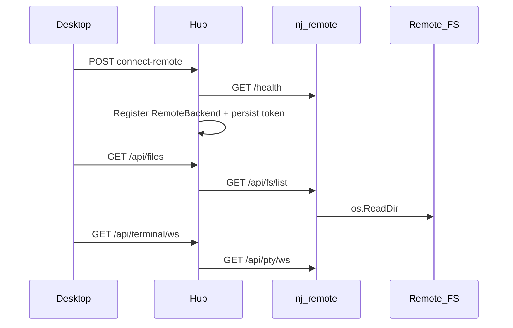

# IDE v4 — full editor depth, remote workspaces

**Status:** Shipped in v1.2 — full Monaco LSP client, remote SSH via `nj-remote` sidecar, dev container attach plan, tree-sitter symbols.

IDE v4 completes the software development pack editor story started in [IDE_V2.md](IDE_V2.md) and [IDE_V3.md](IDE_V3.md).

## What's new in v4

| Feature | Description |
|---------|-------------|
| **Full LSP (local)** | Persistent `gopls` / `rust-analyzer` / `pyright-langserver` via hub WebSocket; `didOpen`/`didChange`/`didClose`; real-time diagnostics; Monaco hover, completion, go-to-definition, find references, rename |
| **LSP-lite fallback** | Workspace-wide Go/Rust/Python squiggles via REST when WebSocket session is unavailable |
| **WorkspaceBackend** | Pluggable local + remote filesystem/exec (`internal/workspacebackend/`) — file IO, git, search, symbols, file changes, `@codebase` |
| **nj-remote sidecar** | `cmd/nj-remote` — HTTP FS, one-shot exec, PTY WebSocket on SSH host or container |
| **Remote SSH workspaces** | Desktop **Remote SSH** wizard + `POST /api/workspaces/connect-remote`; token persist + sidecar health check on connect and hub startup |
| **Remote terminal** | Hub proxies `GET /api/terminal/ws` → sidecar PTY; desktop routes terminal tabs and one-shot exec for remote workspaces |
| **Dev containers** | `GET /api/workspaces/devcontainer-plan` — parse `.devcontainer/devcontainer.json` (run `nj-remote` in container after attach) |
| **tree-sitter symbols** | Optional upgrade to symbol index when `tree-sitter` CLI is on PATH |
| **Editor trust** | `yolo` mode auto-approves file changes like `auto_apply_edits` |

## LSP APIs

| Endpoint | Purpose |
|----------|---------|
| `GET /api/lsp/ws?workspace=&lang=` | WebSocket JSON-RPC relay (notifications + requests; `publishDiagnostics` push) |
| `POST /api/lsp/hover` | Hover with optional `didOpen` bootstrap |
| `POST /api/lsp/request` | Arbitrary LSP request (completion, definition, references, rename) |
| `GET /api/lsp/{go,rust,python}/diagnostics` | LSP-lite fallback (one-shot CLI) |

Desktop: `desktop/src/lsp/lspConnection.ts` manages document sync; `useMonacoLSP.ts` registers Monaco providers.

## Remote workspace flow



1. Start sidecar on remote host: `nj-remote -root /path/to/repo -addr :19876 -token SECRET`
2. Tunnel (if needed): `ssh -L 19876:127.0.0.1:19876 user@host`
3. Desktop **Add workspace → Remote SSH** → hub stores `sidecar_url`, `kind=ssh`
4. File/git/search/symbols/file-changes/`@codebase`/terminal route through `WorkspaceBackend`

## nj-remote

```bash
make build-nj-remote
./nj-remote -root ~/projects/myapp -addr :19876 -token "$NJ_REMOTE_TOKEN"
```

| Endpoint | Purpose |
|----------|---------|
| `GET /health` | Sidecar liveness (hub checks on connect/startup) |
| `GET /api/fs/list` | Directory listing |
| `GET /api/fs/read` | Read file |
| `POST /api/fs/write` | Write file |
| `GET /api/fs/stat` | Stat |
| `POST /api/exec` | One-shot command |
| `GET /api/pty/ws` | Interactive shell (WebSocket) |

## Dev containers

Place `.devcontainer/devcontainer.json` in repo root. NJ reads attach plan via:

`GET /api/workspaces/devcontainer-plan?workspace=<id>`

Returns container name, image, workspace folder, sidecar port. Run `nj-remote` inside the container after `devcontainer up`.

## Known limitations (v4.1)

| Limitation | Notes |
|------------|-------|
| **Remote LSP** | Language servers run on the **hub host** with the remote path string — not on the SSH machine. Use local workspaces for full LSP until sidecar LSP proxy ships. |
| **Dev container UI** | Plan API exists; desktop wizard is SSH-only today. |
| **MCP on remote** | `RunCommandViaBackend` pattern wired for `run_go_tests`; full MCP pack remote routing is incremental. |
| **Collab on remote** | Worktrees and collab sandboxes remain local-workspace only. |

## Editor trust (unchanged from v3)

| Mode | Behavior |
|------|----------|
| `interactive` | Manual file-change approval |
| `auto_apply_edits` | Auto-approve + verify when possible |
| `yolo` | Auto-approve file changes (tool parity) |

## Related

- [REMOTE_WORKSPACES.md](REMOTE_WORKSPACES.md) — security model
- [IMPLEMENTATION_SESSION.md](IMPLEMENTATION_SESSION.md) — agent sessions on local and remote backends
- [SOFTWARE_DEVELOPMENT_PACK.md](SOFTWARE_DEVELOPMENT_PACK.md)
