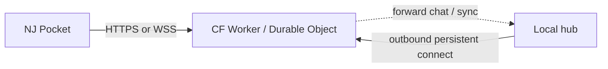

# Mobile companion app — future notes

**Captured:** July 2026  
**Status:** Exploratory reference for a future build. Not a roadmap commitment.

These notes capture a possible **separate mobile app** for Neural Junkie: a smaller, phone-native companion that focuses on chat, lightweight specialists, personal memory, and **local sync with desktop NJ**.

The goal is not to shrink the current desktop workspace onto a phone. The goal is to build a "little brother" app that borrows NJ's ideas while respecting phone constraints.

## Product thesis

Build a separate mobile app that:

- feels like NJ
- runs a small local model on-device
- works offline for core chat and personal workflows
- syncs with desktop NJ **over the local network**
- avoids desktop-only features like terminals, workspace editing, PTY sessions, and full repo workspaces

Possible product names:

- `NJ Pocket`
- `NJ Mobile`
- `NJ Companion`

**Cost posture:** Neural Junkie is **100% free forever**. Prefer **$0 to build and $0 to distribute** — same reason we host Slack OAuth on free Cloudflare Workers instead of paid infra. No paid store accounts, no IAP, no “pay Apple/Google to give the app away” unless a later discovery need forces native listing.

## Why a separate app

Current NJ is desktop-shaped:

- Desktop client is Tauri + React and assumes a hub/WebSocket workflow.
- Local model management assumes an Ollama-style runtime.
- Several core surfaces are desktop-specific: file explorer, Monaco editor, terminal, workspace mutation, and remote dev flows.

Relevant references:

- [ARCHITECTURE.md](ARCHITECTURE.md)
- [SECURITY.md](SECURITY.md)
- [IDE_V4.md](IDE_V4.md)

A phone app should reuse:

- agent/persona concepts
- pack vocabulary
- prompt conventions
- message formats
- settings language
- local-first product framing

It should not try to reuse the entire desktop shell.

## Recommended v1 scope

Ship a **chat-first, offline-first** mobile product.

### Include

- direct chat with `Assistant`
- 3 to 6 lightweight specialist personas
- saved conversations / lightweight threads
- notes, tasks, reminders
- optional voice / image input later
- optional handoff to desktop NJ

### Exclude

- code editor
- terminal
- file explorer
- workspace mutation
- repo-agent indexing
- SSH / devcontainer workflows
- full collaboration DAG execution

## Model strategy

Use **one shared local model** behind multiple personas.

That keeps the NJ "many specialists" feel without requiring multiple weights on the phone.

### Practical target

- 1B to 3B instruct model
- 4-bit quantization
- one default fast model tuned for latency, battery, and thermal limits

### Guidance

- `1B-2B` is the safest mobile tier.
- `3B` is the likely sweet spot on newer phones.
- `7B` may run on high-end devices, but should not define the default UX.

Multiple named experts should mostly be **prompt/persona layers**, not separate model downloads.

## Local sync with desktop NJ

Desktop NJ should be the **local sync host** and source of truth.

The mobile app should keep its own local database for offline use, then sync with the desktop when both devices are on the same network.

### Why local sync instead of cloud sync

- stays aligned with NJ's local-first posture
- avoids standing up hosted accounts / storage as a requirement
- keeps personal notes, tasks, and transcripts on user-controlled devices
- works for users who do not want cloud vendor lock-in

LAN sync is the **default** trust and discovery path. That does **not** rule out a later **anywhere** path — see [Anywhere access via edge relay](#anywhere-access-via-edge-relay). Anywhere access should still keep **compute and canonical state on the home hub**, not move the AI into a hosted cloud product.

## Current NJ building blocks

Today's desktop app already has useful pieces for a future sync design:

- hub auth sessions via `POST /api/auth/session`
- hub token support for non-loopback access
- channel ACLs and local-only route protections
- SQLite message persistence in `~/.neural-junkie/messages.db`
- SQLite conversation memory in `~/.neural-junkie/memory.db`
- assistant data persisted as JSON records under `~/.neural-junkie/assistant/`
- channel export and MCP export flows

Important constraint:

- current hub sessions are **in-memory** and expire on restart, so they should not be the long-lived trust anchor for device pairing

References:

- [SECURITY.md](SECURITY.md)
- [MCP_EXPORTS.md](MCP_EXPORTS.md)
- `cmd/server/auth_handlers.go`
- `internal/hub/auth.go`
- `cmd/server/channel_history_handlers.go`

## Recommended sync architecture

Treat sync as **record replication**, not file copying and not SQLite file mirroring.

### Desktop responsibilities

- own the canonical store for synced data
- advertise local sync when enabled by the user
- issue pairing credentials to mobile devices
- provide snapshot + incremental sync APIs

### Mobile responsibilities

- maintain a local database for offline reads and writes
- queue local changes while offline
- pull changes from desktop when reachable
- upload local mutations when bidirectional sync is enabled

## Data to sync

### Good v1 candidates

- direct-message channels
- personal threads
- notes
- tasks
- reminders
- lightweight persona definitions
- selected exported experts / pack metadata

### Avoid in v1

- workspaces
- file trees
- pending file changes
- terminal state
- PTY sessions
- local model binaries copied from desktop
- repo indexes and code-intelligence caches

## Sync data model

Define syncable logical record types rather than shipping raw storage files.

Suggested common fields:

- `id`
- `type`
- `updated_at`
- `deleted_at` (tombstone)
- `source_device_id`
- `version`

Suggested record families:

- `conversation`
- `message`
- `thread`
- `task`
- `reminder`
- `note`
- `memory_entry`
- `persona`
- `agent_export_ref`

### Merge strategy

- messages: append-only, dedupe by stable ID
- tasks / reminders / notes: last-write-wins first, with tombstones
- memory entries: desktop-authoritative in v1

This keeps the first implementation simple while leaving room for richer conflict handling later.

## Pairing and trust model

Do **not** rely on the current user session token as the permanent pairing identity.

Recommended flow:

1. User enables **Local sync** on desktop.
2. Desktop shows a QR code with host discovery info + one-time pairing token.
3. Mobile scans the QR code on the same LAN.
4. Desktop exchanges the one-time token for a long-lived device credential.
5. Mobile stores that credential securely and uses it for future sync.

### Security requirements

- sync must be opt-in
- desktop should listen on LAN only while sync is enabled
- every sync request must authenticate as a trusted device
- user/session/channel ACL should still apply
- paired devices should be revocable from desktop settings

### Nice-to-have hardening

- device public/private key pairs
- signed sync requests
- optional local TLS or encrypted session transport
- per-device sync audit log

## Transport and discovery

Preferred UX:

- QR pairing for first connection
- mDNS / Bonjour for local discovery after pairing

Fallback UX:

- manual host entry
- desktop-generated short code

Platform caveats:

- iOS requires Local Network permission
- background sync is limited on iOS
- mobile wake/sleep behavior means sync must tolerate intermittent connectivity

## Anywhere access via edge relay

**Captured:** July 2026 (follow-on to Slack OAuth relay discussion)

Goal: talk to your home-hub agents from **NJ Pocket anywhere**, without turning NJ into a cloud-hosted AI product.

### Product framing

> Anywhere access = thin Cloudflare tunnel / session relay, **not** cloud AI.

Slack already proves the *product* shape today: phone → agents on your machine (personal inbox / away mode), with the hub staying local. Pocket would be the first-party surface for that, without requiring Slack as the UI.

### What already exists

| Piece | Role today | Reuse for Pocket |
| --- | --- | --- |
| Slack OAuth relay (`workers/slack-oauth-relay/`) | Free HTTPS edge for OAuth redirects (`*.workers.dev`) | Proves CF Workers as a **zero-cost public edge** we already run |
| Slack Socket Mode bridge | Hub opens **outbound** connection; no public hub URL | Pattern for hub → edge durable connect |
| Personal inbox / away mode | Phone DMs reach local agents | UX proof that "from phone while hub runs locally" works |

The OAuth Worker itself is **not** enough — it is a one-shot HTTPS redirect. Pocket needs a **durable tunnel / session relay**.

### Recommended shape



- Hub opens an **outbound** connection to the free edge (same idea as Slack Socket Mode — no inbound port, no public hub listen URL).
- Pocket talks only to the relay (authenticated device credential).
- Agents, tools, memory, and approvals still run on the **home hub**.
- Edge stays thin: auth, fan-in, and short-lived forward — not model hosting, not long-term message storage as source of truth.

### Design constraints

- Opt-in separately from LAN sync ("Enable away / Pocket relay").
- Reuse the same **device pairing credential** model as local sync; revoke from desktop Settings.
- Do not expose the full hub HTTP API on the public internet; keep a small Pocket surface (chat send/receive, optional sync cursor).
- Prefer the same free Cloudflare footprint we already use for Slack OAuth; AWS Lambda is an optional alternate (same as OAuth relay).
- When the hub is offline, Pocket falls back to on-device chat / offline queue — same as LAN-unavailable behavior.

### Implementation note (later phase)

Land LAN pairing + offline-first Pocket first. Add the edge relay once pairing and the Pocket chat API are stable — otherwise "anywhere" couples tunnel ops to product discovery.

References:

- [SLACK_OAUTH_RELAY_SETUP.md](SLACK_OAUTH_RELAY_SETUP.md)
- [SLACK_INTEGRATION.md](SLACK_INTEGRATION.md) (personal inbox, away mode)
- `workers/slack-oauth-relay/`

## Sync protocol phases

### Phase 1: snapshot + pull

Start simple:

- mobile pairs with desktop
- desktop sends initial snapshot
- mobile stores local copy
- mobile periodically asks for changes since `cursor`

This is enough for:

- read-only transcript sync
- local notes/tasks/reminders mirror
- offline viewing with later refresh

### Phase 2: bidirectional sync

Add mobile-originated writes:

- create/update task
- create/update reminder
- save note
- start mobile conversation that syncs back to desktop

### Phase 3: richer handoff

- "Open on desktop"
- "Continue on phone"
- optional export/import of selected persona or history bundles

## Suggested API shape

Illustrative only:

```text
POST /api/mobile/pair/start
POST /api/mobile/pair/complete
GET  /api/mobile/sync/snapshot
GET  /api/mobile/sync/changes?cursor=...
POST /api/mobile/sync/push
POST /api/mobile/devices/revoke
GET  /api/mobile/devices
```

The important design choice is not the exact path names. It is keeping sync as a **small, explicit surface** instead of exposing the full desktop API to the phone.

## Implementation order

1. Mobile prototype with local-only storage and no sync
2. Pairing flow with desktop discovery
3. Read-only snapshot + incremental pull
4. Bidirectional sync for notes/tasks/reminders
5. DM/thread sync
6. Desktop handoff polish
7. Optional: anywhere access via edge tunnel relay (after Pocket chat API is stable)

This order proves product value before taking on full mobile/desktop convergence, and keeps "from anywhere" off the critical path for v1.

## Open questions

- Which mobile runtime is best for on-device inference?
- Should the mobile app have its own conversation memory store or only cache desktop memory?
- Should synced conversations be limited to DMs and personal channels in v1?
- How much of Assistant state should be editable on mobile vs view-only?
- Should pairing be per-user, per-device, or per-desktop install?
- For anywhere access: CF Durable Objects vs plain Worker + external session store? Same workers.dev account as Slack OAuth, or a separate `nj-pocket-relay` Worker?
- Should Pocket anywhere share device credentials with LAN sync, or require a second "away relay" grant?
- If a PWA is enough for chat + pairing + relay, should native Android APK stay optional forever?

## Distribution (stay free)

NJ (including Pocket) is **free forever** — no IAP, no paid app listing as monetization, no store cut that only exists because we charged users.

Prefer distribution that costs **$0**:

| Path | When | Cost |
| --- | --- | --- |
| **PWA / mobile web** (LAN hub or edge relay) | Default v1 | $0 (Cloudflare free tier if using the relay) |
| **Android APK** on GitHub Releases | Optional later | $0 (sideload; no Play Console) |
| **Slack personal inbox / away mode** | Interim phone UI today | $0 (already shipped) |
| App Store / Play Store | Only if discovery clearly requires it | Account fees even for free apps (~$99/yr Apple, ~$25 Google one-time) — **avoid by default** |

Do **not** plan native store submissions as a prerequisite for Pocket. Treat stores as a last resort distribution channel, not the product surface.

## Bottom line

If this ships, it should ship as:

> A separate NJ companion app with a small local model, offline-first chat, and explicit local sync to desktop NJ — with a later optional thin edge relay so Pocket can reach the home hub from anywhere without hosting the AI in the cloud. Distributed as a **free** PWA (and optional sideload), not as a paid-store product.

Not:

> The full desktop workspace squeezed onto a phone.

And not:

> A cloud chatbot with a phone UI that happens to share branding with NJ.

And not:

> A free app that still requires paying Apple or Google just to ship it.

That narrower shape is much more realistic and better aligned with the current NJ architecture.
