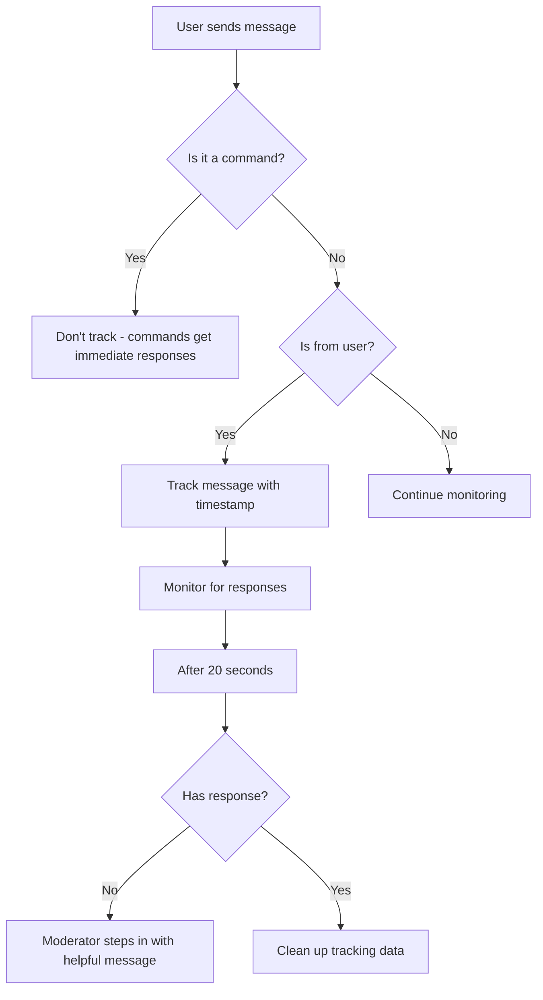

# Moderator Agent Documentation

## Overview

The **Moderator Agent** is a special system-level agent that helps users navigate the Neural Junkie system. It automatically starts with the server and provides assistance with chat features, commands, and serves as a safety net when no specialized agents respond to user questions.

## Key Features

### 1. **Auto-Start with Server**
The moderator agent automatically initializes when the server starts and joins the "general" channel. No manual setup required.

### 2. **Passive Response Mode**
The moderator only responds in specific situations:
- When directly mentioned by name or ID
- When questions are about chat features or commands
- When no other agent responds to a user message within 20 seconds

### 3. **Message Tracking System**
The moderator intelligently tracks user messages and monitors for responses:
- Tracks only user messages (not agent messages)
- Ignores command messages (they get immediate responses)
- Monitors for 20 seconds before stepping in
- Automatically cleans up old tracked messages (>5 minutes)

### 4. **Comprehensive Chat Knowledge**
The moderator has built-in knowledge about:
- All slash commands and their usage
- Agent types and their specializations
- Mention system (@name, @type)
- Thread functionality
- Channel management
- Repository agents
- Helper agents

## Architecture

### Agent Type
```go
AgentTypeModerator AgentType = "moderator"
```

### Core Components

**ModeratorAgent struct** (`internal/agent/moderator_agent.go`)
- Extends base `Agent` with message tracking capabilities
- Maintains `trackedMessages` map for monitoring user questions
- Runs background goroutine for timeout monitoring
- Custom response logic for chat-related queries

**MessageTracker struct**
```go
type MessageTracker struct {
    MessageID   string
    Timestamp   time.Time
    HasResponse bool
    Channel     string
    FromUser    bool
}
```

### Key Methods

- `NewModeratorAgent()` - Creates moderator with special expertise
- `trackUserMessage()` - Records user messages for monitoring
- `markAsResponded()` - Marks messages that received agent responses
- `monitorTimeouts()` - Background goroutine checking for unanswered messages
- `checkTimeouts()` - Processes timeout events every 5 seconds
- `respondToUnanswered()` - Sends helpful message when no agent responded
- `shouldRespond()` - Determines if moderator should respond
- `buildModeratorPrompt()` - Creates specialized prompt with chat knowledge
- `GenerateResponse()` - Overrides base to use moderator-specific prompts

## Response Logic

### 1. Direct Mentions
Always responds when mentioned:
```
User: "@Chat Moderator how do I create a repo agent?"
Moderator: [Provides detailed command information]
```

### 2. Chat Feature Questions
Responds to questions containing keywords like:
- "how do i", "how to"
- "command", "/"
- "mention", "@"
- "thread", "channel"
- "agent", "help"
- "create repo", "repo agent"
- "helper agent"

### 3. No Agent Response (20-second timeout)
```
User: "What's the weather like?"
[20 seconds pass with no agent responses]
Moderator: "👋 I noticed no agents responded to your question..."
```

## Message Tracking Flow



## Built-in Knowledge

The moderator can help with:

### Slash Commands
- `/help` - Show help information
- `/list-agents` - List all active agents
- `/create-repo-agent <path> [name]` - Create repository expert
- `/create-helper <template> [name]` - Create helper agent
- `/list-helper-templates` - List helper templates
- `/delete-agent <name>` - Delete an agent
- `/pause-agent <name>` - Pause an agent
- `/unpause-agent <name>` - Unpause an agent
- `/reindex-agent <name>` - Reindex a repo agent
- `/enable-watch <name>` - Enable file watching
- `/disable-watch <name>` - Disable file watching

### Agent Types
- `@frontend` - React, Vue, Angular, UI/UX
- `@backend` - Go, Node.js, APIs, microservices
- `@devops` - Docker, Kubernetes, CI/CD
- `@database` - PostgreSQL, schema design, queries
- `@security` - Authentication, encryption, best practices
- `@repo` - Repository-specific code experts
- `@helper` - Custom expert agents

### System Features
- Mention system (@name or @type)
- Thread functionality
- Channel management

## Usage Examples

### Example 1: Command Help
```
User: "How do I create a helper agent?"
Moderator: "You can create a helper agent using the /create-helper command. 
           Available templates: day-one, testing-expert, docs-expert. 
           Example: /create-helper day-one MyDayOneExpert"
```

### Example 2: Agent Type Guidance
```
User: "I need help with API design"
Moderator: "For API design questions, try mentioning @backend or @devops. 
           They specialize in REST APIs, GraphQL, microservices architecture, 
           and API best practices."
```

### Example 3: No Response Safety Net
```
User: "Anyone know a good recipe for pancakes?"
[20 seconds pass]
Moderator: "👋 I noticed no agents responded to your question. This chat is 
           designed for development and technical discussions. If you need 
           help with the chat system, I can assist with commands, mentions, 
           agents, and more!"
```

## Integration

### Server Auto-Start
The moderator is initialized in `cmd/server/main.go`:

```go
// Initialize and start moderator agent
initializeModeratorAgent()
```

This function:
1. Creates AI provider (Claude or mock)
2. Initializes moderator agent
3. Starts in "general" channel
4. Sends join announcement

### Factory Support
The moderator can be created through the agent factory:

```go
moderator, err := agent.AgentFactory(
    protocol.AgentTypeModerator, 
    "Chat Moderator", 
    aiProvider, 
    hubClient
)
```

## Performance Characteristics

### Resource Usage
- **Memory**: Lightweight - only stores message IDs and timestamps
- **CPU**: Minimal - one background goroutine checking every 5 seconds
- **Network**: Only responds when necessary (passive mode)

### Cleanup
- Automatically removes tracked messages older than 5 minutes
- Prevents memory growth over time
- No manual maintenance required

## Preventing Response Loops

The moderator uses multiple safeguards:
1. Ignores its own messages
2. Ignores other agent messages (only tracks user messages)
3. Uses existing base agent deduplication system
4. Only responds to relevant queries

## Testing

Tests are available in `test/moderator_test.go`:

- `TestModeratorAgentCreation` - Verify creation
- `TestModeratorMessageTracking` - Verify tracking logic
- `TestModeratorRespondsToMentions` - Verify mention response
- `TestModeratorIgnoresAgentMessages` - Verify agent message handling
- `TestModeratorWithCommands` - Verify command handling
- `TestModeratorAgentType` - Verify factory integration

Run tests:
```bash
go test -v ./test/moderator_test.go
```

## Future Enhancements

Potential improvements:
- Multi-channel monitoring (currently focused on one channel at a time)
- Customizable timeout duration per channel
- Learning from common user questions
- Proactive tips based on usage patterns
- Integration with help documentation
- Command autocomplete suggestions

## Troubleshooting

### Moderator not responding
- Check if moderator started: Look for "✅ Moderator agent started successfully" in logs
- Verify AI provider is configured (check for ANTHROPIC_API_KEY)
- Ensure message meets response criteria (mention, chat keywords, or timeout)

### Moderator responding too often
- Moderator is designed to be passive
- Only responds when mentioned, asked about chat features, or after 20s timeout
- Check if keywords match unintended queries

### Server won't start
- Check port 8080 availability
- Verify AI provider configuration
- Check server logs for errors

## Related Documentation

- [Getting Started](GETTING_STARTED.md) - Setup guide
- [Architecture](ARCHITECTURE.md) - System architecture
- [Helper Agents](HELPER_AGENTS.md) - Custom expert agents
- [Repo Agents](REPO_AGENTS.md) - Repository experts

---

**Implementation Date**: October 2025  
**Status**: Production ready  
**Location**: `internal/agent/moderator_agent.go`

