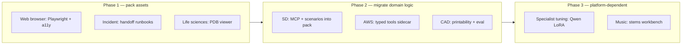

# Domain packs v2 roadmap

Planning document for the next generation of official domain packs.

**Last updated:** July 2026  
**Principle:** **Fat packs, thin core** — Neural Junkie without any packs installed must remain fully useful (Assistant, Moderator, CLI agents, chat, collab, Pack dev studio). Domain depth ships in pack repos, not in core.

**Related:** [PACKS.md](./PACKS.md) · [PACK_CAPABILITY_DEFS.md](./PACK_CAPABILITY_DEFS.md) · [PACK_CAPABILITIES.md](./PACK_CAPABILITIES.md) · [ROADMAP-Q3-2026.md](./ROADMAP-Q3-2026.md)

---

## Core stays thin

The hub and desktop app own **platform primitives** only:


| Core owns                                     | Packs own                                |
| --------------------------------------------- | ---------------------------------------- |
| Pack install, validate, upgrade, dev-link     | Domain specialists, MCP tools, sidecars  |
| Capability registry + extension kinds         | `capability_defs`, pack-local UI hooks   |
| Hub sidecar host + route proxy                | Python/Node sidecar implementations      |
| Generic workbench shell (editor + panel host) | Domain viewers, tools, and workflows     |
| Assistant, Moderator, CLI agent auto-detect   | Runbooks, scenarios, workspace guides    |
| Pack store, settings overlay merge            | Model eval suites, setup scripts, assets |


**Anti-pattern (v1 debt):** Domain logic embedded in `internal/mcp/`*, `builtin/*` agents, and desktop workbench components with no pack-owned counterpart. v2 migrates that logic **out** of core into pack repos over time.

**Reference implementation:** [music-creation](https://github.com/camronwood/neural-junkie-pack-music-creation) — `capability_defs`, hub sidecar, `WORKSPACE.md`, setup scripts, settings overlay. Customer lab packs follow the same pattern ([PACKS_CUSTOM.md](./PACKS_CUSTOM.md)).

---


## v1 → v2 pattern


| v1 (today)                                    | v2 (target)                                         |
| --------------------------------------------- | --------------------------------------------------- |
| Thin manifest (`pack.yaml` + release scripts) | Fat bundle: assets, sidecars, runbooks, scenarios   |
| Single expert per domain pack                 | Specialist roster where the domain warrants it      |
| Platform capability tokens only               | `capability_defs` for pack-local tools and UI       |
| Docs and evals in core repo                   | Pack repo owns smoke scenarios and model benchmarks |
| Hub implements domain MCP servers             | Pack sidecars + `mcp-tools` capability where needed |


### Standard v2 pack layout

```
pack.yaml
assets/
  WORKSPACE.md              # domain workflow guide
  hub/
    server.py               # sidecar entrypoint
    routes/*.py             # REST/MCP-adjacent handlers
  runbooks/                 # optional domain SOPs
  icons/                    # toolbar chips, branding
scenarios/                  # pack smoke / collab fixtures
scripts/
  setup-*.sh                # one-time domain deps
  verify-pack.sh
```

Core changes for v2 are **extension plumbing** (new `capability_defs` kinds, viewer ids, sidecar contracts) — not domain features.

---


## Pack-by-pack v2 vision


### 0. IDE (`ide`)

**v1 today:** Independent pack owning `layout_profile: ide` and IDE capability tokens (`ide-v2`, `ide-v3-composer`, `ide-v4`, `git-rest`, `inline-completion`). Core NJ includes file explorer and Monaco editor; IDE pack unlocks depth on top. Implementation lives in core; pack is the product boundary.

**Repo:** [neural-junkie-pack-ide](https://github.com/camronwood/neural-junkie-pack-ide)

---

### 1. Software development (`software-development`)

**v1 today:** Engineering specialists, dev MCP sidecar, Qwen Coder models. IDE capabilities moved to the **IDE** pack (v2.1+). Most specialist implementation still lives in core.

**v2 goals:**

- **Migrate MCP tool servers** into the pack repo (or pack sidecar) — backend, frontend, platform, database, security, code-review, architecture tools ship with the pack zip, not core releases.
- **Model stack refresh** in `pack.yaml` — align compose defaults with `qwen3.5:27b` primary and `qwen3.5:9b` utility tier.
- **Selective specialist expansion** — focused agents with tight MCP surfaces: SRE/Observability, Mobile, Data/ML (not more generic engineers).
- **Promote language experts** — `rust` from legacy slug to a first-class `agents` entry with pack-owned tools.
- **Pack-owned regression** — `scenarios/` + `make pack-smoke` in the pack repo (implement + collab gates for eng workflows).
- **Runbooks in pack assets** — security review, migration planning, incident handoff SOPs.
- **Explicit pack wiring** — documented consult/handoff patterns with incident-management, aws, and web-browser (today loosely coupled via `requires_packs` on satellite packs only).

**North star:** Orchestration hub for eng-adjacent packs — with domain depth living in the pack repo. IDE layout owned by the separate **IDE** pack.

**Repo:** [neural-junkie-pack-software-development](https://github.com/camronwood/neural-junkie-pack-software-development)

---


### 2. Life sciences (`life-sciences`)

**v1 today:** Single **BiologyExpert**, OpenBioLLM chat, `analyze_sequence` + `fold_protein` (ESMFold via HF), no capability tokens. Lab scan/QC/Phoenix lives in customer sideload packs.

**v1 explicit out-of-scope** ([BIOLOGY_PACK.md](./BIOLOGY_PACK.md)): SMILES/RDKit, scRNA, ESM3, in-app PDB viewer.

**v2 goals:**

- **Structure viewer workbench** — PDB/mmCIF viewer via pack `file-viewer` capability (parallel to CAD and web-browser workbenches).
- **Second specialist** — split sequence/QC from structure/cheminformatics (e.g. GenomicsExpert + StructuralBiologyExpert, or ChemInformaticsExpert with RDKit sidecar).
- **Local fold path** — optional sidecar for ESMFold or ColabFold so HF token is not mandatory for every fold.
- **Official runbook tier** — ship `sequence-review` and basic QC runbooks in the official pack; keep Phoenix/12-Plex in customer packs.
- `capability_defs` — `biology-tools` sidecar for RDKit, pathway DB lookups, BLAST.
- **Model refresh + eval** — newer bio LLMs with benchmark suite in pack repo (pattern: CAD `model-eval`).

**North star:** v1 is one expert + two tools. v2 is **bench + runbooks + optional cheminformatics**, with customer packs still owning org-specific LIMS/Phoenix.

**Implementation plan:** [LIFE_SCIENCES_V2.md](./LIFE_SCIENCES_V2.md) — specialists, sidecar, viewer, runbooks, eval, phased delivery.

**Repo:** [neural-junkie-pack-life-sciences](https://github.com/camronwood/neural-junkie-pack-life-sciences)

---


### 3. CAD (`cad`)

**v1 today:** **CADExpert**, OpenSCAD authoring, Three.js STL preview, param sliders, version history, optional FreeCAD for STEP export.

**v2 goals:**

- **Beyond OpenSCAD** — STEP/IGES import, mesh repair, printability checks (overhangs, wall thickness).
- **Assembly mode** — multi-part `.scad` projects with BOM and fit validation.
- **2D drawings** — dimensioned views from parametric models (FreeCAD sidecar).
- **Pack sidecar** — geometry validation, slicer preset export (Prusa/Orca), G-code sanity checks.
- **Model eval as product** — ship Phase 0 benchmark in pack repo with published leaderboard; data-driven default for `nj-cad:27b`.
- **Collab scenario** — design → render → export STL for print as a first-class pack smoke fixture.

**North star:** v1 is chat → SCAD → STL. v2 is **parametric design through manufacturing**, local-first.

**Repo:** [neural-junkie-pack-cad](https://github.com/camronwood/neural-junkie-pack-cad)

---


### 4. Specialist tuning (`specialist-tuning`)

**v1 today:** Meta-pack — personal learning, LoRA train/compose, bootstrap adapters (`nj-security`, `nj-code-review`, `nj-backend`, `nj-biology`). No new agents. Core already ships LoRA v2 training stack.

**v2 goals:**

- **Qwen-native LoRA** — when Ollama composes Qwen adapters, retire or demote Llama/Mistral bootstrap tier.
- **Auto-train triggers** — configurable policy: after N turns in a repo expert channel, suggest training.
- **Cross-pack adapter catalog** — pack declares adapters for every official pack (CAD, AWS, incident, music lyrics), not only SD + biology.
- **Training sidecar** — move Unsloth/training orchestration behind a pack sidecar (lighter hub, easier GPU isolation).
- **Closed learning loop** — personal learning → export rows → one-click LoRA → assign back (documented in pack `WORKSPACE.md`).
- **Eval-before-assign** — mini benchmark per adapter before promoting to a production agent.

**North star:** v1 is opt-in training. v2 is **experts get sharper by default** without users understanding LoRA.

**Repo:** [neural-junkie-pack-specialist-tuning](https://github.com/camronwood/neural-junkie-pack-specialist-tuning)

---


### 5. AWS (`aws`)

**v1 today:** **AWSExpert**, read-only `aws_cli_query`, SSO profile picker, four MCP tools.

**v2 goals:**

- **Structured tools** — typed `describe_ec2_instances`, `list_s3_buckets`, `get_lambda_config` with schemas and pagination (more reliable than free-form CLI passthrough).
- **IaC awareness** — parse workspace `terraform/` / `cdk/` / CloudFormation; correlate live state vs declared.
- **Cost and security lenses** — Cost Explorer summaries, Security Hub / GuardDuty read-only findings, IAM policy analyzer.
- **Multi-account** — Organizations traversal with explicit account allowlists.
- **Gated write mode** — opt-in mutating ops with confirmation + audit log (v1 is read-only only).
- **Collab with incident-management** — prod alarm → AWSExpert traces resource → IncidentManager files Jira (pack-owned scenario).
- **Role clarity vs PlatformEngineer** — AWS pack owns cloud **account truth**; PlatformEngineer owns **repo/k8s/CI** — document and wire consult triggers in pack assets.

**North star:** v1 is SSO + describe. v2 is an **account-aware SRE copilot** paired with eng and incident packs.

**Repo:** [neural-junkie-pack-aws](https://github.com/camronwood/neural-junkie-pack-aws)

---


### 6. Incident management (`incident-management`)

**v1 today:** **IncidentManager**, Jira Cloud MCP (get/search/comment/summarize). Requires software-development pack.

**v2 goals:**

- **Multi-ticketing** — GitHub Issues, Linear, PagerDuty, Sentry (not Jira-only).
- **Create and transition issues** — v1 is mostly read + comment; v2 adds create, assign, priority, status transitions with approval gates.
- **Automated handoff runbooks** — pack assets: triage → reproduce → `@BackendEngineer` fix proposal → Jira update.
- **Postmortem workflow** — template generation, timeline from channel export, action items.
- **Sentry/stack trace ingestion** — paste trace → structured repro steps → link to code (via SD pack).
- **Severity rubric** — P0–P4 definitions in pack assets for consistent agent behavior.

**North star:** v1 is Jira triage assistant. v2 is an **incident commander** that closes the loop to engineering specialists.

**Repo:** [neural-junkie-pack-incident-management](https://github.com/camronwood/neural-junkie-pack-incident-management)

---


### 7. Web browser (`web-browser`)

**v1 today:** **WebBrowserExpert**, `fetch_url` + `web_search`, HTML preview workbench, dev-server URL mode. Requires software-development pack.

**v2 goals:**

- **Real browser automation** — Playwright sidecar (screenshot, click, fill forms) — bridge between fetch HTML and test my app.
- **A11y audit** — axe-core integration, WCAG report in workbench.
- **Visual regression** — screenshot diff across breakpoints; ties to collab scenarios like `make-me-a-website`.
- **Performance panel** — Lighthouse-lite metrics for localhost previews.
- **DOM inspector** — select element in preview → inject into chat context for FrontendEngineer.
- **Responsive toolbar** — mobile/tablet/desktop presets in workbench.

**North star:** v1 is preview static HTML. v2 is **verify the site actually works** — the frontend QA layer for the SD pack.

**Repo:** [neural-junkie-pack-web-browser](https://github.com/camronwood/neural-junkie-pack-web-browser)

---


### 8. Music creation (`music-creation`)

**v1 today:** Most mature pack. **MusicExpert**, ACE-Step 1.5 sidecar, lyrics via Ollama, inline player, model variants (SFT/Turbo/XL), `WORKSPACE.md`, setup scripts. Catalog version 1.0.1+.

**v2 goals:**

- **Lower setup friction** — optional bundled weights, progress UI, better tier below full ACE-Step install (improve on `NJ_MUSIC_DEMO=1`).
- **Stems and MIDI** — separate vocals/drums/bass; MIDI export for DAW handoff.
- **Music workbench** — waveform editor, loop regions, A/B compare generations (CAD/browser workbench pattern).
- **Multi-track arrangement** — verse/chorus structure as editable timeline, not single-shot generation.
- **Collab scenario** — lyrics → generate → iterate style → export stems as pack smoke test.
- **Album workflow** — formalize EP project workspace guide (cover art via image gen already documented).

**North star:** v1 proves pack sidecars work. v2 makes music a **first-class creative workbench**, not just a chat command.

**Repo:** [neural-junkie-pack-music-creation](https://github.com/camronwood/neural-junkie-pack-music-creation)

---

### 9. Maps (`maps`)

**v1 today:** **MapsExpert** — Nominatim geocode + OSRM walking/driving routes via pack sidecar, interactive Neural Canvas `nj.map` artifacts (Leaflet + OSM tiles). No API keys for public OSM endpoints.

**v2 goals:** bike/transit profiles, optional self-hosted OSRM, traffic-aware providers behind settings, richer itinerary editing on canvas.

**Repo:** [neural-junkie-pack-maps](https://github.com/camronwood/neural-junkie-pack-maps)

---


## Suggested sequencing

Prioritized by impact vs effort and alignment with collab reliability work (Q3 2026).


| Priority | Pack                     | Rationale                                                                      |
| -------- | ------------------------ | ------------------------------------------------------------------------------ |
| 1        | **Web browser**          | Collab website scenarios exist; largest gap between promise and capability     |
| 2        | **Incident management**  | Natural glue for collab reliability; handoff runbooks are mostly pack assets   |
| 3        | **Life sciences**        | PDB viewer unlocks visible value; v1 out-of-scope list is a ready backlog      |
| 4        | **Software development** | Manifest/model refresh + migrate MCP into pack; avoid new IDE features in core |
| 5        | **AWS**                  | Typed tools + cost/security before write mode                                  |
| 6        | **CAD**                  | Manufacturing path + eval maturity                                             |
| 7        | **Specialist tuning**    | Waits on Ollama Qwen LoRA support + training sidecar                           |
| 8        | **Music**                | Already strongest; v2 is polish and workbench depth                            |


### Phased rollout




---


## Core work required (thin additions only)

These are platform changes that **enable** fat packs without shipping domain features in core:

1. **Sidecar + MCP host contracts** — stable `NJ_PACK_SETTINGS_JSON`, health checks, route proxy, pack-owned MCP registration via `mcp-tools` capability.
2. **Generic workbench host** — desktop loads pack-declared `file-viewer` panels without hard-coded domain components in core (migrate CAD/browser viewers to pack-registered viewers over time).
3. **Pack scenario runner** — hub or script hook to run `scenarios/` from an installed pack for smoke/regression (optional `make pack-smoke` convention).
4. **Agent implementation indirection** — `implementation: pack/<module>` or sidecar-backed specialists so new experts do not require core `builtin/`* entries.
5. **Documentation split** — per-pack v1 docs in core become **summaries**; pack repos own detailed WORKSPACE guides and release notes.

---


## What stays in core forever

- Assistant, ChatModerator, CLI agent auto-detect
- Channels, collab, runbooks **engine** (not domain runbook content)
- Pack store, catalog, install/upgrade/dev-link
- Capability registry and extension kinds
- Hub sidecar process manager
- Generic IDE shell (when SD pack enables layout tokens — tokens stay platform, features ship in pack)
- Security, auth, message store, memory

---


## Success criteria for v2

- [ ] Fresh Neural Junkie install with **zero packs** passes core smoke (chat, Assistant, collab, Pack dev studio).
- [ ] Each official pack v2 zip is **self-describing**: `make verify` + `make pack-smoke` green without core domain code for that pack.
- [ ] New domain feature PRs default to **pack repo first**; core PRs only for extension plumbing.
- [ ] Music creation pattern is the template, not the exception.

---


## See also


| Pack                 | v1 doc                                                         |
| -------------------- | -------------------------------------------------------------- |
| Software development | [SOFTWARE_DEVELOPMENT_PACK.md](./SOFTWARE_DEVELOPMENT_PACK.md) |
| Life sciences        | [BIOLOGY_PACK.md](./BIOLOGY_PACK.md) · [LIFE_SCIENCES_V2.md](./LIFE_SCIENCES_V2.md) |
| CAD                  | [CAD_PACK.md](./CAD_PACK.md)                                   |
| Specialist tuning    | [SPECIALIST_TUNING_PACK.md](./SPECIALIST_TUNING_PACK.md)       |
| AWS                  | [AWS_PACK.md](./AWS_PACK.md)                                   |
| Incident management  | [INCIDENT_PACK.md](./INCIDENT_PACK.md)                         |
| Web browser          | [WEB_BROWSER_PACK.md](./WEB_BROWSER_PACK.md)                   |
| Music creation       | [MUSIC_CREATION_PACK.md](./MUSIC_CREATION_PACK.md)             |


