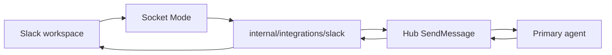
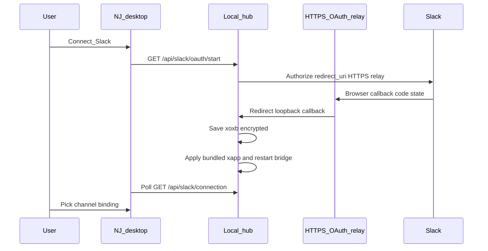

# Slack integration

Neural Junkie can assign **one primary agent per Slack channel** to respond when @mentioned (default) or under broader policies. Replies post through the Slack app with a customized display name (e.g. **Camron**) via `chat:write.customize`.

## Architecture



The bridge runs **in-process** with the local hub (`127.0.0.1:18765` by default). It uses **Socket Mode** so the hub does not need a public URL.

## Public path: Connect Slack (recommended)

End users do **not** paste `xapp` or `xoxb` tokens. The desktop app uses a bundled **Neural Junkie** Slack app (maintainer build) and OAuth through a **public HTTPS relay** so the app can be installed in **any** Slack workspace (unlisted public distribution).



**Public distribution vs App Directory:** Enable **Activate Public Distribution** in the Slack app (Manage Distribution). That allows OAuth installs in other workspaces. You do **not** need the Slack App Directory / Marketplace — Socket Mode apps cannot be listed there, and NJ does not require it.

1. **Settings → Integrations → Slack** → **Connect Slack**
2. Approve the app in the browser; the hub saves the bot token and starts the bridge
3. Follow the **Setup checklist** (tokens, bridge, channels, binding)
4. **Load Slack channels**, pick an agent, save a binding (`mention_only` by default)
5. @mention the bot in that channel to talk to your agent

### Quick start (three tiers)

| Tier | What | When to use |
|------|------|-------------|
| **Core** | Connect + channel binding + @mention | Default — agent in a team channel |
| **Mobile inbox** | DM the bot from Slack | Settings section — personal inbox |
| **Forwarding** | Channel forward rules | Settings section — @mention, `nj:`, reaction |
| **Away assistant** | Human DM auto-reply | Settings section — human DM away mode |

Advanced BYO tokens and hub overrides stay under **Advanced** in Settings.

Status and workspace name: `GET /api/slack/connection`

## Advanced path: bring your own Slack app

Expand **Advanced (bring your own Slack app)** in Settings to paste:

- Socket Mode **app token** (`xapp-…`, scope `connections:write`)
- **Bot token** (`xoxb-…`) or use OAuth with your own client ID / secret / redirect URI

Redirect URI must match the hub, e.g. `http://localhost:18765/api/slack/oauth/callback` (or your custom hub port).

Optional file: `~/.neural-junkie/slack/oauth_app.json`

## Maintainer: release build with bundled credentials

1. Create the **Neural Junkie** Slack app at [api.slack.com/apps](https://api.slack.com/apps) (not a personal test workspace app for public builds).
2. Complete the [Slack app checklist](#release-checklist-slack-console) below.
3. Copy credentials into a **gitignored** vendor file (never commit):

```bash
chmod +x scripts/slack-creds-to-vendor.sh
./scripts/slack-creds-to-vendor.sh
```

This reads `scripts/.slack-creds` and writes `neural-junkie/internal/integrations/slack/vendor/oauth.json` with `client_id`, `client_secret`, `app_token`, and `oauth_relay_base` (no bot token in the bundle).

### Public HTTPS OAuth relay (required for multi-workspace installs)

Step-by-step checklist: [SLACK_OAUTH_RELAY_SETUP.md](SLACK_OAUTH_RELAY_SETUP.md)

Slack requires **HTTPS** `redirect_uri` values before you can enable public distribution. NJ ships a small relay service that:

1. Receives the browser callback from Slack on HTTPS
2. Forwards `code` + `state` to the user's local hub (`http://127.0.0.1:18765/...`)
3. Lets the hub complete `oauth.v2.access` and save tokens locally

Default relay base (after deploy): `https://nj-slack-oauth-relay.<your-cf-subdomain>.workers.dev` — set in `vendor/oauth.json` → `oauth_relay_base` or env `NEURAL_JUNKIE_SLACK_OAUTH_RELAY_BASE`.

**Deploy the relay (maintainer, once — free Cloudflare Workers):**

```bash
cd neural-junkie
make slack-oauth-relay-deploy-cf
# or: cd workers/slack-oauth-relay && npx wrangler login && npm run deploy
```

Requires a personal [Cloudflare account](https://dash.cloudflare.com/sign-up) and `npx wrangler login` (interactive browser) or `CLOUDFLARE_API_TOKEN`.

The script prints your `*.workers.dev` origin. Register these in the Slack app (**OAuth & Permissions → Redirect URLs**):

- `{relay_base}/api/slack/oauth/callback`
- `{relay_base}/api/slack/oauth/user-dm/callback`

Smoke test:

```bash
SLACK_OAUTH_RELAY_BASE=https://nj-slack-oauth-relay.YOUR_SUBDOMAIN.workers.dev ./scripts/verify-slack-oauth-relay.sh
```

Set the same base in CI / vendor JSON:

```bash
export SLACK_VENDOR_OAUTH_RELAY_BASE=https://nj-slack-oauth-relay.YOUR_SUBDOMAIN.workers.dev
gh secret set SLACK_VENDOR_OAUTH_RELAY_BASE --repo camronwood/neural-junkie
```

**Optional — AWS Lambda relay** (work account): `./scripts/deploy-slack-oauth-relay-aws.sh`

**Dev without relay:** Unset bundled vendor creds and use Advanced OAuth with loopback `http://localhost:18765/...` redirects (single-workspace Slack app only), or set `NEURAL_JUNKIE_SLACK_USE_OAUTH_RELAY=0`.

4. Build the hub with the release embed tag:

```bash
cd neural-junkie
go build -tags slackvendor -o bin/server ./cmd/server
```

Template (placeholders only, committed): `internal/integrations/slack/vendor/oauth.json.example`

### GitHub Actions (public installers)

Tagged releases (`.github/workflows/release.yml`) embed the real NJ Slack app so **Connect Slack** works for downloaders:

1. Add repository secrets (**Settings → Secrets and variables → Actions**):
   - `SLACK_VENDOR_CLIENT_ID`
   - `SLACK_VENDOR_CLIENT_SECRET`
   - `SLACK_VENDOR_APP_TOKEN` (`xapp-…`, scope `connections:write`)
   - `SLACK_VENDOR_OAUTH_RELAY_BASE` (HTTPS relay origin, no trailing slash)

2. From your maintainer creds file (same values as `scripts/.slack-creds`):

```bash
cd neural-junkie
./scripts/slack-creds-to-github-secrets.sh   # optional helper; requires gh auth
```

Or set manually:

```bash
gh secret set SLACK_VENDOR_CLIENT_ID --repo camronwood/neural-junkie
gh secret set SLACK_VENDOR_CLIENT_SECRET --repo camronwood/neural-junkie
gh secret set SLACK_VENDOR_APP_TOKEN --repo camronwood/neural-junkie
gh secret set SLACK_VENDOR_OAUTH_RELAY_BASE --repo camronwood/neural-junkie
```

3. Push a new tag (e.g. `v1.0.0-beta.15`) or re-run the Release workflow on an existing tag after secrets exist.

CI runs `scripts/ci-write-slack-vendor-oauth.sh` then `go build -tags slackvendor` on each platform. The generated `vendor/oauth.json` never leaves the runner.

Dev builds without `slackvendor` use the example embed (placeholders ignored), plus env vars:

- `NEURAL_JUNKIE_SLACK_CLIENT_ID`
- `NEURAL_JUNKIE_SLACK_CLIENT_SECRET`
- `NEURAL_JUNKIE_SLACK_APP_TOKEN`
- `NEURAL_JUNKIE_SLACK_REDIRECT_URL` (optional explicit `redirect_uri`)
- `NEURAL_JUNKIE_SLACK_OAUTH_RELAY_BASE` (override public relay origin)
- `NEURAL_JUNKIE_SLACK_USE_OAUTH_RELAY=1` (force relay in dev builds without bundled creds)

**Security:** `client_secret` and `xapp` in a shipped binary can be extracted. Rotate by revoking/regenerating tokens in Slack and shipping a new build.

## Slack app setup (console)

1. Create an app at [api.slack.com/apps](https://api.slack.com/apps).
2. Enable **Socket Mode** and create an **App-Level Token** with **only** the scope **`connections:write`** (token starts with `xapp-`).  
   If Socket Mode logs `connection_error` / `missing_scope`, the app token was generated without that scope or the bot token was pasted in the App token field by mistake.
3. Install the app to your workspace and copy the **Bot User OAuth Token** (`xoxb-...`) for dev/testing only — public users get this via OAuth.
4. **OAuth & Permissions** → Bot Token Scopes:
   - `app_mentions:read`
   - `channels:history`
   - `groups:history`
   - `chat:write`
   - `chat:write.customize`
   - `users:read`
   - `channels:read` + `groups:read` (enables channel picker in Settings)
   - `im:history` (personal inbox — read DMs with the bot)
   - `reactions:read` (reaction forwarding)
5. **OAuth & Permissions** → **User Token Scopes** (human DM away mode only — separate authorize step in Settings):
   - `im:history`
   - `im:read`
   - `chat:write`
   - `users:read`
6. **OAuth & Permissions** → Redirect URLs:
   - **Public / release builds (HTTPS Cloudflare Worker relay):**
     - `https://nj-slack-oauth-relay.<subdomain>.workers.dev/api/slack/oauth/callback`
     - `https://nj-slack-oauth-relay.<subdomain>.workers.dev/api/slack/oauth/user-dm/callback`
   - **Dev / single-workspace only (loopback HTTP):**
     - `http://localhost:18765/api/slack/oauth/callback`
     - `http://localhost:18765/api/slack/oauth/user-dm/callback`
7. **Settings → Manage Distribution** → complete checklist → **Activate Public Distribution** (not App Directory submission)
8. **Event Subscriptions** → **Enable Events** (required for **inbound**; Socket Mode does not auto-subscribe):
   - Under **Subscribe to bot events**, add:
     - `message.channels` — public channels
     - **`message.groups`** — **private channels** (e.g. `#neural-junkie`)
     - **`message.im`** — **DMs with the bot** (personal inbox)
     - `app_mention` — when users @the bot
     - `reaction_added` — when you react to forward a message (optional)
   - Save changes. If you added new bot scopes, **reinstall the app** to the workspace.
9. Invite the bot to channels you want to bind (`/invite @YourBot`).

**Personal inbox:** After Connect Slack, open **Settings → Integrations → Slack → Personal inbox**, pick an agent, and DM the bot from Slack mobile. No channel binding required for DMs.

**Bot DM vs human DM vs note-to-self:**

| Scenario | Who reads it | How NJ replies |
|----------|--------------|----------------|
| You DM **@Neural Junkie** (the bot) | Bot token (`xoxb`) | In your bot DM thread |
| Someone DMs **you** while you're away | User token (`xoxp`, opt-in) | In that human DM timeline with `Assistant (for …):` prefix |
| **Note-to-self** (Slack “You”) | Not supported in v1 | — |

**Outbound works but nothing appears in NJ?** Almost always missing step 7 (`message.groups` for private channels) or wrong `C…` in the binding. Run `GET /api/slack/diagnose` or `./scripts/slack-dev-test.sh diagnose`.

### Release checklist (Slack console)

- [ ] Socket Mode on; app token scope `connections:write`
- [ ] HTTPS OAuth relay deployed (`make slack-oauth-relay-deploy-cf`)
- [ ] Redirect URLs use relay HTTPS base (`/api/slack/oauth/callback` and `/api/slack/oauth/user-dm/callback`)
- [ ] **Activate Public Distribution** enabled (Manage Distribution — not App Directory)
- [ ] Bot scopes listed in step 4 above (including `im:history`, `reactions:read`)
- [ ] User token scopes listed in step 5 (human DM away mode)
- [ ] Redirect URLs include `/api/slack/oauth/user-dm/callback`
- [ ] Event subscriptions: `message.channels`, `message.groups`, `message.im`, `app_mention`, `reaction_added`
- [ ] Reinstall app to workspace after scope changes
- [ ] `vendor/oauth.json` generated locally; `go build -tags slackvendor` for release artifacts
- [ ] GitHub Actions secrets `SLACK_VENDOR_*` and `SLACK_VENDOR_OAUTH_RELAY_BASE` set; release workflow builds with `-tags slackvendor`

## Hub configuration (Advanced / dev)

In `~/.neural-junkie/config.json`:

```json
"slack": {
  "enabled": true,
  "app_token": "xapp-...",
  "bot_token": "xoxb-...",
  "display_name": "Camron",
  "display_icon_url": "",
  "default_policy": "mention_only"
}
```

Environment overrides:

- `NEURAL_JUNKIE_SLACK_ENABLED=1`
- `NEURAL_JUNKIE_SLACK_APP_TOKEN`
- `NEURAL_JUNKIE_SLACK_BOT_TOKEN`
- `NEURAL_JUNKIE_SLACK_DISPLAY_NAME`
- `NEURAL_JUNKIE_SLACK_CLIENT_ID` / `NEURAL_JUNKIE_SLACK_CLIENT_SECRET` (dev without bundled build)

Install metadata after OAuth: `~/.neural-junkie/slack/install.json` (`team_id`, `team_name`, `bot_user_id`, `owner_slack_user_id`). **Disconnect** clears the bot token and install metadata but keeps the bundled app token in config.

## Personal inbox

Config lives in `~/.neural-junkie/slack/inbox.json`. The OAuth installer becomes the **owner**; only their Slack user ID can use the personal DM inbox.

| Inbound source | NJ hub channel | Agent reply in Slack |
|----------------|----------------|----------------------|
| DM with bot | `slack:inbox:U…` | Owner bot DM thread |
| Human DM (away mode) | `slack:inbox:U…` | **Peer's IM channel** (user token, labeled prefix, main timeline) |
| Forwarded channel message | `slack:inbox:U…` | **Source channel/thread** |
| Channel binding (below) | `slack:C…` | Binding channel (unchanged) |

**Forwarding rules** (optional, in inbox config):

| Rule | Trigger |
|------|---------|
| `mention_of_me` | Someone `@mentions` you in watched channels |
| `prefix` | Line starts with `nj:` (default) in any channel the bot is in |
| `reaction` | You add the configured emoji (default `robot_face`) |

If a channel has **both** a channel binding and a forward rule, the **binding wins** (no double-processing).

Enable via **Settings → Integrations → Slack → Personal inbox** or `PUT /api/slack/inbox`.

### Human DM away mode (opt-in)

When you're away, NJ can monitor **human-to-human** 1:1 DMs using a **separate user OAuth token** stored encrypted at `~/.neural-junkie/slack/user_token.json`. This is independent of the bot personal inbox.

**Activation** (all required):

1. Personal inbox enabled with an agent
2. **Human DM away mode** enabled in Settings
3. **Authorize Slack DM access** (user OAuth)
4. Either **I'm away now** is on, **or** **Schedule** is on and current time is **outside** configured work hours (default Mon–Fri 9am–5pm in your timezone)

Replies post in the same IM as a normal message: `Assistant (for {your name}): {agent text}` (prefix configurable in inbox config). Human DMs do not use Slack threads; bot inbox and channel forwards may still reply in-thread when enabled.

**Privacy:** The user token never leaves the hub; the desktop only sees `user_token_set: true/false`. Disconnect Slack or disable the feature to clear the token.

| Endpoint | Method | Purpose |
|----------|--------|---------|
| `/api/slack/oauth/user-dm/start` | GET | User DM OAuth (`?json=1` returns URL) |
| `/api/slack/oauth/user-dm/callback` | GET | User DM OAuth callback |

## Channel bindings

Bindings live in `~/.neural-junkie/slack/bindings.json`. Each entry maps a Slack channel ID (`C…`) to a hub channel `slack:C…` and one **agent_id**.

| Policy | Behavior |
|--------|----------|
| `mention_only` | Agent runs when the app is @mentioned (default) |
| `questions` | Messages that look like questions/requests |
| `always` | Every human message in the channel |

Create bindings via **Settings → Integrations → Slack** or `POST /api/slack/bindings`.

## Repo and MCP agents

Repo, CLI, and MCP-enabled specialists can be assigned. Tool and file-change **approvals still happen in the desktop app**; the bridge may post a short Slack notice when approval is required. Avoid binding agents with broad write tools to public channels without review.

## API

| Endpoint | Method | Purpose |
|----------|--------|---------|
| `/api/slack/status` | GET | Connection and binding count |
| `/api/slack/connection` | GET | OAuth readiness, tokens, bridge, workspace name |
| `/api/slack/config` | GET/PUT | Tokens (write-only), display name, enable |
| `/api/slack/bindings` | GET/POST/DELETE | Channel → agent bindings |
| `/api/slack/test-post` | POST | Test message to a channel |
| `/api/slack/oauth/start` | GET | OAuth install (`?json=1` returns URL) |
| `/api/slack/oauth/callback` | GET | OAuth callback (loopback) |
| `/api/slack/disconnect` | POST | Stop bridge, clear bot token (keeps app token) |
| `/api/slack/restart` | POST | Restart bridge after config change |
| `/api/slack/channels` | GET | List Slack channels the bot is in |
| `/api/slack/inbox` | GET/PUT | Personal inbox config, forward rules, human DM away |
| `/api/slack/inbox/test-dm` | POST | Test message to owner bot DM |
| `/api/slack/oauth/user-dm/start` | GET | User DM away OAuth (`?json=1` returns URL) |
| `/api/slack/oauth/user-dm/callback` | GET | User DM away OAuth callback |
| `/api/slack/diagnose` | GET | Troubleshooting hints + setup checklist |
| `/api/slack/smoke/run` | POST | Maintainer bridge test (default: synthetic inbound, no Slack posts) |

## Related

- [ARCHITECTURE.md](ARCHITECTURE.md) — hub and agents
- [DELEGATION.md](DELEGATION.md) — internal consults; Slack still gets one reply from the primary agent
