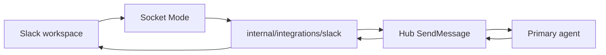
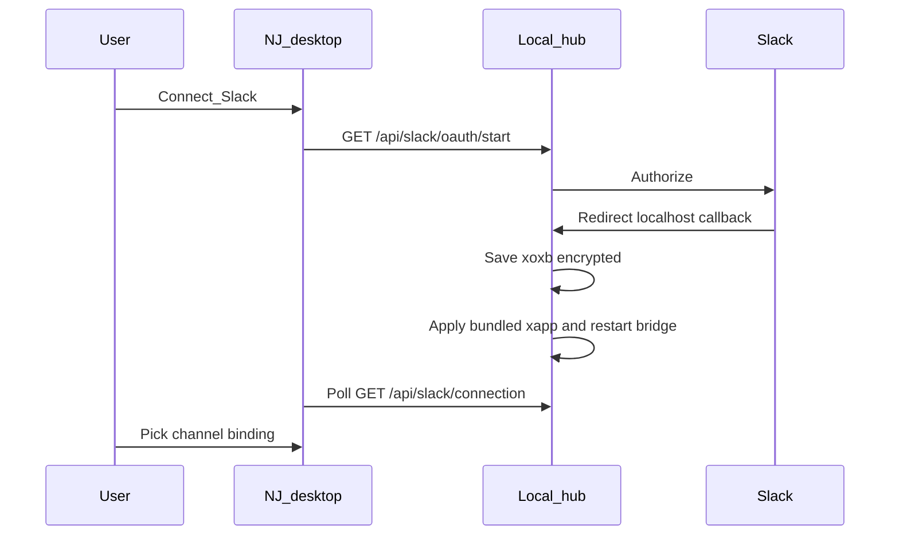

# Slack integration

Neural Junkie can assign **one primary agent per Slack channel** to respond when @mentioned (default) or under broader policies. Replies post through the Slack app with a customized display name (e.g. **Camron**) via `chat:write.customize`.

## Architecture



The bridge runs **in-process** with the local hub (`127.0.0.1:18765` by default). It uses **Socket Mode** so the hub does not need a public URL.

## Public path: Connect Slack (recommended)

End users do **not** paste `xapp` or `xoxb` tokens. The desktop app uses a bundled **Neural Junkie** Slack app (maintainer build) and loopback OAuth on the hub.



1. **Settings → Integrations → Slack** → **Connect Slack**
2. Approve the app in the browser; the hub saves the bot token and starts the bridge
3. **Load Slack channels**, pick an agent, and save a binding

Status and workspace name: `GET /api/slack/connection`

## Advanced path: bring your own Slack app

Expand **Advanced (bring your own Slack app)** in Settings to paste:

- Socket Mode **app token** (`xapp-…`, scope `connections:write`)
- **Bot token** (`xoxb-…`) or use OAuth with your own client ID / secret / redirect URI

Redirect URI must match the hub, e.g. `http://localhost:18765/api/slack/oauth/callback` (or your custom hub port).

Optional file: `~/.neural-junkie/slack/oauth_app.json`

## Maintainer: release build with bundled credentials

1. Create the **Neural Junkie** Slack app at [api.slack.com/apps](https://api.slack.com/apps) (not a personal test workspace app for public builds).
2. Complete the [Slack app checklist](#release-checklist-slack-console) below.
3. Copy credentials into a **gitignored** vendor file (never commit):

```bash
chmod +x scripts/slack-creds-to-vendor.sh
./scripts/slack-creds-to-vendor.sh
```

This reads `scripts/.slack-creds` and writes `neural-junkie/internal/integrations/slack/vendor/oauth.json` with `client_id`, `client_secret`, and `app_token` only (no bot token in the bundle).

4. Build the hub with the release embed tag:

```bash
cd neural-junkie
go build -tags slackvendor -o bin/server ./cmd/server
```

Template (placeholders only, committed): `internal/integrations/slack/vendor/oauth.json.example`

Dev builds without `slackvendor` use the example embed (placeholders ignored), plus env vars:

- `NEURAL_JUNKIE_SLACK_CLIENT_ID`
- `NEURAL_JUNKIE_SLACK_CLIENT_SECRET`
- `NEURAL_JUNKIE_SLACK_APP_TOKEN`
- `NEURAL_JUNKIE_SLACK_REDIRECT_URL` (optional)

**Security:** `client_secret` and `xapp` in a shipped binary can be extracted. Rotate by revoking/regenerating tokens in Slack and shipping a new build.

## Slack app setup (console)

1. Create an app at [api.slack.com/apps](https://api.slack.com/apps).
2. Enable **Socket Mode** and create an **App-Level Token** with **only** the scope **`connections:write`** (token starts with `xapp-`).  
   If Socket Mode logs `connection_error` / `missing_scope`, the app token was generated without that scope or the bot token was pasted in the App token field by mistake.
3. Install the app to your workspace and copy the **Bot User OAuth Token** (`xoxb-...`) for dev/testing only — public users get this via OAuth.
4. **OAuth & Permissions** → Bot Token Scopes:
   - `app_mentions:read`
   - `channels:history`
   - `groups:history`
   - `chat:write`
   - `chat:write.customize`
   - `users:read`
   - `channels:read` + `groups:read` (enables channel picker in Settings)
5. **OAuth & Permissions** → Redirect URLs (loopback):
   - `http://localhost:18765/api/slack/oauth/callback`
   - Add `http://127.0.0.1:<port>/api/slack/oauth/callback` if you use a non-default hub port
6. **Event Subscriptions** → **Enable Events** (required for **inbound**; Socket Mode does not auto-subscribe):
   - Under **Subscribe to bot events**, add:
     - `message.channels` — public channels
     - **`message.groups`** — **private channels** (e.g. `#neural-junkie`)
     - `app_mention` — when users @the bot
   - Save changes. If you added new bot scopes, **reinstall the app** to the workspace.
7. Invite the bot to channels you want to bind (`/invite @YourBot`).

**Outbound works but nothing appears in NJ?** Almost always missing step 6 (`message.groups` for private channels) or wrong `C…` in the binding. Run `GET /api/slack/diagnose` or `./scripts/slack-dev-test.sh diagnose`.

### Release checklist (Slack console)

- [ ] Socket Mode on; app token scope `connections:write`
- [ ] Redirect URL `http://localhost:18765/api/slack/oauth/callback` (and custom port if documented)
- [ ] Bot scopes listed in step 4 above
- [ ] Event subscriptions: `message.channels`, `message.groups`, `app_mention`
- [ ] Reinstall app to workspace after scope changes
- [ ] `vendor/oauth.json` generated locally; `go build -tags slackvendor` for release artifacts

## Hub configuration (Advanced / dev)

In `~/.neural-junkie/config.json`:

```json
"slack": {
  "enabled": true,
  "app_token": "xapp-...",
  "bot_token": "xoxb-...",
  "display_name": "Camron",
  "display_icon_url": "",
  "default_policy": "mention_only"
}
```

Environment overrides:

- `NEURAL_JUNKIE_SLACK_ENABLED=1`
- `NEURAL_JUNKIE_SLACK_APP_TOKEN`
- `NEURAL_JUNKIE_SLACK_BOT_TOKEN`
- `NEURAL_JUNKIE_SLACK_DISPLAY_NAME`
- `NEURAL_JUNKIE_SLACK_CLIENT_ID` / `NEURAL_JUNKIE_SLACK_CLIENT_SECRET` (dev without bundled build)

Install metadata after OAuth: `~/.neural-junkie/slack/install.json` (`team_id`, `team_name`, `bot_user_id`). **Disconnect** clears the bot token and install metadata but keeps the bundled app token in config.

## Channel bindings

Bindings live in `~/.neural-junkie/slack/bindings.json`. Each entry maps a Slack channel ID (`C…`) to a hub channel `slack:C…` and one **agent_id**.

| Policy | Behavior |
|--------|----------|
| `mention_only` | Agent runs when the app is @mentioned (default) |
| `questions` | Messages that look like questions/requests |
| `always` | Every human message in the channel |

Create bindings via **Settings → Integrations → Slack** or `POST /api/slack/bindings`.

## Repo and MCP agents

Repo, CLI, and MCP-enabled specialists can be assigned. Tool and file-change **approvals still happen in the desktop app**; the bridge may post a short Slack notice when approval is required. Avoid binding agents with broad write tools to public channels without review.

## API

| Endpoint | Method | Purpose |
|----------|--------|---------|
| `/api/slack/status` | GET | Connection and binding count |
| `/api/slack/connection` | GET | OAuth readiness, tokens, bridge, workspace name |
| `/api/slack/config` | GET/PUT | Tokens (write-only), display name, enable |
| `/api/slack/bindings` | GET/POST/DELETE | Channel → agent bindings |
| `/api/slack/test-post` | POST | Test message to a channel |
| `/api/slack/oauth/start` | GET | OAuth install (`?json=1` returns URL) |
| `/api/slack/oauth/callback` | GET | OAuth callback (loopback) |
| `/api/slack/disconnect` | POST | Stop bridge, clear bot token (keeps app token) |
| `/api/slack/restart` | POST | Restart bridge after config change |
| `/api/slack/channels` | GET | List Slack channels the bot is in |
| `/api/slack/diagnose` | GET | Troubleshooting hints |

## Related

- [ARCHITECTURE.md](ARCHITECTURE.md) — hub and agents
- [DELEGATION.md](DELEGATION.md) — internal consults; Slack still gets one reply from the primary agent
