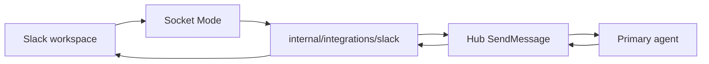

# Slack integration

Neural Junkie can assign **one primary agent per Slack channel** to respond when @mentioned (default) or under broader policies. Replies post through the Slack app with a customized display name (e.g. **Camron**) via `chat:write.customize`.

## Architecture



The bridge runs **in-process** with the hub (no separate cloud service in v1). It uses **Socket Mode** so the hub does not need a public URL.

## Slack app setup

1. Create an app at [api.slack.com/apps](https://api.slack.com/apps).
2. Enable **Socket Mode** and create an **App-Level Token** with `connections:write` (`xapp-...`).
3. Install the app to your workspace and copy the **Bot User OAuth Token** (`xoxb-...`).
4. **OAuth & Permissions** → Bot Token Scopes:
   - `app_mentions:read`
   - `channels:history`
   - `groups:history`
   - `chat:write`
   - `chat:write.customize`
   - `users:read`
5. **Event Subscriptions** (optional for HTTP; Socket Mode receives events anyway):
   - `message.channels`, `message.groups`, `app_mention`
6. Invite the bot to channels you want to bind.

## Hub configuration

In `~/.neural-junkie/config.json`:

```json
"slack": {
  "enabled": true,
  "app_token": "xapp-...",
  "bot_token": "xoxb-...",
  "display_name": "Camron",
  "display_icon_url": "",
  "default_policy": "mention_only"
}
```

Environment overrides:

- `NEURAL_JUNKIE_SLACK_ENABLED=1`
- `NEURAL_JUNKIE_SLACK_APP_TOKEN`
- `NEURAL_JUNKIE_SLACK_BOT_TOKEN`
- `NEURAL_JUNKIE_SLACK_DISPLAY_NAME`

## Channel bindings

Bindings live in `~/.neural-junkie/slack/bindings.json`. Each entry maps a Slack channel ID (`C…`) to a hub channel `slack:C…` and one **agent_id**.

| Policy | Behavior |
|--------|----------|
| `mention_only` | Agent runs when the app is @mentioned (default) |
| `questions` | Messages that look like questions/requests |
| `always` | Every human message in the channel |

Create bindings via **Settings → Integrations → Slack** or `POST /api/slack/bindings`.

## Repo and MCP agents

Repo, CLI, and MCP-enabled specialists can be assigned. Tool and file-change **approvals still happen in the desktop app**; the bridge may post a short Slack notice when approval is required. Avoid binding agents with broad write tools to public channels without review.

## API

| Endpoint | Method | Purpose |
|----------|--------|---------|
| `/api/slack/status` | GET | Connection and binding count |
| `/api/slack/config` | GET/PUT | Tokens (write-only), display name, enable |
| `/api/slack/bindings` | GET/POST/DELETE | Channel → agent bindings |
| `/api/slack/test-post` | POST | Test message to a channel |
| `/api/slack/oauth/start` | GET | OAuth install (optional) |
| `/api/slack/oauth/callback` | GET | OAuth callback |
| `/api/slack/disconnect` | POST | Stop bridge, clear tokens |
| `/api/slack/restart` | POST | Restart bridge after config change |

## OAuth (optional)

Store OAuth client credentials under `~/.neural-junkie/slack/oauth_app.json` (or via Settings). Redirect URI example: `http://localhost:18765/api/slack/oauth/callback`.

Socket Mode still requires the **app token** (`xapp-...`) in config after OAuth.

## Related

- [ARCHITECTURE.md](ARCHITECTURE.md) — hub and agents
- [DELEGATION.md](DELEGATION.md) — internal consults; Slack still gets one reply from the primary agent
