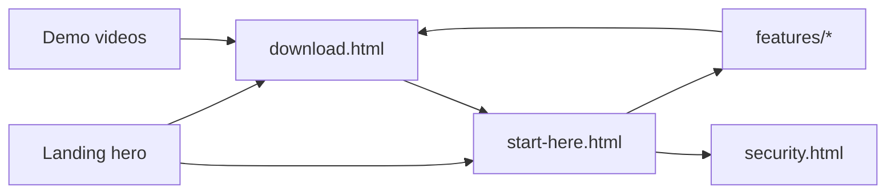

# Website content audit

**Site:** https://camronwood.github.io/neural-junkie/  
**Updated:** 2026-07-10  
**Primary story:** Multi-agent hive-mind → local-first → human control → download / start here  
**Current release:** v1.2.0-beta.5 (July 6, 2026)

## July 2026 refresh summary

| Area | Change |
|------|--------|
| Homepage videos | 6-up grid — feature flythrough, multi-agent, Assistant, Slack, local image gen, away mode |
| Video assets | 9 new MP4s in `docs/media/` (web-optimized via `scripts/optimize-site-videos-batch.py`) |
| Beta.5 messaging | ReAct tools, routing trace, Runbooks v2, multi-repo scope, LoRA v2, Slack diagnostics |
| Moderator purge | Merged into Assistant (beta.2) — removed from marketing copy |
| Articles | Download links → `v1.2.0-beta.5`; beta.5 "this week" → released July 6 |
| Feature guides | Videos on Slack, collab, bundled-ollama; desktop scope chip + routing trace |

### Homepage demo videos (`index.html`)

| File | Topic |
|------|--------|
| `feature-flythrough.mp4` | Product overview |
| `gemini-copilot-cursor-edge-assistant-chat.mp4` | Multi-agent channel |
| `ask-the-assistant.mp4` | Assistant workflow |
| `nj-slack.mp4` | Slack Connect |
| `local-image-gen-free.mp4` | Local image gen |
| `agents-respond-when-away.mp4` | Away mode |

### Feature-page videos

| Page | Videos |
|------|--------|
| `features/slack-connect.html` | nj-slack, slack-message-forwarding, agents-respond-when-away, ask-the-assistant-mobile |
| `features/multi-agent-collaboration.html` | website-collab |
| `features/bundled-ollama.html` | local-image-gen-free |
| `features/agents-and-experts.html` | general-experts-guitar (kept) |

### Legacy videos (retained)

| File | Status |
|------|--------|
| `general-experts-guitar.mp4` | Used on agents-and-experts guide |
| `gemini-cursor-agents.mp4` | Superseded on homepage; kept in repo |
| `local-model-switching.mp4` | Superseded on homepage; kept in repo |

---

## Navigation map

| Nav item | Target | Role |
|----------|--------|------|
| Start here | `start-here.html` | Primary onboarding |
| Product | `#pillars` | Three pillars + use cases |
| Guides | `features/index.html` | Deep capability pages |
| Articles | `articles/index.html` | Long-form architecture writing |
| Benchmarks | `benchmarks/index.html` | Live scenario pass rates |
| Gallery | `gallery/index.html` | Ads, screenshots, Slack art |
| Security | `security.html` | Privacy, approvals, threat model |
| Release notes | `release-notes.html` | Version history |
| Known issues | `known-issues.html` | Trust / beta honesty |
| Download | `download.html` | Conversion |
| Star on GitHub | repo | Community |

---

## Page status (2026-07-10)

| Page | Status |
|------|--------|
| `index.html` | **Refreshed** — 6 videos, beta.5 banner, Runbooks v2, routing trace card |
| `download.html` | **Refreshed** — beta.5 feature summary |
| `start-here.html` | **Refreshed** — Assistant-only, beta.5 onboarding bullets |
| `packs.html` | **Refreshed** — LoRA v2, music v1.0.2, Assistant-only |
| `known-issues.html` | **Refreshed** — July 10 date, layer-gate testing |
| `security.html` | **Refreshed** — Connection settings, version footer |
| `features/*` | **Refreshed** — videos, Moderator purge, beta.5 links |
| `articles/*` | **Refreshed** — beta.5 download URLs, hardware Ollama facts |
| `release-notes.html` | Historical entries unchanged (correct) |

---

## Maintenance

1. **Version strings** — re-run `./scripts/update-website-release.sh` + `python3 scripts/sync-site-nav.py` on each beta tag.
2. **Videos** — add source to `~/Desktop/NJ videos/`, update `scripts/optimize-site-videos-batch.py` mapping, run batch encoder.
3. **Release notes** — append `release-notes.html` manually after each tag.

---

## CTA funnel

