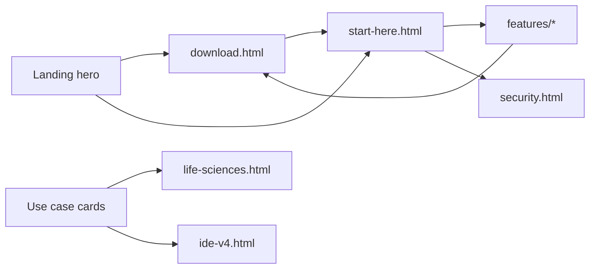

# Website content audit

**Site:** https://camronwood.github.io/neural-junkie/  
**Updated:** 2026-06-24  
**Primary story:** Multi-agent hive-mind → local-first → human control → download / start here

## Navigation map (after refresh)

| Nav item | Target | Role |
|----------|--------|------|
| Start here | `start-here.html` | Primary onboarding (was GitHub DOWNLOAD.md) |
| Product | `#pillars` | Three pillars + use cases |
| Guides | `features/index.html` | Deep capability pages |
| Known issues | `known-issues.html` | Trust / beta honesty |
| Download | `download.html` | Conversion |
| Star on GitHub | repo | Community |

Footer doc-strip: Start here, Security, guides, articles, benchmarks, gallery, releases, known issues, architecture.

---

## Page-by-page audit

### `index.html` (landing)

| Element | Primary CTA | Secondary | Status |
|---------|-------------|-----------|--------|
| Hero | Download | Start here, Use cases | **Refreshed** — hive-mind lead; IDE v4 demoted |
| Pillars | — | — | **New** — specialists / local / control |
| Use cases | Persona cards | 4 vertical entry points | **New** — includes life sciences |
| Demo videos | — | MP4 downloads | **Moved up** (was duplicated at bottom) |
| Flagship jump | In-page anchors | Collab → Local → Slack → Packs → IDE → HW | **Reordered** |
| Spotlight sections | Deep-dive buttons | Repo docs | **Reordered**; IDE framed as capability |
| Everything else | Feature guide links | — | **Trimmed** — removed duplicate IDE card |
| Ship with confidence | Doc strip | — | **Simplified** strip |
| Release preview | Download | Release notes | Summary leads with hive-mind |
| Final CTA | Download | Start here | **Updated** |

### `start-here.html` **(new)**

| Section | Purpose |
|---------|---------|
| Install | Wizard tracks (dev / life sciences / team) |
| First chat | Palette, providers |
| Dev first win | Repo agent + `/collaborate` |
| Lab first win | Life sciences pack + customer sideload mention |
| Hardware / honesty | Links to HW + known issues |

**CTA:** Download → Security

### `security.html` **(new)**

| Section | Purpose |
|---------|---------|
| Privacy by default | Local-first, opt-in cloud |
| Human control | Approvals, collab phases |
| Built-in protections | Threat table (from SECURITY.md) |
| Shared machines | Env vars checklist |
| Lab environments | Customer packs, data locality |

**CTA:** SECURITY.md in repo

### `features/life-sciences.html` **(new)**

| Section | Purpose |
|---------|---------|
| Who this is for | Analysts, research, regulated-adjacent |
| Official pack | Component table (no private Brightest Bio details) |
| Typical workflow | Wizard → pack → BiologyExpert |
| Customer packs | Sideload for instrument-specific QC |
| Privacy | Link to security page |

**CTAs:** Domain packs, BIOLOGY_PACK.md, start here

### `download.html`

| Change | Detail |
|--------|--------|
| After install | Links to `start-here.html` instead of DOWNLOAD.md only |

### `features/index.html`

| Change | Detail |
|--------|--------|
| Grid | Added Life sciences guide card |

### `features/domain-packs.html`

| Change | Detail |
|--------|--------|
| Life sciences bullet | Links to `life-sciences.html` |

### `articles/index.html`

| Change | Detail |
|--------|--------|
| Toolbar | **Fixed** broken `articles-count` span |

### Unchanged high-value pages

| Page | Notes |
|------|-------|
| `known-issues.html` | Keep prominent — differentiator |
| `release-notes.html` | Manual sync with CHANGELOG — maintenance risk |
| `benchmarks/index.html` | Live JSON — strong proof |
| `gallery/index.html` | Moved to footer strip only |
| 17 `features/*.html` | Depth layer; no copy pass this round |

---

## Messaging alignment

| Source | Positioning | Action |
|--------|-------------|--------|
| Landing hero | Digital hive-mind + specialists | **Aligned** |
| `USER_VALUE_GUIDE.md` | "AI engineering team" | Repo doc — narrow; site now broader |
| IDE v4 | Capability, not identity | **Aligned** on landing |
| Life sciences | Public pack + customer sideload | **New** `life-sciences.html` |
| Brightest Bio Lab pack | Private — not on site | Correct — only "customer sideload" |

---

## Remaining gaps (future work)

1. **Version strings** — `v1.2.0-beta.1` still duplicated across HTML; consider generating from release tag in `release-prep.py`.
2. **61 repo markdown docs** — only top onboarding + security surfaced on-site; full docs site optional.
3. **No Pages CI** — deploy is push-to-`main` on `/docs`.
4. **README** — still engineering-heavy; optional sync with landing voice.
5. **Contributing / roadmap** — not on marketing site yet.

---

## CTA funnel (intended)

