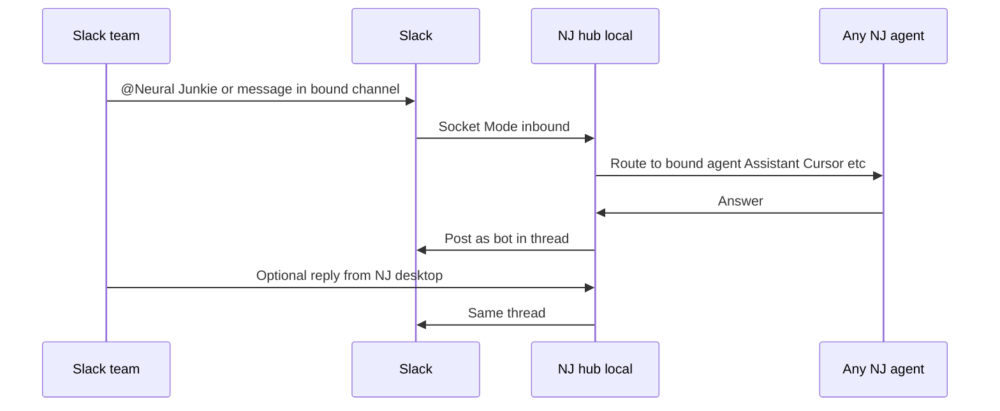

# Beta.13 feature ads — security, CLI agents, TIFF previewer, Slack

**Canonical download:** https://github.com/camronwood/neural-junkie/releases/tag/v1.0.0-beta.13

**Regenerate graphics:**

```bash
chmod +x ./scripts/compose-beta13-ads.sh
./scripts/compose-beta13-ads.sh all
```

| Asset | Variant | Angle |
|-------|---------|--------|
| `assets/neural-junkie-security-local-ad-1080.png` | `security` | Local-first hub hardening |
| `assets/neural-junkie-cli-agents-ad-1080.png` | `cli-agents` | 12 CLI tools auto-detected |
| `assets/neural-junkie-tiff-previewer-ad-1080.png` | `tiff-previewer` | In-app TIFF previewer for plate wells |
| `assets/neural-junkie-slack-ad-1080.png` | `slack` | Any NJ agent → Slack bot (dev / power user) |
| `assets/neural-junkie-slack-ad-nondev-1080.png` | `slack-nondev` | Team Slack channel + AI helper (non-dev) |
| `assets/neural-junkie-slack-ad-models-1080.png` | `slack-models` | Pick Claude / GPT / Ollama / etc. per channel |

Prior release ads remain valid: [BETA12-ADS.md](BETA12-ADS.md), [NONDEV-ADS.md](NONDEV-ADS.md).

---

## Ad 1 — Local-first security

**Headline on image:** Hub on loopback. Sessions on requests.

**X / LinkedIn:**

> Neural Junkie **v1.0.0-beta.13** — **local-first security**: loopback bind, session tokens, rate limits, encrypted config + Tauri credentials. Optional hub token for LAN. `docs/SECURITY.md`
>
> https://github.com/camronwood/neural-junkie/releases/tag/v1.0.0-beta.13

---

## Ad 2 — CLI agents (separate post)

**Headline on image:** Copilot. Codex. Cursor. Twelve agents, auto-detected.

**X / LinkedIn:**

> Your terminal agents, **auto-detected** when Neural Junkie starts — **12 CLIs** including Cursor, Claude, Gemini, Copilot, Codex, Aider, OpenCode, Amazon Q, Crush, Amp, Droid, and Kiro. They join `#general` so you can @mention them right away.
>
> https://github.com/camronwood/neural-junkie/releases/tag/v1.0.0-beta.13

---

## Ad 3 — TIFF previewer (separate post)

**Headline on image:** TIFF previewer built into the app.

**X / LinkedIn:**

> **v1.0.0-beta.13** adds an in-app **TIFF previewer** for life-sciences workflows: open a plate summary, click a well, preview microscopy TIFFs without leaving Neural Junkie.
>
> https://github.com/camronwood/neural-junkie/releases/tag/v1.0.0-beta.13

---

## Ad 4 — Slack: any agent as your workspace bot (separate post)

**Headline on image:** Any agent. One Slack channel. Minimal setup.

**Subhead (website / carousel):** Connect Slack once. Bind **any** agent—Assistant, Cursor, Gemini, repo experts, biology models—to a channel. Replies flow both ways on your **local** hub.

**X / LinkedIn (short):**

> **Slack ↔ Neural Junkie, locally.** Settings → **Connect Slack** (no token paste). Pick a channel, assign **any LLM/agent** NJ already runs—Assistant, CLI agents, repo experts—and your team @mentions it in Slack like a normal bot. Code & approvals stay in the desktop app.
>
> https://github.com/camronwood/neural-junkie/releases/tag/v1.0.0-beta.13

**X / LinkedIn (story — how it works):**

> What you’re really doing: NJ runs a **Socket Mode bridge on your machine** (`127.0.0.1`). You OAuth once → bot token per workspace. You bind `#your-channel` → `Assistant` (or Cursor, Codex, BiologyExpert, …). Slack messages hit your hub; the agent answers; replies post back to Slack **in thread**. Same agents you use in NJ—no separate Slack bot codebase.
>
> Minimal setup: Connect Slack → Load channels → Add binding → `/invite @YourBot`.
>
> https://github.com/camronwood/neural-junkie/releases/tag/v1.0.0-beta.13

**How it works (talk track / demo script):**



| Step | What the user does |
|------|---------------------|
| 1 | **Connect Slack** in Settings (loopback OAuth; bundled app in release builds) |
| 2 | **Load Slack channels** → bind `#channel` → pick **primary agent** (any supported LLM/agent) |
| 3 | Set policy: @mention only, questions, or every message |
| 4 | Invite the bot; chat in Slack or in the mirrored `slack:C…` channel in NJ |

**Differentiators to call out:**

- **Any agent, not one model** — same roster as NJ: Assistant, 12+ CLI agents, repo/MCP specialists, Ollama biology chat, etc.
- **Local-first** — hub on loopback; tokens in `~/.neural-junkie`; no hosted bridge required for v1
- **Minimal setup** — no `xapp`/`xoxb` paste for end users; channel picker + one binding row
- **Safe ops** — tool/file approvals still happen in the NJ desktop, not silently in Slack

**Regenerate Slack ads:**

```bash
./scripts/compose-beta13-ads.sh slack          # dev / agents
./scripts/compose-beta13-ads.sh slack-nondev   # team / non-dev
./scripts/compose-beta13-ads.sh slack-models   # real model backends
```

### Ad 4b — Slack · choose your model (separate post)

**Headline on image:** Claude. Gemini. Ollama. Back your Slack bot. Your keys, your choice.

**X / LinkedIn:**

> One Slack bot — **your** model. Connect Slack in Neural Junkie, bind a channel, and route it to **Claude, GPT, Gemini, Ollama, LM Studio, Hugging Face**, or any OpenAI-compatible API. `#sales` on Claude, `#drafts` on local Ollama. Colleagues just @mention; keys stay on your machine.
>
> https://github.com/camronwood/neural-junkie/releases/tag/v1.0.0-beta.13

---

## Launch post (beta.13 — primary)

Neural Junkie **v1.0.0-beta.13** — **12 CLI agents auto-detected**, **local-first security**, **TIFF previewer**, **Slack: wire any agent to a channel with Connect Slack**, agent delegation, and a critical desktop hub API fix. macOS / Windows / Linux.

Download: https://github.com/camronwood/neural-junkie/releases/tag/v1.0.0-beta.13

Site: https://camronwood.github.io/neural-junkie/
