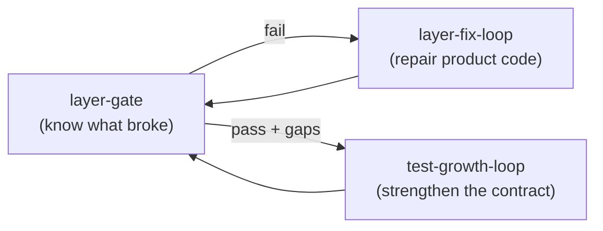

# LinkedIn article — Fix loop + growth loop (release engineering)

**Format:** LinkedIn **Article** (long-form). Use the cover image below when publishing.

**LinkedIn paste tips:** Copy from **"PASTE START"** through **"PASTE END"** only. Do not include `---` lines — LinkedIn renders them as awkward rules with huge gaps. Use LinkedIn's title field for the headline; skip the first `#` line if the editor duplicates it. One blank line between paragraphs is enough.

**Cover image:** `assets/neural-junkie-fix-growth-loops-1200.png` (1200×627)

**Regenerate cover:** `./scripts/compose-fix-growth-loops-article.sh`

**Suggested title (pick one):**
- Green Tests Aren't Enough: Fix Loops and Growth Loops for Agent Platforms
- I Let an Agent Fix My Agent Platform Overnight
- Three Commands Between "Flaky Collab" and "Shippable Beta"

**Feed post teaser:**
> My collab suite was red for weeks. Click-testing a 3-hour multi-agent sweep doesn't scale. So I wired three release loops: gate → fix → grow. Here's what each one does, and why you need both repair *and* test growth.

**Hashtags:** `#AI #DeveloperTools #OpenSource #Testing #AgenticCoding #MultiAgent`

**Link:** https://github.com/camronwood/neural-junkie/releases/latest

**Website:** https://camronwood.github.io/neural-junkie/articles/fix-growth-loops.html

**Download CTA:** https://camronwood.github.io/neural-junkie/download.html

**Related articles:** [Loop stack](LOOP-STACK-LINKEDIN.md) · [Fix Loop](FIX-LOOP-LINKEDIN.md) · [Conversational test harness](CONVERSATIONAL-TEST-HARNESS.md) · [Collaboration](COLLABORATION-LINKEDIN.md)

---

## PASTE START

I already wrote about the **NJ Fix Loop** — platform policy that stops agents from running `make start-all` eight times without touching the Makefile. That loop lives *inside* the product: it repairs **your repo** when boot-fix sessions go sideways.

This article is about the loops *around* the product — the release engineering that keeps Neural Junkie shippable when live scenarios fail at 2am and you're not manually triaging fifteen collab regressions.

**Platform loops** enforce outcomes for users. **Release loops** enforce outcomes for the team building the platform. You need both.

## The wall after the harness

Neural Junkie has a three-layer conversational test harness: deterministic Go tests for orchestrator logic, CI smoke for the collab pipeline, and JSON scenarios with real Ollama agents for conversation quality. That architecture works. It tells you *what* broke.

It does not tell you what to do at 11pm when `collab-full` returns 7/20 PASS and the failures cluster around plan parsing, execution timeouts, and workspace binding.

Click-testing a three-hour multi-agent sweep doesn't scale. Weakening assertions to greenwash flakes doesn't ship honest betas. And "I'll fix it tomorrow" doesn't survive weekly model and prompt churn.

So I wired three release loops.

## The stack at a glance



Same hub. Same scenario harness. Different loops for different jobs.

## Loop 1 — layer-gate: know what broke

**Problem:** `make release-prep` is a ~30-hour full gate. When it fails on hour 18, you don't know whether chat routing regressed, collab planning broke, or implement scenarios flaked — you just know something is red.

**What we built:** Layered gates — test one surface at a time before climbing to the full release:

```bash
make layer-list                         # layers in order + time estimates
make layer-gate LAYER=ci                # fast CI smoke (no hub)
make layer-gate LAYER=implement         # implement-scenarios (20/20)
make layer-gate LAYER=chat              # chat + conversation regression
make layer-gate LAYER=collab            # collab edge-case regression (~11)
make layer-gate LAYER=collab-full       # full collab sweep (~15–20, 1–3h)
make layer-climb                        # run layers in order until first failure
```

Each run writes a markdown report: `docs/testing/layer-gate-<layer>-<stamp>.md` with per-scenario pass/fail, log paths, and failure excerpts.

**Why layers, not one big gate:** Fail fast. Know *which* surface broke. Fix collab without re-running implement. Climb layers in order during release prep so you don't burn a day on a chat flake when collab is the real problem.

## Loop 2 — layer-fix-loop: repair product code

**Problem:** The gate failed. Now what? Manually reading logs, opening Cursor, fixing, re-running the full layer — that's a full evening per iteration.

**What we built:** An automated fix loop:

```bash
make layer-fix-loop LAYER=collab-full   # DRY_RUN=1 MAX_ITER=3 by default
make layer-overnight LAYER=implement    # walk-away fix loop (tmux)
```

The loop:

1. Run `layer-gate` for one layer
2. If PASS → done
3. If FAIL → build an agent brief from the gate report (failed scenarios, log excerpts, targeted rerun commands)
4. Run Cursor agent in an **isolated git worktree** on a `release-prep/layer-<name>-<stamp>` branch
5. Commit iteration changes
6. **Targeted verification** — rerun only the scenarios that failed, not the full layer
7. Repeat until PASS or `MAX_ITER` exhausted

Reports land in `docs/testing/layer-fix-loop-<layer>-<stamp>-iterN.md`.

**Real example — collab-full, July 2026:**

A fix-loop iteration hit CI blockers first, then the dominant collab failure mode:

- **Test isolation bug** — `project_sets_test.go` loaded the developer's real `~/.neural-junkie/project-sets.json` instead of tmp storage. Fixed with `t.Setenv("HOME", tmpHome)`.
- **Judge provider resolution** — deliverable judge baked hub automation mode at import time. Fixed to resolve at runtime so cloud judge fallback tests pass.
- **Ollama HTTP timeout** — collab planning used a 360s client timeout against a 480s discussion budget. Raised to 540s. Planning participation scenarios went from timing out to passing.

Result: **7/20 scenarios PASS** on that iteration — not a full green sweep, but CI green, planning participation improved, and the next iteration had a clear target list (workspace binding, plan parsing, execution dispatch). No assertions weakened.

**Why isolated worktrees:** The fix agent edits product code. You don't want uncommitted hub changes mixed with your feature branch. Each iteration gets a clean branch you can review, cherry-pick, or discard.

## Loop 3 — test-growth-loop: strengthen the contract

**Problem:** The suite is green, but you *know* there are gaps. A scenario passed once and never got tightened. A failure class from last month's logs isn't captured in JSON assertions.

**What we built:** A growth loop — discover gaps → agent adds/strengthens tests → verify → commit:

```bash
make test-growth-list              # ranked candidates (no agent)
make test-growth-once DRY_RUN=1    # preview one iteration
make test-growth-loop              # MAX_ITER=3, branch commits per accepted iteration
make test-growth-loop SKIP_LIVE=1  # CI/unit + scenario contract only (no hub)
```

Candidates are mined from layer-gate failure logs — scenarios that failed, assertion classes that slipped through, edge cases the harness should have caught earlier. The agent proposes new or strengthened scenario JSON, contract tests, or assertion helpers. Verification runs before accept. Reports: `docs/testing/test-growth-*.md`.

**When to use which:**

| Situation | Loop |
|-----------|------|
| Tests fail, product code needs repair | `layer-fix-loop` |
| Suite is green but coverage should improve | `test-growth-loop` |
| You don't know what's broken yet | `layer-gate` first |

Fix loop closes **today's** failures. Growth loop prevents **tomorrow's** regressions from slipping through. One without the other is whack-a-mole or over-fitted tests.

## How this differs from the NJ Fix Loop

Easy to confuse — same word, different layer:

| | NJ Fix Loop (product) | layer-fix-loop (release) |
|---|---|---|
| **Repairs** | User's repo (Makefile, tests, boot scripts) | Neural Junkie platform code |
| **Trigger** | Boot-fix / fix-like implementation session | Layer gate failure |
| **Agent** | Specialist in IDE Agent mode | Cursor agent in isolated worktree |
| **Policy** | Circuit breaker, grounding gates, playbooks | Gate report → brief → targeted rerun |

The product Fix Loop is policy on the tool loop. The release fix loop is automation on the test loop. Both enforce closed outcomes — read before retry, verify before claim success, always report what happened.

## What I run overnight

```bash
make layer-overnight LAYER=collab-full
# or
make overnight NJ_OVERNIGHT_TARGET=release-prep-fix-loop
```

Boot Ollama, warm models, start regression hub, run gate → fix → verify in tmux. Wake up to markdown reports and branch commits — not a Slack message that says "collab might be broken."

## What we didn't solve

- **Model variance** — same scenario can pass on retry. We log flakes; we don't hide them.
- **Full green in one iteration** — 7/20 → 15/20 → 20/20 is normal. Partial wins are still wins.
- **Human judgment on product direction** — loops repair and strengthen; they don't decide what collab should *be*.

The bet: **release loops beat hero debugging** for a platform tested by conversations, not unit tests alone.

## Try it

```bash
make layer-list
make layer-gate LAYER=chat
make layer-fix-loop LAYER=chat DRY_RUN=1
make test-growth-list
```

Docs: [TESTING.md](https://github.com/camronwood/neural-junkie/blob/main/docs/TESTING.md) · [ROADMAP-Q3-2026.md](https://github.com/camronwood/neural-junkie/blob/main/docs/ROADMAP-Q3-2026.md)

Download: https://camronwood.github.io/neural-junkie/download.html

---

*Neural Junkie is a personal open-source project. Feedback and scenario failures welcome on GitHub.*

## PASTE END
