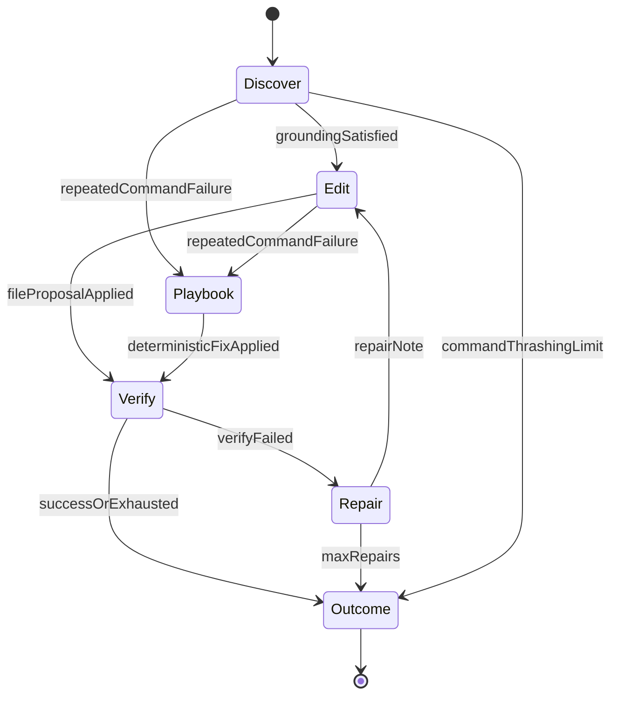

# LinkedIn article — NJ Fix Loop (publish copy)

**Cover:** [neural-junkie-fix-loop-1200.png](../media/articles/covers/neural-junkie-fix-loop-1200.png)

**Suggested title (pick one):**
- Execution Is Not Repair: Building the NJ Fix Loop
- Why Your Coding Agent Keeps Running the Same Failing Command
- From Command Spam to Closed-Loop Boot Fixes

**Feed teaser:**

> My agent could run `make start-all` eight times and never touch the Makefile. Execution worked; repair didn't. Here's the platform policy we added so boot-fix sessions read, edit, verify, and always report an outcome.

**Hashtags (optional):** `#AI #DeveloperTools #OpenSource #LocalFirst #AgenticCoding`

**Download CTA:** https://camronwood.github.io/neural-junkie/download.html

**Suggested post date:** After hub restart with NJ Fix Loop changes validated via `make implement-scenario SCENARIO=tauri-make-start-all-missing`

**Docs:** https://github.com/camronwood/neural-junkie/blob/main/docs/IMPLEMENTATION_SESSION.md

---

## Article body (paste below the line)

---

# Execution Is Not Repair: Building the NJ Fix Loop

If you've shipped an agent that can **run shell commands**, you've probably hit this wall:

The agent runs `make start-all`. It fails. It runs it again. And again. Chat fills with `command_output` messages, but **nothing on disk changes** and sometimes there's **no final summary** at all.

That's not a model intelligence problem alone. It's a **missing closed loop**.

I've been building **Neural Junkie** as a local-first open-source agent hub. Agent Runtime v2 gives specialists long native tool loops — great for reach, dangerous without platform policy. This article is what we shipped as the **NJ Fix Loop**.

---

## The gap: execution without repair

In a real boot-fix session we saw:

- `make start-all` failed **8×** with `No rule to make target 'start-all'`
- **11 command_output posts** in chat
- **Zero file edits**, no `implementation_session_outcome`, no user-visible wrap-up

The outer implementation session only advanced on **file proposals** and **verify**. Tool-step observers tracked discover tools, not `run_command` failures. Failures were **broadcast** to the channel (and mirrored in the terminal panel) but never forced **read → edit → re-run**.

"My agent can execute" ≠ "my agent can fix my app."

---

## What the NJ Fix Loop adds

Platform-owned policy on top of the tool loop:

### 1. Command telemetry + circuit breaker

Every `run_command` in an implementation session is recorded. If the **same command fails twice** without an intervening `read_file` or edit, the **third run is blocked** at the MCP layer — even if the model keeps trying.

### 2. Boot-fix grounding gates

For boot/build intent, agents must **read** `Makefile`, `package.json`, or `scripts/start-all.sh` before `make start-all` or `npm run dev`. The gate is enforced in tools, not just prompts.

### 3. Deterministic playbooks

Known error signatures trigger platform repairs before (or instead of) model guessing. Example: `No rule to make target 'start-all'` when `scripts/start-all.sh` exists → propose a `start-all:` Makefile target wiring to that script.

### 4. Guaranteed session finale

Every implementation session ends with a chat summary and `implementation_session_outcome` metadata — including `command_failures`, `playbook_used`, and `circuit_breaker_triggered` when relevant. Command-only thrashing can't exit silently.

### 5. Routing boot-fix to implementers

Boot-fix signals route to **FrontendEngineer** (`ide_route_agent_type: frontend`), not SoftwareArchitect — design questions still go to architects; "my app won't boot" goes to implementers.

---

## Architecture (state machine)



---

## Proof in the repo

Parity scenario: `tauri-make-start-all-missing`

```bash
make implement-scenario SCENARIO=tauri-make-start-all-missing
```

Fixture: React + Tauri workspace with a valid `scripts/start-all.sh` but a **broken Makefile** (no `start-all` target). Expect Makefile repair, session summary, and no unbounded command spam.

Key code paths:

- `internal/agent/implementation_command_policy.go` — telemetry, circuit breaker
- `internal/agent/implementation_playbooks.go` — Makefile `start-all` playbook
- `internal/mcp/workspace/workspace_mcp.go` — MCP guards on `run_command`
- `desktop/src/utils/bootFixRouting.ts` — boot-fix routing to frontend

---

## What we didn't try to solve (yet)

- Rewriting Agent Runtime v2 into a single monolithic planner
- Fixing individual user repos by hand in agent sessions
- Unified timeline UI correlating tool steps, commands, and edits (tracked separately)

The bet: **platform policy** beats bigger models for reliability on boot-fix loops.

---

## Try it

Docs: [IMPLEMENTATION_SESSION.md](https://github.com/camronwood/neural-junkie/blob/main/docs/IMPLEMENTATION_SESSION.md)  
Cursor parity: [CURSOR_PARITY.md](https://github.com/camronwood/neural-junkie/blob/main/docs/CURSOR_PARITY.md)  
Download: https://camronwood.github.io/neural-junkie/download.html

Restart hub + desktop after pulling agent changes, then send a boot-fix request in **Agent mode** with **auto-apply** enabled.

---

*Neural Junkie is a personal open-source project. Feedback and scenario failures welcome on GitHub.*
