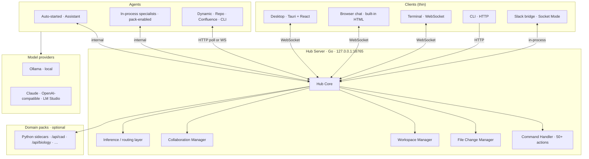

# LinkedIn article — The Hub (publish copy)

**Format:** LinkedIn **Article** (long-form). Use the cover image below when publishing.

**LinkedIn paste tips:** Copy from **"PASTE START"** through **"PASTE END"** only. Do not include `---` lines — LinkedIn renders them as awkward rules with huge gaps. Use LinkedIn's title field for the headline; skip the first `#` line if the editor duplicates it. One blank line between paragraphs is enough.

**Cover image:** `assets/neural-junkie-hub-1200.png` (1200×627)

**Regenerate cover:** `./scripts/compose-hub-article.sh`

**Suggested title (pick one):**
- The Hub Is the Product: Why Neural Junkie Isn't a Chatbot
- We Built a Local Agent Hub — Not Another IDE Plugin
- One Go Server, Many Clients: The Architecture Behind Neural Junkie

**Feed post teaser:**
> Most AI tools are chat UIs or IDE plugins. Neural Junkie is a local Go hub — channels, agents, collaboration phases, file approvals, and model routing in one orchestrator your desktop, browser, Slack, and CLI all talk to. Here's why we built it that way.

**Hashtags:** `#AI #LocalAI #MultiAgent #DeveloperTools #OpenSource #LocalFirst #Architecture`

**Link:** https://github.com/camronwood/neural-junkie/releases/latest

**Website:** https://camronwood.github.io/neural-junkie/articles/hub.html

**Download CTA:** https://camronwood.github.io/neural-junkie/download.html

**Related articles:** [Model layering](MODEL-LAYERING-LINKEDIN.md) · [Inference layer](INFERENCE-LAYER-LINKEDIN.md) · [Loop stack](LOOP-STACK-LINKEDIN.md) · [Collaboration](COLLABORATION-LINKEDIN.md)

---

## PASTE START

If you browse the AI tooling landscape, most products fall into one of two buckets:

1. **A chat window** with a model picker
2. **An IDE plugin** that edits files in your editor

Both can be useful. Neither is enough when you want **multiple specialists**, **structured collaboration**, **human approval for mutations**, **Slack as a front door**, and **local-first control** — without rebuilding orchestration in every client.

**Neural Junkie** is built around a third shape: a **local agent hub** — a Go server that owns channels, agents, routing, collaboration lifecycle, file-change workflow, workspaces, and session state. The desktop app, browser chat, terminal client, CLI, and Slack bridge are **clients**. The hub is the product.

This article is the architecture story we never published on its own — what the hub does, how the pieces connect, and **why** we made the decisions we did.

## The bet in one sentence

**Orchestration belongs in a server you control — not in whichever UI happened to be open.**

Models improvise. UIs come and go. The hub enforces the rules: who can speak, what gets written to disk, which model runs, and when a collaboration phase advances.

## What we were solving

Early prototypes looked like every other agent demo: one process, one chat loop, one model. That breaks the moment you want:

- **Several specialists** in the same channel — security, backend, repo expert — without six separate chat tabs
- **Threads and DMs** with persistent history, not a fresh context window per question
- **Multi-agent collaboration** with phases, task DAGs, workspace gates, and file approvals
- **Repo-aware work** where agents *propose* edits and humans *approve* them
- **Slack** as a team front door while agents still run on your machine
- **Local Ollama** plus optional cloud providers — mixed per agent, per task, per turn
- **One install** that ships as a desktop `.dmg` / `.msi` / `.deb` without asking users to run five services

You can bolt some of that onto a chat UI. You cannot bolt all of it on cleanly without a **central coordinator**.

So we built one.

## System overview



**Read it left to right:** clients talk to one hub; the hub owns state and policy; agents call models; packs extend the hub with domain sidecars.

## Why a hub — and not just a bigger desktop app

### 1. Multiple surfaces, one brain

The **Tauri desktop** is the full workspace — palette, files, editor, threads, pending changes. But you shouldn't need the desktop open for every interaction.

| Client | Role |
|--------|------|
| **Desktop** | Primary workspace — IDE v4, file approval, settings, collab UI |
| **Browser** (`GET /`) | Lightweight chat against the same channels |
| **Terminal** (`make chat`) | WebSocket chat for scripting and quick checks |
| **Go CLI** | Automation, CI hooks, headless commands |
| **Slack bridge** | Team-visible channel mirroring; DMs land in private hub channels |

All of them hit the **same channel history**, **same agent registry**, **same file-change queue**. No duplicate orchestration logic in React and Go and Python.

### 2. Agents are participants, not callbacks

In plugin-style tools, the editor calls a model and applies a diff. In Neural Junkie, **agents are first-class hub members**:

- They **register** with capabilities and provider config
- They **join channels** and receive broadcast messages
- They decide whether to respond (@mention, expertise match, moderator timeout)
- They send messages back through the hub — including `file_change`, `collaboration_plan`, `tool_approval`, streaming deltas

That pub/sub shape is what makes multi-agent chat feel like Slack, not like a single completion stream with costumes.

### 3. Policy lives server-side

Humans approve file changes. Collaboration advances through phases. Tool use can be gated. Rate limits apply per client. Session ACLs decide who sees which DM.

Those rules need to hold whether the message arrived from the desktop, a Slack @mention, or `POST /api/send`. **Server-side enforcement** beats "the React app remembered to ask."

### 4. Local-first without fragile glue

The hub binds **`127.0.0.1:18765`** by default. Your models, history, repo indexes, and approvals stay on your machine. The desktop bundles the Go binary as a **Tauri sidecar** — one artifact, no separate `go install` step.

Opt-in LAN binding (`NEURAL_JUNKIE_LISTEN_ALL=1`) plus a hub token supports room chat and shared benches — still **your** hub, not our cloud.

## Hub core: what it actually owns

The `Hub` struct in `internal/hub/` is the central broker. These aren't marketing labels — they're the subsystems we had to name in code.

| Subsystem | Responsibility |
|-----------|----------------|
| **Channels** | Create, join, leave; per-channel history; subscriber broadcast |
| **Agent registry** | Register, list, dedupe; track removed agents; per-agent provider |
| **Message routing** | @mention parsing, keyword detection, path auto-detection, thread replies |
| **Command handler** | 50+ slash actions — agents, repos, collab, providers, files, meetings |
| **Collaboration manager** | Planning → review → approved → executing → completed; task DAG dispatch |
| **File change manager** | Register proposals; approve/reject; backup before apply |
| **Workspace manager** | Multi-root workspaces; persisted paths; scope for file APIs |
| **Session persistence** | Periodic save to `~/.neural-junkie/last-session.json`; SQLite sidecar for history |

```go
type Hub struct {
    channels          map[string]*protocol.Channel
    agents            map[string]*protocol.AgentInfo
    messages          map[string][]*protocol.Message
    subscribers       map[string][]chan *protocol.Message
    threads           map[string][]*protocol.Message
    commandHandler    *CommandHandler
    collabManager     *collaboration.CollaborationManager
    fileChangeManager *filechange.FileChangeManager
    workspaceManager  *WorkspaceManager
}
```

Concurrency is guarded by `sync.RWMutex`. Subscriber channels are buffered Go channels. The hub is **single-process, single instance** — honest limitation, simpler ops.

## Message flow: one turn through the hub

```
User sends message
    │
    ▼
Hub receives (WebSocket or HTTP)
    │
    ├── Parse @mentions
    ├── Detect slash commands → CommandHandler
    ├── Detect file paths → optional repo agent
    ├── Classify intent (closure / casual / substantive / task)
    ├── Build context stack (mode, memory, grounding, budget)
    │
    ▼
Broadcast to channel subscribers
    │
    ▼
Each agent evaluates relevance
    │
    ├── @mentioned? → respond
    ├── Expertise match? → respond
    ├── Moderator safety-net timer? → respond
    │
    ▼
Inference layer picks model + provider
    │
    ▼
Agent streams reply → Hub → subscribers
```

**Key insight:** the desktop doesn't pick the model for collab tasks, delegation consults, or tool loops. The **hub's inference layer** does — and attaches a routing trace on the message so you can audit it. See [Inference layer](INFERENCE-LAYER-LINKEDIN.md) and [Model layering](MODEL-LAYERING-LINKEDIN.md) for the per-turn detail.

## Agents: three deployment shapes

Not every agent runs the same way. The hub supports three patterns on purpose.

### In-process (default)

**Assistant**, pack-enabled specialists (BackendEngineer, BiologyExpert, …), and configured experts run **inside the hub process**. Message delivery is push-based — no HTTP polling loop to yourself.

**Why:** lower latency, simpler local install, shared config, no port juggling for six agents on a laptop.

### Standalone `cmd/agent` (optional)

`make agents` starts separate processes that register over HTTP or WebSocket. Useful for development, isolation, or resource-heavy agents.

**Why:** escape hatch without making multi-process the default UX.

### Dynamic agents

**Repo agents**, **Confluence agents**, and **CLI agents** (Cursor, Gemini) spin up when you index a path or detect a binary on PATH. They register, join relevant channels, and poll or subscribe.

**Why:** expertise should attach to *your* codebase and *your* docs — not ship as a fixed roster of six generic personas.

## Collaboration: why it lives in the hub

`/collaborate` looks like one command. Under the hood it's a **state machine** the hub enforces:

| Phase | What the hub guarantees |
|-------|-------------------------|
| **Planning** | Round-robin turns, budgets, timeouts; plan artifact versioning |
| **Review** | Human approves or revises before execution |
| **Executing** | Task DAG — `ReadyTasks` waves; per-task routing; workspace gates |
| **File changes** | Agents propose; hub registers; human approves in desktop |

Models improvise. The hub **does not** let chat markdown write to disk. Structured `file_change` messages do — after approval.

This is the difference between a demo and a product. See [Collaboration](COLLABORATION-LINKEDIN.md) and [Loop stack](LOOP-STACK-LINKEDIN.md) for the full loop map.

## File changes: humans stay in the loop

```
Agent proposes file change (message metadata)
    │
    ▼
Hub registers with FileChangeManager
    │
    ▼
Desktop Pending Changes panel (diff preview)
    │
    ├── Approve → apply to workspace (local or remote SSH)
    └── Reject → discard; thread records decision
```

**Why server-side registration:** Slack, CLI, and collab execution all produce proposals. The hub is the **single queue** — the desktop is the best approval UI, not the only enforcement point.

Backups land in `~/.neural-junkie/backups/` before apply. Remote workspaces route through `nj-remote` with the same hub-backed tree.

## Domain packs extend the hub

Official packs (software dev, life sciences, CAD, AWS, incident management, web browser, music) install as zip bundles. When enabled, they can:

- Register **capabilities** and compose templates (chat / tool / LoRA stacks)
- Start **Python sidecars** — biology fold, CAD geometry, music generation, browser automation
- Expose routes like `/api/biology/*`, `/api/cad/*` proxied through the Go hub

**Why sidecars:** domain tools need Python ecosystems (RDKit, CadQuery, Playwright) that don't belong inside the Go binary. The hub stays the **front door** — one port, one auth model, one session.

Pack layout IDE vs team layout is a presentation concern. Orchestration still flows through the hub.

## Data: everything under `~/.neural-junkie/`

| Path | Purpose |
|------|---------|
| `repos/` | Cached repository indexes |
| `confluence/` | Cached Confluence indexes |
| `assistant/` | Reminders, tasks, notes |
| `exports/` | MCP-format agent exports |
| `backups/` | Pre-apply file change backups |
| `workspaces.json` | Registered workspace roots |
| `last-session.json` | Channel/session recovery |
| `config.json` | Providers, packs, integrations (encrypted secrets) |

**Why one data root:** backup, migration, and "where did my stuff go?" should have one answer.

## Security follows from the hub shape

Neural Junkie is **not** a multi-tenant cloud service. Security choices assume **your machine**:

| Threat | Hub response |
|--------|----------------|
| Random websites calling localhost | Loopback bind; restricted CORS |
| Agent impersonation | `from` ignored unless hub token set |
| Path traversal | `pathutil.WithinRoot` on workspace and data paths |
| LAN exposure | Opt-in + `NEURAL_JUNKIE_HUB_TOKEN` required |
| Secrets on disk | AES-GCM for config keys and desktop credentials |
| API abuse | Per-IP/session rate limits (disable for scenario CI) |

Channel ACLs gate DMs and custom channels when session auth is active. See [SECURITY.md](https://github.com/camronwood/neural-junkie/blob/main/docs/SECURITY.md).

## What we deliberately did *not* build

Honesty matters in open beta:

| Non-goal | Why |
|----------|-----|
| **Multi-tenant cloud hub** | Conflicts with local-first; you run your models |
| **Horizontal scale** | Single hub instance; no regional failover |
| **Full browser IDE** | Web UI is chat-only; desktop owns files and approval UX |
| **Autonomous file writes** | Human approval is a feature, not a missing checkbox |

These are documented on [Known issues](https://camronwood.github.io/neural-junkie/known-issues.html). They're tradeoffs, not oversights.

## How the rest of the article series maps to the hub

Once you accept "the hub is the product," the other articles are **layers on top**:

| Article | Hub layer it explains |
|---------|----------------------|
| [Model layering](MODEL-LAYERING-LINKEDIN.md) | Context, weights, routing, orchestration per turn |
| [Inference layer](INFERENCE-LAYER-LINKEDIN.md) | Decide before you generate — closure skips inference |
| [Modular AI composition](MODULAR-AI-COMPOSITION-LINKEDIN.md) | Pack-declared compose stacks; routing badges |
| [Loop stack](LOOP-STACK-LINKEDIN.md) | Collab, implementation, fix, tool, and guard loops |
| [Collaboration](COLLABORATION-LINKEDIN.md) | Phases, DAG, workspace gates |
| [Conversation memory](CONVERSATION-MEMORY-LINKEDIN.md) | Hub-indexed retrieval, not transcript stuffing |
| [LoRA / MCP](LORA-LINKEDIN.md) | Weight and knowledge layers agents call through the hub |

We should have published this one first. Better late than never.

## What we learned

**1. Chat UIs are clients. Orchestrators are products.**

If your "product" is only the React app, every new surface (Slack, CLI, headless CI) reimplements half the rules.

**2. Pub/sub beats request/response for multi-agent.**

Agents observing a channel — with dedup, expertise, and @mentions — scales better than a central "call each agent in sequence" script.

**3. Put gates in the server.**

File approval, collab phase transitions, and tool policy belong in Go, close to the data paths they protect.

**4. Bundle the hub, don't install it separately.**

Tauri sidecar packaging was the unlock for "download and run" beta installers. Users shouldn't manage a Go service manually.

**5. Extend via packs, not forks.**

Python sidecars and capability tokens let domains grow without bloating `internal/hub/` with biology-only `if` branches.

## Try it

Personal open-source project — macOS, Windows, Linux.

```bash
make pull-models   # optional — qwen2.5-coder:14b + qwen2.5:7b
make start-all     # hub + desktop
```

Or download installers: https://github.com/camronwood/neural-junkie/releases/latest

**Architecture docs:**
- [ARCHITECTURE.md](https://github.com/camronwood/neural-junkie/blob/main/docs/ARCHITECTURE.md) — full technical reference
- [CONTEXT_MODEL.md](https://github.com/camronwood/neural-junkie/blob/main/docs/CONTEXT_MODEL.md) — per-turn context stack
- [COLLABORATION.md](https://github.com/camronwood/neural-junkie/blob/main/docs/COLLABORATION.md) — collab lifecycle
- [PACKS.md](https://github.com/camronwood/neural-junkie/blob/main/docs/PACKS.md) — domain pack install and sidecars

If you run a local multi-agent setup and hit a routing, approval, or collab edge case — GitHub issues welcome. That feedback becomes the next scenario in the harness.

**Next in the series:** [Model layering](MODEL-LAYERING-LINKEDIN.md) — how the hub picks models at four levels once a turn deserves inference.

Camron Wood — Neural Junkie (personal project)

## PASTE END
