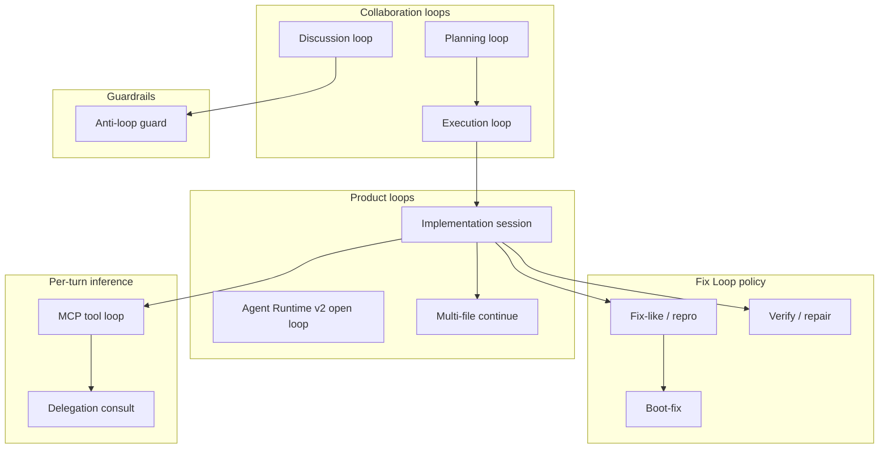

# LinkedIn article — NJ Loop Stack (publish copy)

**Format:** LinkedIn **Article** (long-form). Use the cover image below when publishing.

**LinkedIn paste tips:** Copy from **"PASTE START"** through **"PASTE END"** only. Do not include `---` lines — LinkedIn renders them as awkward rules with huge gaps. Use LinkedIn's title field for the headline; skip the first `#` line if the editor duplicates it. One blank line between paragraphs is enough.

**Cover image:** `assets/neural-junkie-loop-stack-1200.png` (1200×627)

**Regenerate cover:** `./scripts/compose-loop-stack-article.sh`

**Suggested title (pick one):**
- We Didn't Build One Agent Loop. We Built a Stack.
- Execution Is Not Repair: Neural Junkie's Loop Stack
- Why Your Coding Agent Needs Platform Loops, Not Just Tool Loops

**Feed post teaser:**
> My agent could run `make start-all` eight times and never touch the Makefile. That's not a model problem — it's a missing closed loop. Here's the stack of loops we built in Neural Junkie, and why each one exists.

**Hashtags:** `#AI #DeveloperTools #OpenSource #LocalFirst #AgenticCoding #MultiAgent`

**Link:** https://github.com/camronwood/neural-junkie/releases/latest

**Website:** https://camronwood.github.io/neural-junkie/articles/loop-stack.html

**Download CTA:** https://camronwood.github.io/neural-junkie/download.html

**Suggested post date:** After `make implement-scenarios` green (20/20) with Fix Loop scenarios

**Related articles:** [NJ Fix Loop](FIX-LOOP-LINKEDIN.md) · [Inference layer](INFERENCE-LAYER-LINKEDIN.md) · [Collaboration](COLLABORATION-LINKEDIN.md)

---

## PASTE START

If you've shipped an agent that can **run shell commands**, you've probably hit this wall:

The agent runs `make start-all`. It fails. It runs it again. And again. Chat fills with `command_output` messages, but **nothing on disk changes** and sometimes there's **no final summary** at all.

That's not a model intelligence problem alone. It's a **missing closed loop**.

I've been building **Neural Junkie** as a local-first open-source agent hub — specialists in chat, IDE Agent mode, and multi-agent collaboration. Agent Runtime v2 gives specialists long native tool loops. Great for reach. Dangerous without platform policy.

This article is the map: **the loop stack** — every named loop in the product, what problem it solves, and why we didn't try to solve everything with one monolithic planner.

## The bet in one sentence

**Platform loops beat bigger models for reliability.**

Models improvise. Loops enforce outcomes: read before you run, edit before you retry, verify before you claim success, and always report what happened.

## The stack at a glance

Not every "loop" in Neural Junkie is the same kind of thing. Some are **user-facing workflows**. Some are **policy layers**. Some are **inference mechanics**. Some are **guardrails**.



Same hub. Same desktop. Different loops for different failure modes.

---

## Layer 1 — Implementation session loop

**Problem:** A single tool-call turn isn't enough to implement a feature. The model needs to explore the repo, propose edits, and confirm the workspace still builds — without the user saying "go ahead" after every file.

**What we built:** A bounded **implementation session**: discover → edit → apply → verify → repair.

**Why bounded:** Unbounded agent loops look impressive in demos and expensive in production. Phase 1 caps (~20 tool iterations, 3 edit rounds) gave us a testable contract. Agent Runtime v2 raises those caps for Cursor parity, but the **shape** stays the same.

**Triggers:** IDE Agent mode, `implementation_session: true`, or team-channel implement metadata when the dev pack and workspace are active.

**Outcome metadata:** Every session posts `implementation_session_outcome` — files changed, verify status, repair used — so scenario harnesses and users get a definitive answer, not silence.

Docs: [IMPLEMENTATION_SESSION.md](https://github.com/camronwood/neural-junkie/blob/main/docs/IMPLEMENTATION_SESSION.md)

---

## Layer 2 — Agent Runtime v2 (open loop)

**Problem:** Cursor-like parity needs coordinated multi-file refactors and long repair chains without the user nudging between files. Bounded Phase 1 caps were right for acceptance testing; they were too tight for real refactors.

**What we built:** Agent Runtime v2 — same discover → edit → verify → repair phases, but with open-loop guardrails: up to 100 tool steps, 5 repair rounds, 50 files per cycle, 60-minute wall clock.

**Why separate from Phase 1:** We wanted a **feature flag** (`features.agent_runtime_v2`) and parity scenarios (`long-agent-loop-repair`, `multi-file-refactor-10`) without breaking the 20/20 implement gate that ships releases.

**Key insight:** Open loop is not "no policy." It's "higher caps with the same phase machine."

---

## Layer 3 — NJ Fix Loop (platform policy)

**Problem:** In a real boot-fix session we saw `make start-all` fail **8×**, **11 command_output posts**, **zero file edits**, and **no session wrap-up**. The outer implementation session only advanced on file proposals and verify. Tool-step observers tracked discover tools, not `run_command` failures.

**My agent can execute** ≠ **my agent can fix my app**.

**What we built:** Fix Loop — platform-owned policy on top of the tool loop:

| Mechanism | Why |
|-----------|-----|
| **Command telemetry** | Every `run_command` recorded in session state |
| **Circuit breaker** | Same failing command twice without read/edit → third run blocked at MCP layer |
| **Boot-fix grounding** | `make start-all` / `npm run dev` blocked until Makefile, package.json, or startup scripts were read |
| **Deterministic playbooks** | Known signatures (e.g. missing `start-all` target) trigger Makefile repairs before model guessing |
| **Session finale** | Every session ends with summary + outcome metadata — command thrashing can't exit silently |
| **Routing** | Boot-fix signals route to **FrontendEngineer**, not SoftwareArchitect |

**Why a policy layer, not a new runtime:** The phase machine was already correct. What was missing was **forcing** read → edit → re-run when commands failed. That's hub policy, not a bigger model.

Proof scenario: `make implement-scenario SCENARIO=tauri-make-start-all-missing`

---

## Layer 4 — Fix-like and repro loops

**Problem:** "Something's broken" and "add dark mode" both look like implementation requests. Feature builds need discovery and multi-file edits. Bug fixes need **reproduction first** — run the failing command, capture output, fix the root cause, re-run.

**What we built:** `FixLikeIntent` detection. When the message looks like repair (errors pasted, "won't boot", "not working") rather than greenfield feature work:

1. Infer a **repro command** (`go test ./...`, `npm run build`, `make start-all`, …)
2. Run it once in **repro bootstrap**
3. Apply playbooks if output matches known signatures
4. **Repro verify** — re-run the same command after edits

**Why separate from generic implement:** Without repro targeting, agents optimize for plausible edits instead of **closing the failure you actually reported**. The verify loop for a theme toggle is `npm run build`. The verify loop for a failing test is that exact test command.

**Clarification gate:** Vague reports ("it's broken") get one short question — "What command fails, or paste the error?" — before we burn a full session.

---

## Layer 5 — Boot-fix loop

**Problem:** Boot and build failures are a subset of fix-like work with extra failure modes: agents run dev servers without reading startup scripts, spam long-running commands, and route to the wrong specialist (architect vs implementer).

**What we built:** `BootFixIntent` — boot-fix diagnostic bootstrap, mandatory reads of startup files, dev-server timeout hints, optional **best-of-K** (2 candidates) for boot-fix sessions, and DM redirect when you're talking to SoftwareArchitect but need FrontendEngineer.

**Why not fold into generic fix-like:** Boot failures have predictable artifacts (Makefile, `package.json`, `scripts/start-all.sh`) and predictable bad behavior (command spam, no grounding). Specialized policy is cheaper than hoping the model generalizes.

---

## Layer 6 — Verify / repair loop

**Problem:** Auto-applied edits without verification is how agents confidently ship broken code. But verify-everything on interactive trust (manual approval) wastes time and annoys users who want to review diffs first.

**What we built:** Stack-aware verify after auto-apply (`go test ./...`, `npm run build`, `tsc --noEmit`, …). If verify fails → **one typed repair round** with structured feedback (build error vs test failure vs partial success). Interactive trust skips verify; proposals await manual approval.

**Why one repair round in Phase 1:** Diminishing returns. If verify still fails after one guided repair, the session should report failure honestly — not loop until timeout.

Scenarios: `verify-failure-one-repair`, `go-test-failure-repair`

---

## Layer 7 — Multi-file continue loop

**Problem:** "Add dark mode" in a React + Tailwind repo isn't one file. If the session stops after `tailwind.config.js` and waits for "go ahead" to touch `App.tsx`, the UX feels broken and the harness flakes.

**What we built:** When the stack manifest still has targets, the session **continues in the same user turn** — up to 5 files — without re-prompting.

**Why same turn:** Continuation prompts are where users abandon agent UIs. The platform should carry intent forward when the manifest already knows what's left.

Scenario: `react-theme-multi-file`

---

## Layer 8 — MCP tool loop

**Problem:** Chat models answer from weights. Coding agents need **tools** — read, grep, edit, run commands. Native tool calling iterates until the model stops or hits a cap.

**What we built:** MCP tool loop through Ollama or Claude's tool API. Separate **tool-loop model** when the chat model lacks native tools (e.g. OpenBio chat + `qwen3.5:9b` for biology MCP tools).

**Why split chat and tool models:** Domain chat models (OpenBio, security LoRA tags) often can't call tools. Running a small Qwen for tools while keeping the specialist voice on chat is cheaper and more reliable than forcing one tag to do both.

**Caps:** 20 iterations in bounded implementation sessions; 100 in Runtime v2. Plaintext tool-call recovery chains malformed tool output during implementation.

This is the **inner loop** — it runs inside almost every outer loop above.

---

## Layer 9 — Delegation consult loop

**Problem:** Users DM one specialist but ask cross-domain questions. "Review this API change" to BackendEngineer might need SecurityReviewer. Handing off in chat breaks UX; ignoring domain fit produces wrong answers.

**What we built:** In-process consult — responding agent queries up to 2 other specialists, merges `DELEGATE_RESULTS` into one reply. Skipped for closure/casual intents and during collaboration (collab orchestration owns multi-agent flow).

**Why in-process, not public handoff:** One synthesized answer. No "I'll ask SecurityReviewer" theater unless you want visibility.

Docs: [DELEGATION.md](https://github.com/camronwood/neural-junkie/blob/main/docs/DELEGATION.md)

---

## Layer 10 — Collaboration loops

**Problem:** Multi-agent collaboration is easy to demo and hard to ship. `/collaborate` is one command; underneath it's phases, task dependencies, workspace gates, and file approvals — while real models improvise.

**What we built:** Three named loops:

| Loop | Purpose |
|------|---------|
| **Planning loop** | Agents discuss → plan parsed → `reviewing` phase |
| **Execution loop** | Approve plan → workspace ack → tasks → file approval → deliverables on disk |
| **Discussion loop** | Turn-taking and @mention replies within a collab |

**Why three, not one:** Planning without execution is a writing exercise. Execution without planning is chaos. Discussion without turn rules is infinite agent-to-agent chatter.

Scenarios: `planning-two-agent`, `execute-deliverable`

---

## Layer 11 — Anti-loop guard

**Problem:** Agents replying to agents creates infinite chatter — impressive in a screenshot, unusable in a channel.

**What we built:** Default **anti-loop guard** — agents skip messages from other agents unless collaboration mode explicitly allows participant replies on their turn or when @mentioned.

**Why explicit allow in collab:** Multi-agent work *requires* agent-to-agent messages. Everywhere else, it's a bug.

---

## How the layers compose

A typical boot-fix in IDE Agent mode might traverse:

1. **Implementation session** opens (Layer 1)
2. **Fix-like intent** sets repro command (Layer 4)
3. **Boot-fix policy** enforces grounding + circuit breaker (Layer 3/5)
4. **MCP tool loop** runs reads and edits (Layer 8)
5. **Playbook** patches Makefile if signature matches (Layer 3)
6. **Repro verify** re-runs `make start-all` (Layer 4)
7. **Verify/repair** runs `npm run build` if auto-applied (Layer 6)
8. **Session finale** posts outcome metadata (Layer 3)

A biology tool question in a DM might only hit **delegation consult** (Layer 9) and **MCP tool loop** (Layer 8) — no implementation session at all.

That's the point: **different jobs, different loops**. The inference layer decides whether to infer; the loop stack decides how work **closes**.

---

## What we didn't try to solve

- Rewriting Agent Runtime v2 into a single monolithic planner
- Fixing individual user repos by hand in agent sessions
- One loop to rule them all

We added loops when we saw a **specific failure mode** in scenario harnesses or real sessions — command spam, silent exits, wrong specialist, verify skipped, multi-file stall.

---

## Try it

```bash
make implement-scenario SCENARIO=tauri-make-start-all-missing   # Fix Loop playbook
make implement-scenario SCENARIO=verify-failure-one-repair       # verify/repair
make implement-scenario SCENARIO=react-theme-multi-file          # multi-file continue
make parity-scenario SCENARIO=long-agent-loop-repair             # Runtime v2 open loop
```

Docs: [IMPLEMENTATION_SESSION.md](https://github.com/camronwood/neural-junkie/blob/main/docs/IMPLEMENTATION_SESSION.md) · [CURSOR_PARITY.md](https://github.com/camronwood/neural-junkie/blob/main/docs/CURSOR_PARITY.md)

Download: https://camronwood.github.io/neural-junkie/download.html

Restart hub + desktop after pulling agent changes, then send a boot-fix request in **Agent mode** with **auto-apply** enabled.

---

*Neural Junkie is a personal open-source project. Feedback and scenario failures welcome on GitHub.*

## PASTE END
