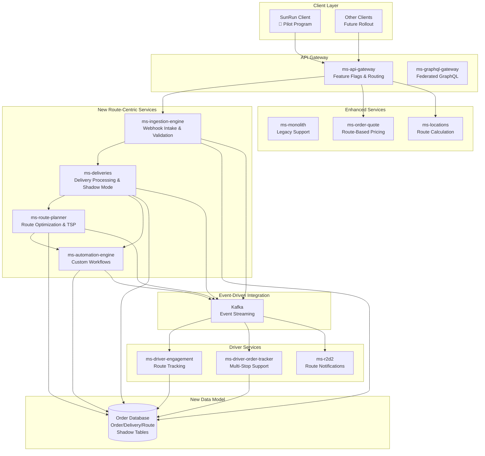

# Test Wide Mermaid Diagram

This file contains a wide Mermaid diagram to test rendering in the MarkdownPreview component.

## Architecture Diagram

## Expected Behavior

The diagram above should:
1. Be fully visible in the preview pane
2. Show horizontal scrollbars if wider than the container
3. Be clickable to expand in a modal

